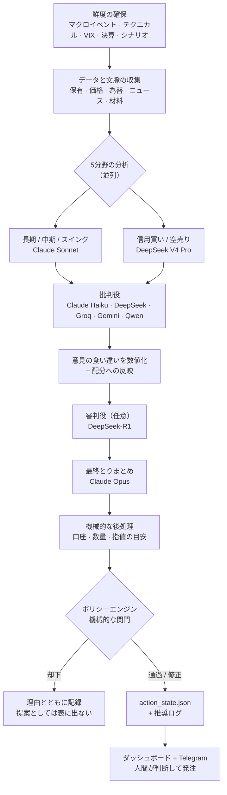

# ALMANAC

*[English](README.md)*

**ALMANAC** は、個人の資産運用を支えるAI活用型の管理システムです。Python のバックエンドと Next.js のダッシュボードを組み合わせ、実際に運用している長期投資の口座に対して、日々の分析・銘柄探索・リスク管理を行います。

いちばんの特徴は、**AIの提案がそのまま売買につながらない**ことです。AIの提案と実際の発注のあいだには、必ず機械的なルールによる関門が入ります。

**自動売買botではありません。** このコードのどこにも、証券会社へ注文を出すAPIはありません。AIが案を出し、機械的なルール（ポリシーエンジン）が通すか止めるかを判定し、最後は人間が自分で証券会社の画面から発注します。

このリポジトリは、そのシステムを**公開用に匿名化したスナップショット**です。実運用のデータ、認証情報、保有者が特定できる情報は入れていません（詳しくは [公開リポジトリの安全性](#公開リポジトリの安全性public-repository-safety)）。

> **これは何で、何ではないか:** すぐ使える製品でも、安定した公開APIでもありません。「こういう考え方で作るとこうなる」という参考実装であり、今も変わり続けている個人用システムです。まずデモ用の状態で動かし、ルールの中身を確かめたうえで使ってください。ファイル形式や運用手順は変わることがあります。

## できること

このシステムが何を目指すかは、[`objective.md`](objective.md) に文章として明記し、バージョン管理しています。目標は **税金と手数料を引いたあとの、円建ての運用成績（TWR）を最大化する**ことです。比較対象は「世界株式60%＋世界債券40%」の組み合わせ。ただし損失やリスクには上限を設けていて、その上限を守らせるのはAIの判断ではなく、機械的なルールです。

> **TWR（時間加重収益率）** — 入金や出金の影響を取り除いた運用成績の指標です。たとえば給料日に大きく入金すると資産額は増えますが、それは運用がうまくいったからではありません。TWRはそういう「お金の出し入れ」を除いて、投資判断そのものの良し悪しを測ります。

| 領域 | 内容 |
|---|---|
| **ポートフォリオ・リスク** | AIの見通しを取り込んだ配分最適化（Black-Litterman）、値動きの荒さの予測（GJR-GARCH）、相場の局面判定（強気／中立／弱気／暴落）、1銘柄への偏りすぎと勤務先関連の資産偏重のチェック |
| **AI判断支援** | Claude と DeepSeek を用途ごとに使い分けたマルチモデル分析。「一部売る」「買い増す」「配分を戻す」「損を確定して税負担を減らす」といった個別判断を扱いますが、発注に至る前に必ず機械的ルールの関門を通します |
| **スクリーニング・シグナル** | 日米株の長期スクリーニング、企業の開示情報（EDINET／TDnet／EDGAR）を起点とした材料の検知、信用取引・空売り候補の抽出、インサイダー売買の集中やIPOの監視 |
| **執行・ガードレール** | 日次・月次の損失が一定を超えたら取引を止める仕組み、リスク指標に基づく発注ブロック、追記のみで書き換え不可の履歴台帳、未約定の注文を考慮した数量計算 |
| **税務・口座管理** | 売却時にどの取得分から充てるかの戦略（FIFO／LIFO／損出し／利益最小化）、NISA枠の残量管理、持株会（従業員株式制度）の偏り管理 |
| **可観測性** | ベンチマークと比較した運用成績の記録。「これだけ儲かる」と主張するのではなく、実測値をそのまま出す検証ページを用意しています |

## 動作原理

このシステムの中心にあるのは、**市場データを「人間が実行できる少数の具体的な提案」に変える日次の処理の流れ**と、**その提案をユーザーに届く前に却下・修正できる機械的な関門**です。

### 1. 一日の流れ



各段階には、そうしている理由があります。

**まず情報を最新にする。** 関門が判断に使う材料 — 経済イベントの予定、テクニカル指標、VIX（後述）、決算の近さ、相場シナリオ — は、分析を始める**前**にすべて作り直します。

理由は単純で、古い予定表をそのまま読むと「重要なイベントは近くにない」と誤解してしまうからです。その誤解ひとつで、決算前に買いを止める仕組みが働くかどうかが変わります。更新に失敗したら黙って握りつぶさず表示し、予定表が見つからない場合は「問題なし」ではなく「要確認」として扱います。

**なんでも屋を1つ置くより、専門を5つ置く。** 保有の目的ごとにポートフォリオを分けます（長期の中核・中期・短期のスイング）。さらに信用買いと空売りの2つを加えて、合計5分野です。それぞれに専用の指示文と、専用のリスクの見方を持たせています。

5つは同時に走り、1つずつに制限時間があります。1つが時間切れになっても、影響はその分野だけに留まり、その日の分析全体は止まりません。

**わざと批判させる。** 5分野の結果は「批判役」に渡され、その推論を攻撃させます。役割ごとに扱える情報が違います。Claude Haiku の担当は保有情報を見たうえで批判できます。外部ベンダーの担当は公開情報か匿名化した情報だけを扱い、APIキーが設定されていれば DeepSeek・Groq・Gemini・Qwen を使います。

ベンダーを意図的にばらしているのは、**同じ系統のモデルは同じ見落とし方をしやすい**からです。批判役どうしの意見がどれだけ食い違ったかを数値にして次の段階へ渡すので、まとまった結論だけを見て「どこで意見が割れたか」を見失うことがありません。

**審判役（あれば）、そしてとりまとめ。** `DEEPSEEK_API_KEY` が設定されていれば、DeepSeek-R1 が判定役として入ります。このとき渡すのは匿名化した提案だけで、銘柄コードもアナリスト役が書いた理由の文章も渡しません。この段階は必須ではなく、使えなければ飛ばすだけで、全体は止まりません。

そのあと Claude Opus が最終的なとりまとめを行います。ここでは「必ず決められた形式で答えさせる」呼び出し方をしているので、返ってくるのは解釈が必要な文章ではなく、検証済みのデータ構造です。また、**出力の途中で文字数上限に達して切れた応答は、たとえ中身が入っていても採用せず捨てます**。中途半端な答えを「そういう結論だった」と読み違えないためです。

**判断材料は先、執行の詳細は後。** ニュース・材料・チャート・オプションの情報は、判断そのものに影響する段階、つまりとりまとめの前か最中に集めます。構造化された提案が返ってきたあとで、機械的なコードが「どの口座で」「どれだけ」「いくらの指値が目安か」を付け足し、それから関門に渡します。

### 2. なぜ複数のAIを使うのか

役割ごとのモデル選択は `model_router.py` にまとめてあります。`ALMANAC_BUDGET_MODE=eco|normal|premium` を切り替えると、役割から決まった Claude のグレードが一段上下します。

ただし全部が変わるわけではありません。リスクの低い定型処理、接続失敗時の代替モデル、外部ベンダー担当の役割は対象外です。この例外は、隠さず各呼び出し箇所に書いてあります。

| 役割 | モデル | 理由 |
|---|---|---|
| 最終とりまとめ | Claude Opus | ここでの誤りは全提案に波及する。唯一の一発勝負 |
| 長期 / 中期 / スイング | Claude Sonnet | 件数は多いが、質も落とせない本体の分析 |
| 信用買い / 空売り | DeepSeek V4 Pro | 一次判断を担当。採用するかは最終とりまとめが決める |
| スクリーニング予選 | DeepSeek | 大量の候補を広く安くふるいにかける |
| スクリーニング第二意見 | Claude Sonnet | 買い候補の上位だけが高いモデルの精査を受ける |
| 批判役 | Claude Haiku / DeepSeek / Groq / Gemini / Qwen | 保有情報を見られるAnthropic担当と、公開情報だけの他社担当を組み合わせる |
| チャット / 差分監視 | Claude Haiku | 回数が多く、1回あたりの重要度は低い |

要するに**ふるいの構造**です。安いモデルが全部に目を通し、高いモデルは生き残ったものだけを見る。すべての呼び出しについてトークン使用量と推定コストを共通の台帳に記録しているので、費用は「たぶんこのくらい」ではなく実測値でわかります。

### 3. 関門

**ここが「売買を提案するだけのAI」との分かれ目です。**

提案された行動は、順番の決まったルールの列を通ります。中身はただのPythonで、**この判定にAIは一切関与しません**。各ルールは、その行動を却下するか、修正（緊急度を下げる、数量を半分にする）できます。

| ルール | 内容 |
|---|---|
| `ledger_integrity` | 履歴台帳につじつまが合わない箇所があれば、実行できる提案を一切通さない |
| `var_budget` | 想定される1日の損失（VaR）が上限を超えていたら、新規の買いを**すべて**却下 |
| `dd_stage` | 資産の落ち込みが −8% 以下なら原則として新規の買いを停止。−5% 以下なら緊急度を下げ、数量を半分に。積立の階段買いだけは例外だが、それも上限管理下に置く |
| `leverage_block` | 借入の状態が警戒・縮小・緊急のいずれかなら、新規の信用建てを禁止 |
| `earnings_blackout` | 決算発表の5営業日前からは、その銘柄の買い・買い増し・積立を原則却下。よほど確信度の高いイベント狙いだけは例外だが、後段で上限をかける |
| `freshness_downgrade` | 判断材料が古ければ、そのまま信じずに格下げする |
| `cvar_unstable` | 実データが少なく極端な損失を見積もれない場合は信用買いを完全に止める。単に運用履歴が短いだけの場合は、恒久的に止めるのではなく数量を縮める |
| `vix_extreme` | VIX が 40 以上なら投機的な取引を却下し、買いの緊急度を下げる |

個々の数値より大事な設計判断が2つあります。

**判断できないときは「止める」側に倒す。** 材料が欠けている、読み取れない — そういう場合を「特に問題なし」ではなく「許可しない」として扱います。安全側に倒す、という意味で fail-closed と呼ばれる考え方です。コード上で「偽（`False`）」と「不明（`None`）」をわざわざ区別しているルールが複数あるのは、このためです。

**却下したものは捨てずに残す。** 却下・修正された提案は、その理由とともに分析結果に書き出します。だから後から「なぜあの売買が出てこなかったのか」を追跡できます。

なお、これらの数値は思いつきで決めたものではなく、[`objective.md`](objective.md)（何を目指すかを定めたバージョン管理下の文書）を実装したものです。上限を変えるときは、目的の文書・設定・コード・テストをまとめて更新します。

### 4. 提案から約定まで

**繰り返しますが、このリポジトリに発注APIはありません。** 一連の流れは、必ず人間を経由して閉じます。

```
提案 → 実行可否の判定（すぐ可 | 要確認 | 不可） → 人間が証券会社で発注
     → 人間が約定を記録 → 約定済み | 一部約定 → 履歴台帳 → 保有情報へ反映
```

ここで意図的に分けているのが、**「約定を記録すること」と「保有情報に反映すること」**です。

どの口座・どの経路の取引か一意に決まらない約定は、まず「起きた事実」としてだけ保存し、反映は保留にします。推測で違う口座に書き込まないためです。帰属を間違えると、取得価格の管理・NISAの残枠・運用成績の数字が、気づかないうちに全部おかしくなります。

また、記録の書き込みには重複防止の仕組みを入れてあり、フォームを二重送信しても2件の取引になることはありません。

### 5. 成績の測り方

このシステムは「儲かります」と主張するのではなく、**自分の成績を自分で採点します**。

毎日その時点の資産評価額を記録し、入出金の影響を除いた収益率を計算して、「世界株式60%＋世界債券40%」と比べます。計算方法は Modified Dietz 法という近似で、日ごとに厳密に区切って計算する方式ではありません。この点は隠さず明記しています。

比べる対象は**税引後・手数料控除後・円建て**です。国内の分離課税と米国株の配当源泉税を計算に入れ、ドル建ての資産はその日の終値レートで円に直します。

ダッシュボードの検証ページは、実測値をそのまま表示します。計測期間が短すぎる、あるいはデータが汚れていて結論を出せない場合は、そう書きます。

これとは別に、watchdog（見張り役）が定期的にデータの鮮度・形式の変化・台帳の整合性・バックアップの状態・ディスク残量を点検し、本当に対処が必要なものだけを通知します。

### 6. 壊れたときにどうなるか

不具合が起きたとき、黙って劣化させず、必ず表に出します。

- 時間切れになった分析は「劣化した実行」として結果に明記する
- 途中で切れたAIの応答は、解釈せずに捨てる
- 古い材料は、そのまま信じずに格下げする
- 安全確認のモジュールを読み込めなければ、無検査で進まずに呼び出しを断る

一貫している原則はひとつです。**自信ありげな間違いを出すくらいなら、何も推奨しないほうがいい。**

## 用語集

本文に出てくる専門用語をまとめます。

| 用語 | 意味 |
|---|---|
| **TWR（時間加重収益率）** | 入出金の影響を除いた運用成績。給料日の入金で資産が増えても成績は上がらない |
| **Modified Dietz 法** | TWR の近似計算法。期間中の入出金を、その発生タイミングで重み付けして調整する |
| **VaR（バリュー・アット・リスク）** | 「悪いほうに転んだ場合、1日でどれくらい減りうるか」の推定値。本システムでは95%の確からしさで見積もる |
| **CVaR** | VaR をさらに超える最悪領域に入ったときの、平均的な損失額。「最悪の中の平均」 |
| **ドローダウン** | 過去の最高値からどれだけ落ち込んでいるかの割合 |
| **VIX** | 米国株の「恐怖指数」。将来の値動きの荒さの予想。数値が高いほど市場が不安定 |
| **Black-Litterman** | 市場全体の推定に自分の見通しを混ぜて資産配分を決める手法。本システムではAIが出した見通しを取り込む |
| **GJR-GARCH** | 値動きの荒さを予測するモデル。「下落局面のほうが荒れやすい」という現実の非対称性を扱える |
| **レジーム** | 相場の局面（強気・中立・弱気・暴落）。局面によって同じ行動でも妥当性が変わる |
| **DCA（積立）** | 一度に買わず、時期を分けて少しずつ買う方法 |
| **NISA** | 日本の少額投資非課税制度。非課税の枠に上限があるため、残枠の管理が要る |
| **信用買い** | 資金や株を借りて、自己資金より大きい額を買うこと |
| **空売り** | 株を借りて先に売り、値下がりしてから買い戻して返す取引 |
| **fail-closed** | 判断がつかないときに「許可しない」側へ倒す設計。逆は fail-open（黙って通す） |
| **append-only（追記のみ）** | 記録を追加するだけで、過去の記録を書き換えたり消したりしない方式。監査のため |
| **冪等（べきとう）** | 同じ操作を何回実行しても結果が変わらない性質。二重送信が二重登録にならない |
| **book-aware** | 保有銘柄・数量・損益といった「自分の資産の中身」を含んだ状態でAIを呼ぶこと。反対は公開情報や匿名化情報だけを渡す呼び方 |
| **ティア** | 分析の担当区分（長期・中期・スイング・信用買い・空売り）。またはモデルのグレード |
| **Red Team（批判役）** | 出てきた結論をわざと攻撃させ、弱点を洗い出す役割 |

## アーキテクチャ

- **バックエンド** — Python 3.12 / FastAPI。資産配分の最適化（[PyPortfolioOpt](https://github.com/robertmartin8/PyPortfolioOpt)、[riskfolio-lib](https://riskfolio-lib.readthedocs.io/)、[skfolio](https://skfolio.org/)）、リスクの推定（[arch](https://arch.readthedocs.io/)）、金融文書向けの感情分析 FinBERT（`transformers` / `torch`）、AI分析に Claude（Anthropic）と DeepSeek を使用。
- **フロントエンド** — Next.js 16（App Router）/ React 19 / TypeScript。ポートフォリオ・スクリーニング・リスク・シナリオ・戦略・信用取引・NISA・AI判断支援・執行ログ・成績検証を1つの画面にまとめています。
- **プライバシー層** — ALMANAC はローカルで動きますが、AI機能の一部は保有銘柄・数量・損益・配分といった情報を外部のAIへ送ります。公開情報や匿名化した情報だけを扱う Anthropic 以外の経路（開示情報の特徴量抽出・議論・外部の批判役・スクリーニング）は、許可リスト方式の関門（`almanac/llm_safety.py`）を通します。保有情報を含む経路は、分析本体・チャット・判断支援・ガードレール通知・Anthropic の批判役で、いずれも呼び出し箇所ごとに個別の関門で制御しています。

## 設定（Configuration）

`.env.example` は設定の雛形です。コマンドラインで分析を動かすときの認証情報は、環境変数として渡すか、`run_with_secrets.sh` 経由で `~/.almanac_secrets` から読み込みます。FastAPI の書き込み認証はこれとは別で、`ALMANAC_API_KEY` または `~/.config/almanac/api_key` を読みます。

**プロジェクト直下の `.env` は読み込みません。** コードを眺めるだけ、読み取り専用のAPIを叩くだけ、デモ状態のダッシュボードを見るだけなら、設定は何も要りません。

**対応するAI機能を使う場合のみ必須**

| 変数 | 用途 |
|---|---|
| `ANTHROPIC_API_KEY` | Claude — AI判断支援・ケース分析・AI生成の見通しの中核 |
| `DEEPSEEK_API_KEY` | DeepSeek — 安価なスクリーニングと長期スキャン |

**任意**

| 変数 | 用途 |
|---|---|
| `FRED_API_KEY` | 米国の経済統計（FRED）— 相場局面の判定やリスクの文脈に使用 |
| `FINNHUB_API_KEY` | 補助的な市場データ |
| `GEMINI_API_KEY`, `GOOGLE_AI_API_KEY` | 代替のAIバックエンド |
| `GROQ_API_KEY` | 高速推論の代替AIバックエンド |
| `OPENROUTER_API_KEY` | 複数AIへの振り分け／代替バックエンド |
| `TELEGRAM_TOKEN`, `TELEGRAM_BOT_TOKEN`, `TELEGRAM_CHAT_ID` | アラートと日次まとめのプッシュ通知 |
| `ALMANAC_API_KEY`, `NEXT_PUBLIC_ALMANAC_API_KEY` | 書き込み操作（取引の記録・設定変更）の認証キー。閲覧だけなら不要 |
| `ALMANAC_ESPP_*` | 持株会（従業員株式制度）の追跡設定。既定はすべて無効（`0`） |
| `ALMANAC_CONTRIBUTION_SCHEDULE_JSON` | 定期積立の設定。既定は空 |
| `ALMANAC_CLEAN_NAV_SINCE`, `ALMANAC_MIN_CLEAN_DAYS` | 成績計測に使う期間の絞り込み。データが汚れている期間を除くための設定 |
| `ALMANAC_PRIVACY_MODE` | 保有情報を含む外部AI呼び出しを制御する（下記） |
| `ALMANAC_BUDGET_MODE` | Claude のグレード方針: `eco` / `normal`（既定）/ `premium`。定型処理と外部ベンダー担当は変わらない |
| `ALMANAC_MODEL_OVERRIDE_<ROLE>` | 役割ごとにモデルを個別指定する。テストや切り戻し用。値は `sonnet` のような登録名で、ベンダーのモデルIDではない |

### プライバシーモード

AI機能の一部は、設計上その必要があるため、保有銘柄・残高・損益といった情報を外部モデルへ送ります（どこが該当するかは [公開リポジトリの安全性](#公開リポジトリの安全性public-repository-safety) を参照）。`ALMANAC_PRIVACY_MODE` は、**そもそもその呼び出しを実行してよいか**を決めます。

| 値 | 効果 |
|---|---|
| `strict_local`（既定） | 保有情報を含む経路 — 分析本体・チャット・判断支援・ガードレール通知・Anthropic の批判役 — は外部へ出る前に遮断し、ローカルで「無効」の結果を返す |
| `anthropic_book_aware` | Anthropic へのみ、保有情報を含む呼び出しを許可 |
| `multi_provider_book_aware` | 設定済みのすべてのベンダーに対して許可（この関門を入れる前の、元々の挙動） |

公開情報・匿名化情報だけを使う呼び出し（スクリーニング、開示情報の特徴量抽出）は、この設定の影響を受けません。そもそもポートフォリオの中身を含まないからです。関門がかかっている箇所は `tests/test_llm_call_site_gating.py` のテストで一覧化・強制しています。

> **できることの限界:** このプライバシーモードは、**テスト済みの呼び出し箇所に対するポリシー**であって、プロセス全体の通信を遮断するものではありません。既知の保有情報経路は止まりますが、公開・匿名化された呼び出しは引き続き通ります。外部への送信を完全に断ちたい場合は、外部APIキーを設定しないか、ネットワーク自体を隔離してください。

## 公開リポジトリの安全性（Public Repository Safety）

このリポジトリには、ローカルの保有状況、証券会社からのエクスポート、データベース、ログ、スクリーンショット、ローカルAIツールのセッション、APIキーを含めていません。

`holdings.json`・`account.json`・`nisa_portfolio.json`・`trade_history.csv`・`almanac.db` などは Git の管理対象外で、ローカル環境の外へ出ることはありません。ドキュメント中の金額例は実際の数字ではなく、丸めた仮の値です。

`scripts/check_public_safety.py` は、**現在 Git が追跡しているファイル**から、既知の個人情報やシークレットキーのパターンを探します。ただし **Git の履歴までは見ませんし、専用のシークレットスキャナの代わりにもなりません**。push の前に実行する運用です。

このプロジェクトをフォークして自分で公開する場合は、一度でもコミットした、あるいはローカルツールの設定に貼り付けたトークン類を、公開前に必ず再発行してください。

## はじめかた

### 前提

- Python 3.12
- ダッシュボードを使うなら Node.js 20 と npm
- macOS が要るのは、同梱の自動実行設定（LaunchAgent）をそのまま使う場合だけです。手元で動かすだけなら不要
- 使いたい外部データ・AI機能に対応するAPIキー

`torch` や `transformers`、最適化・リスク分析のライブラリが含まれるため、初回のインストールはそれなりに大きく、時間もかかります。

### 1. バックエンドとデモ状態

```bash
python3 -m venv venv
source venv/bin/activate
pip install -r requirements.txt

# APIキーは ~/.almanac_secrets（KEY=VALUE を1行ずつ書いたシェル形式）から
# 読み込みます。プロジェクト直下の .env ではありません。
# このリポジトリのどこも dotenv を読み込んでいないためです。
cp .env.example ~/.almanac_secrets
chmod 600 ~/.almanac_secrets

python scripts/init_private_state.py   # 足りないローカル状態にだけ
                                        # サンプルの現金と SPY を入れます。
                                        # 既にあるものは上書きしません

./start_v5.sh                      # FastAPI だけを 127.0.0.1:8000 で起動
```

`start_v5.sh` は起動したまま前面に残ります。別のターミナルを開いて確認してください。

```bash
curl http://127.0.0.1:8000/health
```

APIドキュメントは <http://127.0.0.1:8000/docs> で見られます。このスクリプトが起動するのは FastAPI だけで、定期実行とダッシュボードは別に立ち上げる形です。

### 2. ダッシュボード

```bash
cd frontend
npm ci
npm run dev                        # http://localhost:3000（上記のバックエンドと通信）
```

閲覧するだけならAPIキーは不要です。手元で書き込み操作も使いたい場合は、キーを作ります。

```bash
mkdir -p ~/.config/almanac
python -c 'import secrets; print(secrets.token_urlsafe(32))' > ~/.config/almanac/api_key
chmod 600 ~/.config/almanac/api_key
```

同じ値を `frontend/.env.local` にも書きます。

```dotenv
NEXT_PUBLIC_API_BASE=http://127.0.0.1:8000
NEXT_PUBLIC_ALMANAC_API_KEY=<~/.config/almanac/api_key の中身>
```

`NEXT_PUBLIC_` で始まる変数は、ブラウザへ配信される JavaScript にそのまま埋め込まれます。この設定は「自分のPCの中だけで使う」前提のものです。**ダッシュボードやこのキーを、信頼できないネットワークへ公開しないでください。**

### 3. AI分析を動かす

```bash
./run_with_secrets.sh venv/bin/python portfolio_analyst.py --force
```

このコマンドは外部APIを実際に呼ぶので、**利用料金が発生することがあります。**

既定の `ALMANAC_PRIVACY_MODE=strict_local` では、保有情報を含む分析と Anthropic の批判役は止まりますが、公開・匿名化された呼び出しは実行されることがあります。`anthropic_book_aware` や `multi_provider_book_aware` に変えるときは、そのモードでどの情報が外部へ出るのかを確認してからにしてください。

### 4. 手元での検証

```bash
venv/bin/python -m pytest tests/ -q
python scripts/check_public_safety.py
git diff --check

cd frontend
npm ci
npm run lint
npm test
npm run build
```

## ディレクトリ構成

```
almanac/                 中核パッケージ — 実行時設定・AI安全層・DBマイグレーション・監視
analyst/                 AI分析のパイプライン（マルチモデル・ケース別）
api/                     FastAPI のルート定義
frontend/                Next.js のダッシュボード
examples/private_state/  ローカル専用ファイルの雛形（コミットされない）
tests/                   pytest のテスト一式
model_router.py           役割ごとのモデル振り分けとグレード変換
policy_engine.py          順番の決まった機械的な関門
event_ledger.py           追記のみの監査記録と整合性チェック
objective.md              バージョン管理された目的と上限の定義
```

トップレベルにあるその他の `.py` は、パッケージというより単機能のモジュール（スクリーナー、データ取得、リスク計算、税務ツールなど）です。詳細は各ファイル冒頭の説明を読んでください。

## 免責事項

これは個人が自分のポートフォリオのために作った個人プロジェクトです。投資助言ではありません。第三者による正確性の監査も受けていません。中身に興味のある方向けにそのまま公開しているだけなので、利用は自己責任でお願いします。

## ライセンス

[MIT](LICENSE)
