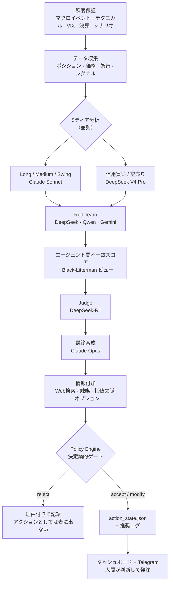

# ALMANAC

*[English](README.md)*

**ALMANAC** は、個人のポートフォリオ運用を支援するAIアシスト型の資産管理・リスク管理システムです。Pythonバックエンドと Next.js ダッシュボードを組み合わせ、実際の長期投資口座に対して日次のポートフォリオ分析・銘柄スクリーニング・規律あるリスク管理を行います。AIの提案と実際の発注の間には、必ず決定論的なガードレールが挟まる設計です。

**自動売買botではありません。** このコードベースのどこにも証券会社への発注APIはありません。AIが提案し、ポリシーエンジンがその提案を通すか止めるかを判定し、実際の発注は人間が証券会社の画面で行います。

このリポジトリは、そのシステムの**公開用に匿名化したスナップショット**です。実運用データ・認証情報・保有者を特定しうる情報は意図的に除外しています（詳細は [公開リポジトリの安全性](#公開リポジトリの安全性public-repository-safety)）。

## できること

目的関数は明文化されバージョン管理されています（[`objective.md`](objective.md)）：**税引後・手数料控除後・円建ての時間加重収益率（TWR）を、グローバル株式60%／グローバル債券40%のベンチマークに対して最大化する**こと。これはVaR・ドローダウン・VIX連動のサーキットブレーカーといったハードな制約下にあり、これらはLLMの判断ではなく決定論的なポリシーエンジンが強制します。

| 領域 | 内容 |
|---|---|
| **ポートフォリオ・リスク** | LLM生成ビューを用いたBlack-Litterman最適化、GJR-GARCHによるボラティリティモデリング、相場レジーム判定（強気／中立／弱気／クラッシュ）、集中リスク・人的資本エクスポージャーの上限管理 |
| **AI判断支援** | Claude + DeepSeekによるマルチモデル分析（タスクごとにコスト最適なモデルを選択）。トリム・買い増し・リバランス・損出しといったケース別判断を、発注に至る前に必ず決定論的ポリシーでゲーティング |
| **スクリーニング・シグナル** | 日米のファンダメンタルズ長期スクリーニング、開示（EDINET／TDnet／EDGAR）起点のカタリスト検知、信用・空売り候補スクリーニング、インサイダークラスター・IPO監視 |
| **執行・ガードレール** | 日次／月次ドローダウンのサーキットブレーカー、VaR・VIX連動の発注ブロック、監査用のappend-onlyイベント台帳、既存注文を考慮したポジションサイジング |
| **税務・口座管理** | FIFO/LIFO/損出し/利益最小化の税ロット戦略、NISA枠の追跡、持株会（従業員株式制度）の集中度管理 |
| **可観測性** | ベンチマーク対比のNAV/TWR実績追跡（Modified Dietz法によるキャッシュフロー調整済みの近似値。日次sub-period計算による厳密なTWRではない）。固定的な実績主張ではなく、実測値をそのまま示す検証ページ |

## 動作原理

このシステムの中心は、市場データを少数の「人間が実行できる具体的な提案」に変換する日次パイプラインと、**その提案の大半を捨てる決定論的なゲート**です。

### 1. 日次ループ



各段階には理由があります。

**まず鮮度を保証する。** ゲートが依存する入力 — マクロイベント暦、テクニカル状態、VIX、決算接近、シナリオスナップショット — は分析開始**前**にすべて再生成します。古い暦をそのまま読むと「重要イベントなし」と黙って解釈され、決算ブラックアウトが発動するかしないかの差になるからです。更新失敗は握り潰さず出力し、暦の欠落は「問題なし」ではなく `review` として扱います。

**汎用1体ではなく専門5体。** ポートフォリオを保有意図（長期コア / 中期 / スイング）で分割し、さらに信用買い・空売りの2レーンを加えます。各々が固有のプロンプトと固有のリスク語彙を持ちます。並列実行され呼び出し単位でタイムアウトを持つため、1ティアの失敗はそのレーンの劣化に留まり、実行全体は落ちません。

**敵対的レビュー。** ティア出力は**別系統のモデル**（DeepSeek / Qwen / Gemini）による Red Team に渡され、推論を攻撃させます。ベンダーを分けるのは意図的で、同系統のモデルは盲点を共有しやすいためです。エージェント間の不一致スコアを算出して後段に引き継ぐので、合意だけを見て分岐点を見失うことがありません。

**Judge、そして合成。** 推論モデル（DeepSeek-R1）が裁定し、Claude Opus が構造化された結果に最終合成します。合成呼び出しは forced tool use を使うため、出力はパースが必要な散文ではなく検証済みオブジェクトです。トークン上限で切断された応答は「部分的な答え」として採用せず、明示的に拒否します。

**情報付加は最後。** ここまで生き残った提案に対してのみ、最新ニュース・触媒仮説・チャート由来の指値文脈・オプションシグナルといった執行の詳細にコストを払います。

### 2. なぜ複数モデルなのか

モデル選択は単一のレジストリ（`model_router.py`）に集約され、**ロール**を**ティア**に対応づけます。どのモジュールもモデルIDを直書きしません。環境変数1つ（`ALMANAC_BUDGET_MODE=eco|normal|premium`）で全ロールが一斉に切り替わります。

| ロール | モデルティア | 理由 |
|---|---|---|
| 最終合成 | Claude Opus | 誤りが全提案に伝播する唯一の呼び出し |
| Long / Medium / Swing | Claude Sonnet | 量は多いが品質も要る本体分析 |
| 信用買い / 空売り | DeepSeek V4 Pro | 信用側の一次判断。採否は最終合成が決める |
| スクリーナー予選 | DeepSeek | 多数の候補を広く安く一次通過させる |
| スクリーナー第二意見 | Claude Sonnet | BUY上位だけが高価な精査を受ける |
| Red Team | DeepSeek / Qwen / Gemini | 相関しない批判を得るため意図的にベンダーを分散 |
| チャット / 差分監視 | Claude Haiku | 高頻度・低リスク |

経済的な形はファネルです。安いモデルが全部を見て、高いモデルは生き残ったものだけを見る。全呼び出しはトークン使用量と推定コストを共有台帳に記録するため、支出は「たぶんこのくらい」ではなく実測値になります。

### 3. ゲート

**ここが「トレードを提案するLLM」との分かれ目です。** 提案されたアクションは、順序付きの**決定論的ルール連鎖**を通ります。素のPythonで、この経路にモデルは介在しません。ルールはアクションを reject するか、modify（緊急度の降格・サイズ半減）できます。

| ルール | 内容 |
|---|---|
| `ledger_integrity` | 台帳が不整合なら何も通さない（fail-closed） |
| `var_budget` | 事前1日95% VaR が予算超過 → 新規買い**全て** reject |
| `dd_stage` | ドローダウン ≤ −8% → 新規買い全停止 / ≤ −5% → 緊急度降格 + サイズ半減 |
| `leverage_block` | レバレッジが warning/deleverage/emergency → 新規信用建て禁止 |
| `earnings_blackout` | 決算5営業日以内 → その銘柄の buy / add / DCA を reject |
| `freshness_downgrade` | 入力が古い → 信用せず降格 |
| `cvar_unstable` | テールサンプル不足で CVaR 推定が不安定 → 信用買い禁止 |
| `vix_extreme` | VIX ≥ 40 → 投機系を reject、buy の緊急度を降格 |

個々の閾値より重要な設計判断が2つあります。

- **fail-open ではなく fail-closed。** 入力の欠落や読み取り失敗は「異議なし」ではなく「許可しない」として扱います。複数のルールが `False` と `None` を明示的に区別しているのはこのためです。
- **却下は捨てずに記録する。** reject / modify されたアクションは理由とともに分析結果に書き出されるため、ゲートの挙動は事後監査できます。「期待した売買がなぜ出てこなかったか」を後から問えます。

閾値自体も恣意的な値ではなく、[`objective.md`](objective.md) — 何を最適化するかを定義したバージョン管理下の文書 — から導出されます。制限を変えるにはまずこの文書を変える必要があります。

### 4. 提案から約定まで

**このリポジトリに証券会社の発注APIはありません。** ループは人間を経由して閉じます。

```
提案 → readiness 判定（ready | review | blocked） → 人間が証券会社で発注
     → 人間が約定を記録 → executed | partial → イベント台帳 → ポートフォリオ反映
```

約定の記録とポートフォリオへの適用は意図的に分離しています。口座・経路が一意に確定できない約定は、**起きた事実として保存**したうえで `portfolio_application_pending` として保留し、推測で誤った口座に書き込みません。帰属を誤ると、税務ロット・NISA枠・パフォーマンス数値のすべてが静かに壊れるからです。書き込みはクライアント生成キーで冪等化されており、フォームの二重送信が2件の約定になることはありません。

### 5. パフォーマンスの測り方

このシステムは結果を主張するのではなく、自分を採点します。日次で NAV を記録し、時間加重収益率（サブ期間厳密なTWRではなく、キャッシュフロー調整の Modified Dietz 近似）を、世界株式60% / 世界債券40% のベンチマークに対して算出します。目的関数は**税引後・手数料後・JPY建て** — 国内分離課税と米国配当源泉税をモデル化し、USD建ては日次終値で円換算します。

ダッシュボードの検証ページは、実測値そのものを報告します。計測期間が短すぎる・汚染されていて結論を出せない場合はそう表示します。別途、watchdog がデータ鮮度・スキーマ変化・台帳整合性・バックアップ状態・ディスク残量を定期チェックし、本当に対処が必要な問題だけを通知します。

### 6. 壊れたときの挙動

劣化は暗黙にせず明示します。タイムアウトしたティアは実行を degraded として出力に明記し、切断されたLLM応答はパースせず拒否し、古い入力は信用せず降格させ、安全モジュールを import できなければ無監査で進まず呼び出しを拒否します。一貫している原則は、**自信のある誤りを出すくらいなら何も推奨しない**ことです。

## アーキテクチャ

- **バックエンド** — Python 3.12 / FastAPI。ポートフォリオ最適化（[PyPortfolioOpt](https://github.com/robertmartin8/PyPortfolioOpt)、[riskfolio-lib](https://riskfolio-lib.readthedocs.io/)、[skfolio](https://skfolio.org/)）、GARCHリスクモデリング（[arch](https://arch.readthedocs.io/)）、FinBERTセンチメント分析（`transformers` / `torch`）、AI分析にClaude（Anthropic）とDeepSeekを使用。
- **フロントエンド** — Next.js 16（App Router）/ React 19 / TypeScript。ポートフォリオ・スクリーニング・リスク・シナリオ・戦略・信用取引・NISA・AI判断支援・執行ログ・パフォーマンス検証ページを1つのコンソールに統合。
- **プライバシー層** — ALMANACはローカルで動作しますが、設定されたAI機能の一部は、保有銘柄・数量・損益・配分などのポートフォリオコンテキストを外部LLMへ送信します。公開・匿名化データのみを扱うことを意図した非Anthropic経路（開示特徴量抽出・アナリスト間の討論・Red Team・スクリーニング）は、許可リスト方式のゲート（`almanac/llm_safety.py`）を通ります。一方、「book-aware」と呼ばれる別経路（チャットアシスタント・ケース別の判断支援・一部のガードレール通知）は、設計上ポートフォリオ情報をAnthropicへ（一部はDeepSeekへも）送信し、その利用を記録します。何がローカルから一切出ないかは [公開リポジトリの安全性](#公開リポジトリの安全性public-repository-safety) を参照してください。

## 設定（Configuration）

`.env.example` を `.env` にコピーし、必要な項目だけ埋めてください。コードを読むだけなら何も設定は不要です。実際にシステムを動かす場合にのみ関係します。

**AI機能に必須**

| 変数 | 用途 |
|---|---|
| `ANTHROPIC_API_KEY` | Claude — AI判断支援・ケース分析・LLM生成ポートフォリオビューの中核 |
| `DEEPSEEK_API_KEY` | DeepSeek — コスト効率重視のスクリーニング・長期スキャン処理 |

**任意**

| 変数 | 用途 |
|---|---|
| `FRED_API_KEY` | マクロ経済データ（FRED）— レジーム判定・リスク文脈に使用 |
| `FINNHUB_API_KEY` | 補助的な市場データ |
| `GEMINI_API_KEY`, `GOOGLE_AI_API_KEY` | 代替LLMバックエンド |
| `GROQ_API_KEY` | 高速推論の代替LLMバックエンド |
| `OPENROUTER_API_KEY` | LLMルーティング／代替バックエンド |
| `TELEGRAM_TOKEN`, `TELEGRAM_BOT_TOKEN`, `TELEGRAM_CHAT_ID` | アラート・日次ブリーフィングのプッシュ通知 |
| `ALMANAC_API_KEY`, `NEXT_PUBLIC_ALMANAC_API_KEY` | 書き込み系エンドポイント（取引記録・チューニング変更）の認証キー。閲覧のみなら不要 |
| `ALMANAC_ESPP_*` | 持株会（従業員株式制度）追跡設定。既定は全て無効（`0`） |
| `ALMANAC_CONTRIBUTION_SCHEDULE_JSON` | 定期積立の設定。既定は空 |
| `ALMANAC_CLEAN_NAV_SINCE`, `ALMANAC_MIN_CLEAN_DAYS` | パフォーマンス計測期間の衛生設定 |
| `ALMANAC_PRIVACY_MODE` | 「book-aware」な外部LLM呼び出し（チャット・判断支援・ガードレール通知・日次最終統合）をゲートする。詳細は下記 |

### プライバシーモード

一部のAI機能は、設計上ポートフォリオコンテキスト（保有銘柄・残高・損益）を外部モデルへ送信します（該当箇所は [公開リポジトリの安全性](#公開リポジトリの安全性public-repository-safety) を参照）。`ALMANAC_PRIVACY_MODE` は、それらの呼び出しをそもそも実行してよいかを制御します。

| 値 | 効果 |
|---|---|
| `strict_local`（既定） | book-awareな呼び出しは一切外部へ出ない。チャット・判断支援・ガードレール通知・最終統合の各経路は、外部呼び出しの代わりにローカルの「無効化」応答を返す |
| `anthropic_book_aware` | Anthropicへのbook-aware呼び出しのみ許可 |
| `multi_provider_book_aware` | 設定済みの全プロバイダへのbook-aware呼び出しを許可（このコードベースの元々の、ゲート導入前の挙動） |

公開・匿名化データの呼び出し（スクリーニング・開示特徴量抽出）はこの設定の影響を受けません。そもそもポートフォリオ情報を含まないためです。`assert_book_aware_allowed()` でゲートされている呼び出し箇所は全て `tests/test_llm_call_site_gating.py` で列挙・回帰テストされています。

## 公開リポジトリの安全性（Public Repository Safety）

このリポジトリは、ローカルのポートフォリオ状態・証券会社からのエクスポート・データベース・ログ・スクリーンショット・ローカルAIツールのセッション・APIキーを意図的に含んでいません。

`holdings.json`・`account.json`・`nisa_portfolio.json`・`trade_history.csv`・`almanac.db` などはGitで無視され、ローカル環境の外に出ることはありません。ドキュメント中の数値例は実際の金額ではなく、丸めたプレースホルダーを使用しています。`scripts/check_public_safety.py` は、既知の個人識別情報やシークレットキーのパターンをトラッキング対象ファイルから検出するスクリプトで、pushの前に実行する想定です。

このプロジェクトをフォークして独自に公開する場合は、公開前にローカルツールの設定へ一度でも貼り付けた・コミットしたトークン類を必ずローテーションしてください。

## はじめかた

### バックエンド

```bash
python3 -m venv venv
source venv/bin/activate
pip install -r requirements.txt

# APIキーは ~/.almanac_secrets（シェル形式の KEY=VALUE、1行1項目）から
# 読み込まれます。プロジェクト直下の .env ファイルではありません — この
# リポジトリのどこもdotenvを読み込んでいません。
cp .env.example ~/.almanac_secrets
chmod 600 ~/.almanac_secrets

python scripts/init_private_state.py   # examples/ から少額のデモ値
                                        # （サンプルの現金・SPY）を投入。
                                        # 実際のポートフォリオではない

./start_v5.sh                      # FastAPIのみ:8000で起動（ダッシュボードは下記）
```

`start_v5.sh` はFastAPIバックエンドだけを起動します。スクリプト自身のコメントにある通り、Next.jsダッシュボードは別管理が前提です（元の環境ではmacOSのLaunchAgent）。ダッシュボードを自分で動かすには:

```bash
cd frontend
npm install
npm run dev                        # http://localhost:3000（上記のFastAPIバックエンドと通信）
```

書き込み系エンドポイントには `ALMANAC_API_KEY`（または `~/.config/almanac/api_key` のキーファイル）が必要です。

## ディレクトリ構成

```
almanac/                 コアパッケージ — ランタイム設定・LLM安全層・DBマイグレーション・可観測性
analyst/                 LLM分析パイプライン（マルチモデル・ケース別）
api/                     FastAPIルート
frontend/                Next.jsダッシュボード
examples/private_state/  ローカル専用状態ファイルのテンプレート（コミットされない）
tests/                   pytestスイート
```

その他のトップレベルの `.py` ファイルの多くは、パッケージの一部というより単機能モジュール（スクリーナー、データ取得、ポリシー/リスクエンジン、税務ツール等）です。詳細は各ファイルのdocstringを参照してください。

## 免責事項

これは個人が自身のポートフォリオのために構築した個人プロジェクトです。投資助言ではなく、第三者による正確性の監査も受けていません。中身に興味のある方向けにそのまま公開しているものであり、利用は自己責任でお願いします。

## ライセンス

[MIT](LICENSE)
