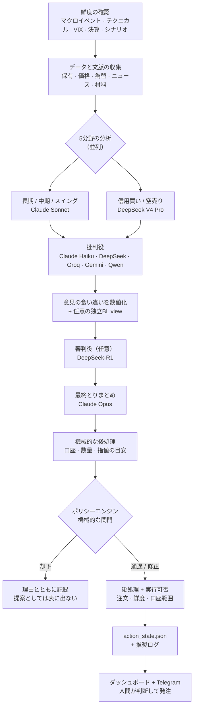

# ALMANAC

*[English](README.md)*

**ALMANAC** は、個人の資産運用を支えるAI活用型の管理システムです。Python のバックエンドと Next.js のダッシュボードを組み合わせ、実際に運用している長期投資の口座に対して、日々の分析・銘柄探索・リスク管理を行います。

いちばんの特徴は、**AIの提案がそのまま売買につながらない**ことです。AIの提案と実際の発注のあいだには、必ず機械的なルールによる関門が入ります。

**自動売買botではありません。** このコードのどこにも、証券会社へ注文を出すAPIはありません。AIが案を出し、機械的なルール（ポリシーエンジン）が通すか止めるかを判定し、最後は人間が自分で証券会社の画面から発注します。

このリポジトリは、そのシステムを**公開用に匿名化したスナップショット**です。実運用のデータ、認証情報、保有者が特定できる情報は入れていません（詳しくは [公開リポジトリの安全性](#公開リポジトリの安全性public-repository-safety)）。

> **これは何で、何ではないか:** すぐ使える製品でも、安定した公開APIでもありません。「こういう考え方で作るとこうなる」という参考実装であり、今も変わり続けている個人用システムです。まずデモ用の状態で動かし、ルールの中身を確かめたうえで使ってください。ファイル形式や運用手順は変わることがあります。

## できること

このシステムが何を目指すかは、[`objective.md`](objective.md) に文章として明記し、バージョン管理しています。目標は **税金と手数料を引いたあとの、円建ての運用成績（TWR）を最大化する**ことです。比較対象は「世界株式60%＋世界債券40%」の組み合わせ。ただし損失やリスクには上限を設けていて、その上限を守らせるのはAIの判断ではなく、機械的なルールです。

公開版の初期状態は「全商品OFF」ではありません。**計算・観測を常時動かすこと**と、**実際の提案を変更する権限**を分けています。現物株・非レバレッジETF・投信は稼働、信用買い・空売り候補は安全関門を満たす場合だけ、オプションは分析シグナルだけ、half-Kelly と FX ヘッジは影実行、税務取得費は新旧比較、GINN は検証済みモデルが昇格した場合だけ使い、それ以外は GJR-GARCH へ戻ります。execution-plan の関門は observe から始まり、どのモードにも証券会社への自動発注権限はありません。完全な有効化契約は [`objective.md`](objective.md#8-機能商品の有効化契約) にあります。

ダッシュボードの**システム**画面は、静的な機能一覧ではなく、稼働状態の棚卸しです。空売り・信用買い候補、オプション指標、相場レジーム、GINN、凍結済み分析入力、証券会社照合、税務取得費、AIプライバシー、Kelly・FX影実行、通貨方針、実行計画、Auto Tuneについて、設定状態と実効状態、停止理由、権威となる入力、最終確認時刻、鮮度、ジョブのheartbeatを表示します。**変更可能なのは日米の空売り候補スイッチだけ**です。それ以外は参照専用で、変更権限を持つstate・環境変数・検証関門と変更場所を明記します。

空売りの各レーンでは、意味の違う数を混ぜません。設定ユニバース、**米国はproxy適格率**、**日本株は実データの貸借可能率**、直近の価格取得率、検出候補数、銘柄単位の借株関門を通った候補数を別々に表示します。証券会社データや価格が欠けた場合は、その銘柄だけを fail-closed で除外し、それだけでレーン全体をOFFとは判定しません。必須入力が欠損または期限切れならレーンを安全停止し、価格取得率が低い場合は劣化警告として表示します。実行時の上書きは Git 対象外の `feature_control_state.json` に保存します。商品・口座のON/OFFと相場レジーム上の推奨は別です。空売り商品がONでも、強気相場では広範な方向性ショートを抑えつつ、借株確認済みの過熱候補を人間確認用に残せます。ONにしても鮮度・規制・流動性・踏み上げ・インサイダー関門は迂回せず、注文は人間実行のままです。

この構成では、ALMANACへ読み込んだ確認済み現金をすべて余剰投資資金として扱い、システム内の生活防衛用現金は0円です。ただし相場に応じて戦術的に現金を残すことはあり、保護額を0円にしても口座・鮮度・発注意図・受渡・税・手数料・必要保証金を確認する既存関門は無効になりません。実行計画が配備できるのは戦術現金目標を超える分だけで、さらに月次ペース上限を適用します。当月の買付はその枠を消費し、翌月に自動再計算します。現金の権威は経過時間ではなくイベントで管理し、時間が過ぎただけでは確認済み残高を失効させませんが、後続の未照合口座イベントがあれば再確認が必要です。家計の生活防衛資金は、このシステムが表す投資口座の外で管理する前提です。

> **TWR（時間加重収益率）** — 入金や出金の影響を取り除いた運用成績の指標です。たとえば給料日に大きく入金すると資産額は増えますが、それは運用がうまくいったからではありません。TWRはそういう「お金の出し入れ」を除いて、投資判断そのものの良し悪しを測ります。以降に出てくる専門用語は [用語集](#用語集) にまとめてあります。

| 領域 | 内容 |
|---|---|
| **ポートフォリオ・リスク** | 独立alpha viewを使う任意の配分最適化（Black-Litterman）、値動きの荒さの予測（GJR-GARCH）、相場の局面判定（強気／中立／弱気／暴落）、1銘柄への偏りすぎと勤務先関連の資産偏重のチェック |
| **AI判断支援** | Claude と DeepSeek を用途ごとに使い分けたマルチモデル分析。「一部売る」「買い増す」「配分を戻す」「損を確定して税負担を減らす」といった個別判断を扱いますが、発注に至る前に必ず機械的ルールの関門を通します |
| **スクリーニング・シグナル** | 日米株の長期スクリーニング、企業の開示情報（EDINET／TDnet／EDGAR）を起点とした材料の検知、信用取引・空売り候補の抽出、インサイダー売買の集中やIPOの監視 |
| **執行・ガードレール** | 日次・月次の損失が一定を超えたら取引を止める仕組み、リスク指標に基づく発注ブロック、追記型の履歴台帳と照合検査、未約定の注文を考慮した数量計算 |
| **税務・口座管理** | 取得履歴の監査、総平均取得価額への移行経路、本人・口座単位のNISA計画、持株会（従業員株式制度）の偏り管理 |
| **可観測性** | ベンチマークと比較した運用成績の記録。「これだけ儲かる」と主張するのではなく、実測値をそのまま出す検証ページを用意しています |

## 前提としているもの

導入を検討する段階で知っておくべきことです。

**日本の個人投資家向けです。** 目的関数は円建て、税計算は国内の分離課税 20.315% と米国配当源泉税 10%、非課税枠は NISA、開示情報は EDINET と TDnet。これらは設定で切り替えられるものではなく、設計に埋め込まれています。他の国で使うなら、税務・非課税枠・国内開示まわりは作り直しになります。

**マシンが動き続けている必要があります。** 定期実行が前提で、その時刻に起きていなければ実行されません。取りこぼしたときの影響は [「動かし続けるということ」](#5-動かし続けるということ) に書きました。

**運用にお金がかかります。** LLM の利用料です。参考環境の45日分のログでは、**1日あたり中央値 $0.91、月額にして $27 前後**でした。平均は $1.50 で、開発作業をした日に引っ張られています（最大 $13.63/日）。使うモデル構成（`ALMANAC_BUDGET_MODE`）と有効にする機能で変わります。

**価格データは yfinance に依存しています。** 61個のモジュールが使っており、事実上の基盤です。Yahoo Finance の非公式ライブラリなので、先方の仕様変更で壊れることがあります。壊れるとスクリーニングと事後検証が止まります。`FINNHUB_API_KEY` は補助的なデータ源で、完全な代替ではありません。

**手作業は残ります。** 発注は人間が行い、約定の記録も人間が入力します。自動化されているのは「何をすべきか」を出すところまでです。

## 動作原理

このシステムの中心にあるのは、**市場データを「人間が実行できる少数の具体的な提案」に変える日次の処理の流れ**と、**その提案をユーザーに届く前に却下・修正できる機械的な関門**です。

### 1. 一日の流れ



各段階には、そうしている理由があります。

**まず情報を最新にする。** 関門が判断に使う材料 — 経済イベントの予定、テクニカル指標、VIX（後述）、決算の近さ、相場シナリオ — は、分析を始める**前**に鮮度を確認し、それぞれの期限を超えている場合に作り直します。

理由は単純で、古い予定表をそのまま読むと「重要なイベントは近くにない」と誤解してしまうからです。その誤解ひとつで、決算前に買いを止める仕組みが働くかどうかが変わります。更新に失敗したら黙って握りつぶさず表示し、予定表が見つからない場合は「問題なし」ではなく「要確認」として扱います。

その後、2段階の **decision snapshot（判断材料の凍結記録）**を作ります。base snapshot は保有・現金・価格・為替・マクロ・ニュース・スクリーニング、候補確定後の enriched snapshot は保有銘柄と候補銘柄のチャート・オプション情報を含みます。材料抽出やtier分析を始める前に、その実行全体で1つだけ使う`analysis_id`を発行し、材料レイヤー・全tier・最終とりまとめ・action・段階ログ・2つのsnapshotへ同じIDを渡します。全tierと最終とりまとめには同じ内容ハッシュ・出所時刻・payloadハッシュを渡し、enriched snapshot 確定後の外部再取得を禁止します。注文直前の価格・spread・市場状態だけは別の execution-quote snapshot で更新できますが、できるのは再値付けか review/block への格下げまでで、投資理由やconfidenceを書き換えることはできません。

**なんでも屋を1つ置くより、専門を5つ置く。** 保有の目的ごとにポートフォリオを分けます（長期の中核・中期・短期のスイング）。さらに信用買いと空売りの2つを加えて、合計5分野です。それぞれに専用の指示文と、専用のリスクの見方を持たせています。

5つは同時に走り、1つずつに制限時間があります。1つが時間切れになっても、影響はその分野だけに留まり、その日の分析全体は止まりません。

**わざと批判させる。** 5分野の結果は「批判役」に渡され、その推論を攻撃させます。役割ごとに扱える情報が違います。Claude Haiku の担当は保有情報を見たうえで批判できます。外部ベンダーの担当は公開情報か匿名化した情報だけを扱い、APIキーが設定されていれば DeepSeek・Groq・Gemini・Qwen を使います。

ベンダーを意図的にばらしているのは、**同じ系統のモデルは同じ見落とし方をしやすい**からです。批判役どうしの意見がどれだけ食い違ったかを数値にして次の段階へ渡すので、まとまった結論だけを見て「どこで意見が割れたか」を見失うことがありません。

**審判役（あれば）、そしてとりまとめ。** `DEEPSEEK_API_KEY` が設定されていれば、DeepSeek-R1 が判定役として入ります。このとき渡すのは匿名化した提案だけで、銘柄コードもアナリスト役が書いた理由の文章も渡しません。この段階は必須ではなく、使えなければ飛ばすだけで、全体は止まりません。

そのあと Claude Opus が最終的なとりまとめを行います。

ここでは「指定した形式でしか答えられない」呼び出し方をするので、返ってくるのは解釈の要る文章ではなく構造化されたデータです。まれにモデルが普通の文章で返すことがあり、その場合はJSONを取り出す代替経路が働きます。どちらを通っても、そのあと「中身が空でないか」「行動項目が揃っているか」を機械的に検査します。

さらに、**出力の途中で文字数上限に達して切れた応答は、たとえ中身が入っていても採用せず捨てます**。中途半端な答えを「そういう結論だった」と読み違えないためです。

**判断材料はtierを呼ぶ前に凍結し、執行の詳細は後で付けます。** ニュース・材料・チャート・オプションは、どれも enriched decision snapshot に入れてから最初のtier LLMを呼びます。構造化された提案が返ってきたあとで、機械的なコードが口座・数量・指値の目安を付け、それから関門に渡します。外部由来の主張にはURLと公表・観測・取得時刻、snapshot由来にはsnapshot上の出所、計算値には入力claim IDと計算versionを付けます。出所を確認できない主張を含むactionはreviewへ格下げします。

### 2. いつ何が動くか

`launchagents/` に入っているのは、macOS用の**自動実行設定の例**です。セットアップ時に自動登録されるものではありません。各ファイルの `/path/to/ALMANAC` を自分の場所に直し、使うジョブだけを読み込むと、平日に次の周期で動きます。時刻は日本時間です。

| 時刻 | 処理 |
|---|---|
| 06:15 | AI分析（前節の「一日の流れ」まるごと） |
| 16:30 | TDnet の適時開示を取り込む |
| 16:45 | EDINET の提出書類を取り込む |
| 17:10 | 開示情報をもとにシャドーブックを更新 |
| 23:00 | その日の資産評価額を記録 |
| 23:05 | ベンチマークとの比較を再計算 |

朝の分析を 06:15 にしているのは、東京市場が開く前に判断を出しておくためです。開示の取り込みが 16:30〜17:10 に固まっているのは、東京市場が閉じたあとにその日の開示が出そろうからです。

スクリーニングと閾値調整は、これとは別の周期で動きます（後述）。

### 3. 銘柄を探す（スクリーニング）

前節までの「一日の流れ」は、**すでに保有している銘柄をどうするか**が中心です。新しい候補を探すのはまったく別の仕組みで、狙う対象ごとに専用のスクリーナーが分かれています。

| スクリプト | 何を探すか |
|---|---|
| `screener.py` | モメンタム（勢いのある銘柄） |
| `short_screener.py` | 空売り候補。相場の局面ごとに条件を変える |
| `margin_long_screener.py` | 信用買い候補 |
| `long_term_screener.py` | 長期のファンダメンタルズ |
| `news_screener.py` | ニュースの感情分析 |
| `social_screener.py` | SNSの話題 + オプション市場の異常 |
| `pair_screener.py` | ロング・ショートのペア取引シグナル |
| `screener_shadow_book.py` | 上記が挙げた候補の**その後の成績を実際に計測**（発注はしない。§11を参照） |

**いつ動かすか**

時間帯を分けているのには理由があります。

- **朝 06:00〜06:05**（平日）— `--us-only --morning` を付けて米国株だけを見ます。前夜に米国市場が閉じた直後の値を使い、東京市場が開く前に候補を用意するためです
- **15:30**（平日）— `--jp-only` で日本株だけ。東京市場の引け時刻です
- **夕方 18:00〜19:15**（平日）— 制限なしの本番実行。モメンタム → 計測 → ニュース → ペア/空売り → SNS → 信用買い の順に10〜15分ずらして流します。同時に走らせて市場データAPIを叩きすぎないためです
- **長期は日曜と木曜の 07:00** — 週2回

**モメンタム系の中身は2段構え**

1. まず DeepSeek を1回だけ呼び、その1回の中で強気・弱気・マクロの3つの視点を展開させて、全候補に BUY / WATCH / SKIP を付けます
2. そのうち **BUY 上位3件だけ**、Claude Sonnet が第二意見を出します

以前は Claude Sonnet を3並列で走らせて Opus が統合していましたが、呼び出し回数が多く割に合わなかったため、この形に置き換えました。ここでも「安く広く → 高く狭く」というふるいの発想は同じです。

**長期スクリーナーの中身**

対象銘柄は自分で決めます。`tickers.json` の `long_term_universe` から読み込む形で、このファイルは gitignore 対象、同梱テンプレート（`examples/private_state/`）は空です。参考までに、開発環境では約120銘柄（米国は全セクター、日本株はテック以外）を対象にしています。10個の指標を合計160点満点で採点します。

| 指標 | 配点 |
|---|---|
| EPS成長 | 25 |
| ROE（自己資本利益率） | 20 |
| 売上成長 | 15 |
| 粗利率 | 15 |
| FCF利回り（自由に使える現金の割合） | 15 |
| PEG（成長率に対する割高さ） | 15 |
| アナリスト評価 | 15 |
| テクニカル | 10 |
| 優先セクターへの加点 | 10 |
| インサイダー保有・株主還元余力 | 10 |

投資テーゼの文章生成には Anthropic の Batch API を使います。これは「送信して、あとで取りに行く」非同期の仕組みで、現在は入出力トークンに[50%のバッチ割引](https://docs.anthropic.com/en/docs/about-claude/pricing#batch-processing)があります。そのため**提出（日曜・木曜）と回収（月曜・金曜の 08:30）が別のジョブ**に分かれています。急がない処理なので、遅くて安いほうを選んでいます。

これらの実行時刻は [`examples/crontab.example`](examples/crontab.example) にまとめてあります。

### 4. 開示から材料へ

企業が出す開示（決算短信・適時開示・大量保有報告など）は、そのままでは「文書」であって判断材料になりません。数字に変換する工程が要ります。

| 段階 | スクリプト | 内容 |
|---|---|---|
| 取り込み | `ingest_disclosures.py` | EDINET・TDnet から当日分を取得 |
| 特徴量抽出 | `disclosure_feature_extractor.py` | 文書から根拠つきの数値特徴を取り出す |
| 評価 | `disclosure_feature_promotion.py` | 月次ガバナンス向けに、昇格・維持・廃止の判定案を作る |
| 補強 | `disclosure_enrich.py` | 追加の文脈を付ける |
| 追跡計測 | `disclosure_shadow_book.py` | 手数料込みで「もし従っていたら」を記録 |

肝は、抽出した特徴が最初は **observe_only（観察のみ）** として入ることです。

昇格判定のスクリプトは、開示の種類ごとにその後の超過収益と突き合わせます。ただし**作るのは判断材料だけ**で、設定を書き換えたり、特徴量をそのまま発注候補に変えたりはしません。採用するかどうかは、月次のガバナンスで人が決めます。

観察中の材料を小さく試したい場合のために、別の限定経路もあります。通れる条件は2つです。

1. 最終とりまとめが「どの材料か」「なぜか」「暫定判断である」ことを明示している
2. 後段の機械処理が、確信度の下限と金額の上限を満たすと確認した

この2つを満たしたものだけが、暫定的な提案として通常の関門へ進みます。`observe_only=true` のまま素で上がってきた提案は却下されます。

つまりこの領域には、**測る／正式に昇格させる／上限つきで試す**という3つの別々の仕組みがある、ということです。

抽出プロンプトにはバージョン番号が付いています。プロンプトを書き換えたとき、前の版で取った特徴と混ざらないようにするためです。

### 5. なぜ複数のAIを使うのか

役割ごとのモデル選択は `model_router.py` にまとめてあります。`ALMANAC_BUDGET_MODE=eco|normal|premium` を切り替えると、役割から決まった Claude のグレードが一段上下します。

ただし全部が変わるわけではありません。リスクの低い定型処理、接続失敗時の代替モデル、外部ベンダー担当の役割は対象外です。この例外は、隠さず各呼び出し箇所に書いてあります。

| 役割 | モデル | 理由 |
|---|---|---|
| 最終とりまとめ | Claude Opus | ここでの誤りは全提案に波及する。唯一の一発勝負 |
| 長期 / 中期 / スイング | Claude Sonnet | 件数は多いが、質も落とせない本体の分析 |
| 信用買い / 空売り | DeepSeek V4 Pro | 一次判断を担当。採用するかは最終とりまとめが決める |
| スクリーニング予選 | DeepSeek | 大量の候補を広く安くふるいにかける |
| スクリーニング第二意見 | Claude Sonnet | 買い候補の上位だけが高いモデルの精査を受ける |
| 批判役 | Claude Haiku / DeepSeek / Groq / Gemini / Qwen | 保有情報を見られるAnthropic担当と、公開情報だけの他社担当を組み合わせる |
| チャット / 差分監視 | Claude Haiku | 回数が多く、1回あたりの重要度は低い |

要するに**ふるいの構造**です。安いモデルが全部に目を通し、高いモデルは生き残ったものだけを見る。

費用は実測できます。分析・スクリーニング・開示処理・監視といった主要な経路が、トークン使用量と推定コストを共通のログへ書き出すためです。ただし記録されるのは計装済みの経路だけで、支出のすべてを捕捉しているわけではありません。

### 6. 関門

**ここが「売買を提案するだけのAI」との分かれ目です。**

提案された行動は、順番の決まったルールの列を通ります。中身はただのPythonで、**この判定にAIは一切関与しません**。各ルールは、その行動を却下するか、修正（緊急度を下げる、数量を半分にする）できます。

| ルール | 内容 |
|---|---|
| `ledger_integrity` | 履歴台帳につじつまが合わない箇所があれば、実行できる提案を一切通さない |
| `var_budget` | 想定される1日の損失（VaR、95%水準）が上限以上なら、新規の買いを**すべて**却下。上限は相場で動きます（弱気・ストレス時 1.2% ／ 通常 1.6% ／ 強気確認かつ VIX<25 で 2.0%）。環境変数で緩めても 2.3% は超えられません |
| `dd_stage` | 資産の落ち込みが −8% 以下なら原則として新規の買いを停止。−5% 以下なら緊急度を下げ、数量を半分に。積立の階段買いだけは例外だが、それも上限管理下に置く |
| `leverage_block` | 借入の状態が警戒・縮小・緊急のいずれかなら、新規の信用建てを禁止 |
| `earnings_blackout` | 決算発表の5営業日前からは、その銘柄の買い・買い増し・積立を原則却下。よほど確信度の高いイベント狙いだけは例外だが、後段で上限をかける |
| `freshness_downgrade` | 判断材料が古ければ、そのまま信じずに格下げする |
| `cvar_unstable` | 実データが少なく極端な損失を見積もれない場合は信用買いを完全に止める。単に運用履歴が短いだけの場合は、恒久的に止めるのではなく数量を縮める |
| `vix_extreme` | VIX が 40 以上なら投機的な取引を却下し、買いの緊急度を下げる |

個々の数値より大事な設計判断が2つあります。

**安全性が答えに依存するところでは「止める」側に倒す。** ポリシー判定そのものが失敗した、または安全上必須の材料が欠けている場合は、「特に問題なし」とせず対象の提案を止めます。一方、重要度の低い材料の鮮度不足は「要確認」への格下げで扱う場合もあります。コード上で「偽（`False`）」と「不明（`None`）」をわざわざ区別しているのは、不明を安全と取り違えないためです。

**却下したものは捨てずに残す。** 却下・修正された提案は、その理由とともに分析結果に書き出します。だから後から「なぜあの売買が出てこなかったのか」を追跡できます。

なお、これらの数値は思いつきで決めたものではなく、[`objective.md`](objective.md)（何を目指すかを定めたバージョン管理下の文書）を実装したものです。上限を変えるときは、目的の文書・設定・コード・テストをまとめて更新します。

### 7. シナリオとプレイブック

「もし◯◯が起きたら、こう動く」を事前に決めておく仕組みです。

`geopolitical_monitor.py` は、公開ニュースと `scenario_playbook.json` のキーワードを照合します。`scenario_engine.py` が、必要なシグナル数・深刻度・判断への利用可否・段階ごとの行動を評価し、シナリオの状態を書き出します。状態が `active` または `partial` で、判断への利用が明示的に許可されている場合だけ、分析パイプラインが対象となる第1段階の行動を提案として機械的に注入できます。

注意すべきは、**プレイブック経由で入った提案も関門を素通りしない**ことです。注入時に `source=scenario_playbook` と検証記録を付け、通常のポリシー判定と後処理を通します。`execution_plan_engine.py` は後からその出所を認識し、シナリオ状態・1件あたりの上限・1回の実行全体の上限・対象確認がすべて正しい場合だけ、プレイブック用の限定的な扱いを認めます。事前に決めてあるというのは「速く動ける」という意味であって、「無条件に通る」という意味ではありません。

### 8. 提案から約定まで

**繰り返しますが、このリポジトリに発注APIはありません。** 一連の流れは、必ず人間を経由して閉じます。

```
提案 → 実行可否の判定（すぐ可 | 要確認 | 不可） → 人間が証券会社で発注
     → 人間が約定を記録 → 約定済み | 一部約定 → 履歴台帳 → 保有情報へ反映
```

ここで意図的に分けているのが、**「約定を記録すること」と「保有情報に反映すること」**です。

どの口座・どの経路の取引か一意に決まらない約定は、まず「起きた事実」としてだけ保存し、反映は保留にします。推測で違う口座に書き込まないためです。帰属を間違えると、取得価格の管理・NISAの残枠・運用成績の数字が、気づかないうちに全部おかしくなります。

また、記録の書き込みには重複防止の仕組みを入れてあり、フォームを二重送信しても2件の取引になることはありません。

後から証券会社CSVで口座経路の誤りが分かった場合も、元の約定記録は書き換えません。別の原子的な照合overlayで変更できるのは owner・broker・account だけに限定し、安全判定と集計はすべて同じeffective route resolverを通します。数量・価格・取引日の修正はroute修正に混ぜず、別種のcorrectionとして扱います。overlayが壊れていれば`review`へ倒します。取得原価も、PositionIdentity・数量・snapshot以降の約定順序を照合できる証券会社残高だけを採用し、同日の約定で時刻が不明ならsnapshotの前後を推測せず`temporal_order_unknown`にします。

証券会社で確認した保有数量・現金・NISA枠・ヘッジ残高は、**72時間ごとの期限ではなくイベント駆動**で有効性を判定します。時間が経っただけでは株数や取得原価は変わりません。初回snapshotの後は、Webの実績入力で「証券会社確認済み」を選び、取引ID・日時・数量・価格を保存すると、影響するポジション・現金・NISA枠の権威が前進するため、定期的な全CSV再取得は不要です。不完全・未適用・口座経路が曖昧なイベントは安全側に倒して再照合を求めます。ALMANAC外で行った売買・入出金・移管は、CSV取込またはWeb記録が必要です。観測できない外部イベントをシステムだけで検知することはできません。価格・VIX・ニュースなどの市場データには、これとは別に従来どおり時間ベースの鮮度期限があります。

execution plan は帰属していない過去イベントも監査表示しますが、月次予算のenforceを止めるのは、予算を消費する買い（`buy` / `add` / `DCA` / 信用買い）だけです。売却と金額未確定のexitは警告として残し、買付予算を消費したりobserve modeからの移行を妨げたりはしません。

### 9. 記録と監査

台帳の仕組みは、SQLite に3つのテーブルを作ります。

**`ledger_events`** — 何が起きたかの本体です。ここで効いているのは、**「実際に起きた時刻」と「記録した時刻」を別々に持っている**ことです。3日前の約定を今日入力すれば、前者は3日前、後者は今日になります。1つにまとめてしまうと、後から「いつ気づいたのか」を復元できなくなります。

記録するイベントは主に3種類です。

| 種別 | 内容 |
|---|---|
| `trade` | 売買 |
| `cash_flow` | 外部からの入出金（給与・引き出しなど） |
| `dividend` | 配当 |

`cash_flow` を独立させているのは、成績計算（§10）で入出金の影響を取り除くためです。ここが混ざると TWR が意味を失います。

このほかにも、税・手数料・為替交換・株式分割／併合・NISA枠の使用・口座間移動・残高照合を記録できます。上の表を短くするため省いているだけで、台帳が3種類しか扱えないわけではありません。

**`execution_idempotency`** — 二重登録を防ぐテーブルです。キーと内容のハッシュを持つので、同じ操作が2回届いても2件にはなりません。

**`portfolio_application_journal`** — ローカルの保有ファイルを書き換える前に、反映後の保有・口座状態、入力、結果、処理状態を保存します。途中で止まった反映を調べて復旧するための記録であり、完了済みの売買を何でも巻き戻せる履歴ではありません。

さらに `portfolio_integrity.py` が、記録と実態のズレを定期的に検査します。見ている項目は具体的です。

- 約定はあるのに台帳にイベントが無い
- 台帳にはあるが保有情報へ反映されていない
- 反映が保留のまま止まっている
- 外部との照合元が記録されていない

「記録した」と「反映した」を分けている以上、その間で止まったものを見つける仕組みが要る、という発想です。

### 10. 成績の測り方

このシステムは「儲かります」と主張するのではなく、**自分の成績を自分で採点します**。

毎日その時点の資産評価額を記録し、入出金の影響を除いた収益率を計算して、「世界株式60%＋世界債券40%」と比べます。計算方法は Modified Dietz 法という近似で、日ごとに厳密に区切って計算する方式ではありません。この点は隠さず明記しています。

比べる対象は**税引後・手数料控除後・円建て**です。国内の分離課税と米国株の配当源泉税を計算に入れ、ドル建ての資産はその日の終値レートで円に直します。

ダッシュボードの検証ページは、実測値をそのまま表示します。計測期間が短すぎる、あるいはデータが汚れていて結論を出せない場合は、そう書きます。

これとは別に、watchdog（見張り役）が定期的にデータの鮮度・形式の変化・台帳の整合性・バックアップの状態・ディスク残量を点検し、本当に対処が必要なものだけを通知します。

### 11. 結果から学ぶ

出した推奨を出しっぱなしにせず、後から答え合わせをして次に返します。学習といっても3種類あり、**どこまで自動で反映してよいか**をそれぞれ変えています。

**① 推奨が当たったかを測る**

`recommendation_verifier.py` が、過去の推奨を **5・20・60営業日後**の株価で採点し、「行動の種類 × 緊急度」ごとの勝率表を作ります。この表は次の分析のプロンプトに差し戻され、AIは自分の過去の的中率を見たうえで判断します。

ここに工夫がひとつあります。**売り・一部売り・空売りは、株価が下がったかどうかでは採点しません。** SPY（米国市場全体）と比べてどうだったかで採点します。強気相場では市場全体が上がるので、絶対値で見ると売り判断がほぼ全部「外れ」になり、勝率が構造的に歪むからです。SPY を 0.5% 以上下回っていれば「売って正解」と判定します。

スクリーナーが挙げた候補も同じように追跡します。`screener_shadow_book.py` が平日に動き、候補のその後の値動きを、発注も財務台帳への記入もせずに記録します。候補を人間が別途買ったかどうかまでは判定せず、候補リスト自体の成績を独立して測る仕組みです。スクリーナーの精度を、当たった記憶だけで語らないようにするためのものです。

**② 信念を貯めて、腐ったら捨てる**

分析のたびに投資信念（belief）を更新します。各信念には確信度（conviction）が付きます。

ただ貯め続けると古い前提が居座るので、**30日間更新されず、確信度も55以下の汎用的な信念は自動的に削除**します。増える仕組みだけでなく、減る仕組みを入れているということです。

あわせて、判断した時点の価格と実際の約定価格の差（implementation shortfall）も、サンプルが10件以上たまったら中央値とばらつきを記録します。「判断は良かったが執行が下手で損した」のか「判断自体が外れた」のかを切り分けるためです。

**③ 閾値そのものを調整する — ただし全部ではない**

`tuning_advisor.py` は、いまの市場・ポートフォリオの状態と直近30日の却下統計をAIに渡し、各種パラメータの推奨値とその根拠を出させます。

ただし**AIの言うとおりに変えることはしません**。自動適用には何段もの制限をかけています。

| 制限 | 内容 |
|---|---|
| 許可リスト / 禁止リスト | 自動で変えてよいパラメータを明示列挙。**VIXの閾値・最小発注額・損出しの下限・現金比率の危険水準・執行ゲートの動作**などは禁止リスト側で、自動適用は一切できない |
| リスク区分 | 各パラメータを高・中・低に分類 |
| 1回あたりの変化幅 | パラメータごとに上限。例えば通貨の目標比率は一度に3ポイントまで |
| 1回あたりの件数 | 高・中・低それぞれ1グループまで。まとめて動かさない |
| クールダウン | 変更後1営業日は次の変更をしない |
| 入力の鮮度 | ガード3時間・VIX 4時間・レジーム8時間・マクロ12時間より古い材料では調整しない |
| 連動グループ | 合計が意味を持つ組（円とドルの目標比率など）は必ず同時に動かす |

要するに、**売買と同じ構造をチューニングにも当てはめています。** AIは提案するだけで、機械的なルールが「何を・どれだけ・どの頻度で」変えてよいかを決めます。

実行時の状態は `off` / `shadow` / `apply` の3モードで、**パラメータを実際に書き換えられるのは `apply` のときだけ**です。`--force` は `--dry-run` と一緒でなければ使えず、同じ文脈の重複除去を一時的に外すだけです。この境界は越えられません。

この仕組み自体、2026年7月のレビューで「古いログを根拠にした推奨をそのまま適用していた」ことが判明したあとに作り直したものです。

新しく clone した状態では **off** から始まります。可変状態を持つ `tuning_auto_state.json` はローカル専用で、このリポジトリには含めていません。参考運用環境では後から `apply` に切り替え、別の LaunchAgent で平日1日4回動かしています。2026-07-24 時点の運用スナップショットでは、再有効化後は「変更不要」か「前回と文脈が同じ」で終わり、自動適用は0件でした。これはその日時点の運用記録であって、リポジトリの既定値でも、今後の動作保証でもありません。自分の状態は `python auto_tune.py --status` または `/tuning` 画面で確認できます。

これは意図した状態です。めったに発動しないチューナーは正常で、毎回何かを変えるチューナーは基準が緩すぎることを意味します。

### 12. 壊れたときにどうなるか

不具合が起きたとき、黙って劣化させず、必ず表に出します。

- 時間切れになった分析は「劣化した実行」として結果に明記する
- 途中で切れたAIの応答は、解釈せずに捨てる
- 古い材料は、そのまま信じずに格下げする
- 安全確認のモジュールを読み込めなければ、無検査で進まずに呼び出しを断る

一貫している原則はひとつです。**自信ありげな間違いを出すくらいなら、何も推奨しないほうがいい。**

## 投資ロジック

数字をどう出しているかを説明します。**各項目の状態を明示します** — 実装があることと、日々の判断に使われていることは別だからです。

| 表記 | 意味 |
|---|---|
| **稼働** | 日次の判断経路に配線されている |
| **任意** | 明示的に有効化したときだけ動く |
| **未配線** | 実装はあるが、判断には使われていない（CLI/診断用） |
| **retired** | 通常運用では使わない |

### どう配分を決めるか

配分計算は [PyPortfolioOpt](https://github.com/robertmartin8/PyPortfolioOpt) と [skfolio](https://skfolio.org/) を使い、3つの目的関数を持ちます。

| 手法 | 内容 |
|---|---|
| `max_sharpe` | リスク1単位あたりのリターンを最大化 |
| `min_cvar` | 最悪シナリオでの平均損失を最小化 |
| `equal_risk` | **逆ボラティリティ配分**。値動きの小さい銘柄ほど大きく持つ。各銘柄のリスク寄与を厳密に等しくする risk parity ではない |

**Black-Litterman（任意）** — 明示的に指定したときだけ実行されます。

ここには設計上の失敗がありました。当初は Sonnet が出した「買い/売り」と「緊急度」を期待リターンに変換し、そのまま view に注入していました。同じLLMの主観を数字に化粧して同じLLMに見直させる循環で、レビューで "confidence laundering" と指摘されたものです。

対応として `bl_alpha_sources.py` に、tier LLM出力と独立した3つの源（アナリスト予想・モメンタム・ファクターベータ）を実装しました。**ただし既定では有効になっていません。** `BL_USE_INDEPENDENT_ALPHA` が既定の`"0"`では、tier由来値は監査用として`bl_views.json`に残すだけで、最終Opus promptにもBlack-Litterman最適化にも渡しません。`"1"`は独立源のみ、`"mix"`は成果物上で併存できますが、消費するのは`is_independent=true`の行だけです。

同じevidence lineageを二重に数えません。`independent_count=0`なら最終promptにBLの裏付け欄自体を出さず、最適化も過去のLLM出力を再利用せずに市場priorへ戻ります。

### リスクをどう測るか

**VaR は Cornish-Fisher 補正**を使います。通常のVaRは「リターンは正規分布」と仮定しますが実際の相場は裾が厚いため、歪度と尖度で補正します。

**CVaR の主出力はヒストリカル Expected Shortfall** です。分位点以下の実測値の平均を取ります。Cornish-Fisher 閾値によるCVaRも計算しますが、こちらは補助出力です（`method: 'historical'`）。テールの観測数が10未満なら `cvar_unstable` が立ちます。

ボラティリティ予測は **GJR-GARCH**。下落局面のほうが荒れやすいという非対称性を扱えます。

**GINN（研究用）** — `ginn_model.py` は GARCH-Informed Neural Network（ICAIF 2024）の実装です。

```
モデル: 2層LSTM (hidden=64, dropout=0.1) + 線形層 + Softplus
損失:   MSE(σ予測, |実際の変動|) + 0.3 × MSE(σ予測, σ_GARCH)
```

第2項は GARCH 推定からの逸脱に罰則をかける正則化です。ただし**過学習を防ぐと断定はできません** — 学習時の VIX とレジームは実データではなく定数（0.2 / 1.0）で渡され、GARCH の σ も銘柄ごとの単一予測値を全期間に敷いています。

本番利用は fail-closed（安全を確認できなければ使わない）です。検証メタデータのない旧モデルや、事前に固定した検証基準を満たさない候補は拒否し、GJR-GARCH に戻します。tier成果物・Today API・ダッシュボードへ渡すモデル名も、固定の「GINN」ではなく実際に使ったモデルです。この安全ゲートは研究モデルの妥当性を証明するものではなく、未検証モデルを判断へ混入させないためのものです。

学習は、学習区間を広げていく3つのrolling-origin foldで検証します。各foldでは、その時点の学習区間だけで正規化統計とGARCH基準を作り、直後のvalidation区間を評価します。検証後は利用可能な履歴全体で候補を再学習します。version付きbundleには`model.pt`・manifest・推論で使う銘柄別scalerを保存し、それぞれchecksumで検証します。昇格には、事前固定したvalidation件数・銘柄数・特徴量充足率・データ鮮度・GARCH比の誤差基準をすべて満たす必要があり、推論時にも明示的な銘柄経路と一致する保存済みscalerを要求します。昇格後の性能は、その後に初めて観測したデータで測ります。`forward_observations`と`forward_metrics`は観測が貯まるまで空で、walk-forward validationを「最後まで触れていないtest」と表現しません。

**リスク計算には現在の保有構成を使います。** 自分のNAV履歴は短く、過去の会計バグで汚れてもいます。そこで `portfolio_risk_returns.py` が、いまの保有ウェイトを過去の市場価格に当てて日次リターンを再構成します。

**VaRモデルの検証** — `risk_model_validation.py` が日々のVaR予測を保存し、**Kupiec の POF検定**にかけます。「95%VaR の超過が本当に約5%か」を検定するものです。対象はクリーンな日次損益から作った Cornish-Fisher VaR で、リスクモデル全体の妥当性を保証するものではありません。

### どれだけ買うか（影実行のみ）

`kelly_sizing.py` が **half-Kelly** で参考サイズを出します。

```
kelly = 0.5 × (p×b − q) / b     p = 勝率, b = 平均利益 ÷ 平均損失
```

p と b は実売買ではなく、採点済みの **buy/add/DCA推奨シグナル**から作ります。同じ分析内の重複推奨を除き、5・20・60営業日のhorizonを分け、対象horizonについて最低20観測を要求します。反実仮想の影経路では、実経路と同じpolicyの前にKelly上限を当てたあと、永続化を止めた同じpost-filterと実行可否判定まで通します。最後に、端数処理や最低金額への増額でKelly上限を超えていないかを再検査し、超えていれば実行不能にします。実action・action state・execution plan・通知は変更しません。signal統計は銘柄＋方向＋horizon、現在保有額は本人＋証券会社＋口座＋銘柄で解決し、識別できない場合やゼロ保有を証明できない場合は0と仮定せず「観測不能」にします。

### いつ買い増すか

`drawdown_dca_engine.py` は「底が確認できてから買うと、反転にはもう間に合わない」という問題に対するものです。3つのトランシェが**それぞれ別の条件**で発動します。

| | 主な発動条件 |
|---|---|
| T1 | VIXのピークからの減衰（VIX主導。Fear&Greed条件なし） |
| T2 | DD ≤ −12% かつ VIX ≥ 25 かつ Fear&Greed ≤ 25 かつ HYスプレッド ≥ 500bps |
| T3 | DD ≤ −18% かつ VIX ≥ 40 かつ（Put/Call > 1.2 **または** VIX > 40）かつ RSI反転 |

T3 は T1・T2 の組み合わせではなく、独立した「キャピチュレーション反転」条件です。

加えて全トランシェ共通で、セクター幅・出来高・5日クールダウン・年間予算上限（総資産の15%）・通貨別現金のガードがかかります。

### 為替（部品実装・影実行のみ）

`fx_hedge_manager.py` は、レジーム・VIX・IV・ドル円水準から目標ヘッジ比率を **0〜70%** で計算し、前回目標からの変化を **±10ポイント**に制限します（往復ビンタ防止）。

ヘッジ管理とeconomic exposure（経済的な通貨感応度）の解決器は、分析実行の**観測専用shadow lane**には配線済みですが、action sizingや注文作成には接続していません。ヘッジ目標のmodeは`off` / `shadow` / `advisory`だけで、影実行stateは実残高と分離し、商品分類または証券会社照合済みヘッジ残高が欠ける場合はstateを進めません。従来のAIによる58/42型の通貨配分候補も観測専用で、look-throughの経済的エクスポージャーと証券会社照合済みヘッジ残高が権威になるまでは、rebalanceにはstatic目標を渡します。上場通貨だけを経済通貨とはみなしません。

具体的な商品コードは、商品性が変わりうるため本節には列挙しません。コード側では、分類した各商品に一次資料の出所と確認日を保持します。

### 税務

`tax_lot.py` が、イベント台帳の売買履歴から銘柄ごとの取得ロット履歴を **FIFO** で再構成します。用途は**内部監査と損益候補の可視化**です。

**税務上の取得費は、証券会社と国税庁の計算（同一銘柄の一部売却は総平均法に準ずる方法）を正とします。** 内部のロット選択を税務上の取得費確定として扱ってはいません。

`tax_harvest_scanner.py` が定期実行され、損出し候補を human-only で提示します。`tax_optimizer.py` は NISA残枠と外国税額控除のシミュレーションを担当します。

APIはmodeによらず常にv2 schemaを返し、経済的損益・課税損益・NISA損益を分離します。`legacy|compare|total_average`は算出元だけを切り替え、field構成は変えません。総平均法に準ずる経路は口座単位で、FX欠落や履歴不足ではfail-closedです。本人・証券会社単位の照合が終わるまでは比較・助言用で、特定lotを選ぶ提案はactionableにしません。

NISA移管候補は、本人・証券会社・口座・銘柄の組を崩さずに扱います。識別情報が欠ければ実行不可とし、同じ銘柄・口座名でも証券会社が違う保有や取得履歴は合算しません。APIの出力は助言専用で、実行は人が行います。

### 成績を分解する

`factor_attribution.py` が **OLS回帰**で α・β・R² を出します。ETF代用のファクターは MKT/SMB/HML に加え MOM・QMJ・LVOL・BAB・FX を含む**8因子**です。

```
MKT = SPY          SMB = IWM − SPY       HML = IVE − IVW
MOM = MTUM − SPY   QMJ = QUAL − SPY      LVOL = SPLV − SPY  ほか
```

**ただし従属変数は実現収益ではありません。** 現在ウェイトを過去に固定し、投信・現金等を除外して残りを再正規化し、ドル円を固定レートで換算した合成系列です。したがって α を「運用の腕」と読むことはできません。現在保有の一部から作った代理ポートフォリオの回帰残差です。

### レジーム判定

**運用レジームは、市場別の決定論的な分類**です。`market_regime_v2.py` が米国と日本を別々に、強い強気・弱い強気・中立・弱い弱気・強い弱気の5段階で採点します。改善中・安定・悪化中という向きも記録し、急激なストレスは別のショック判定で扱います。

採点材料は、各指数の50日・200日移動平均からの距離、**市場の広がり**（許可済みスクリーニング母集団のうち移動平均を上回る銘柄の割合）、VIX、ハイイールド債の信用スプレッド、米国金利です。市場の広がりは、各市場で有効な終値が十分にある商品が20本以上ある場合だけ採用します。分母は、その実行で取得できた規制・制限適用後の `tickers.json` 母集団であり、欠損銘柄を弱気として数えません。

金利は補正要因であり、単独の売買スイッチではありません。名目・実質の米10年金利、5・20観測日の変化、10年期待インフレ、10年–3カ月の傾きを使います。金利の急上昇や高い実質金利の持続は株式スコアを下げ、金利低下は信用市場がストレスを示していない場合だけ支援材料にします。この米国金利ブロックは世界の株式価値に効く割引率の補正であり、日本金利と誤表示しません。

通常の段階変更は異なる評価日で2回の確認が必要ですが、ショックは即時です。材料の網羅率が足りない場合、v2は review-only となり、従来の4状態シナリオを変更しません。HMMは別のリスク補助信号として残りますが、v2と同じ入力から派生したものを独立した追加根拠として数えません。

| 段階 | 戦術的な現金目標 | 新規買付サイズ上限 | レバレッジ |
|---|---:|---:|---|
| 強い強気 | 3% | 1.00倍 | 他の全ゲート通過時のみ可 |
| 弱い強気 | 7% | 0.75倍 | オフ |
| 中立 | 12% | 0.50倍 | オフ |
| 弱い弱気 | 20% | 0.25倍 | オフ |
| 強い弱気 | 30% | 裁量買い0倍・有効な決定論的DCAのみ | オフ |

これらは推薦とサイズ制約であり、証券会社への注文ではありません。暴落時の30%は既に持っている現金の上限であって、**下落後に売却して現金を増やす指示ではありません**。既存の戦術的現金は、有効なDCAトランシェからだけ投入できます。投資仮説の崩壊・信用リスク・集中上限は別に判定します。

`regime_params.py` のパラメータは、旧ウォークフォワード最適化の結果を出発点に**その後手動で更新**されています。生成元の `backtest_wfo.py` は現在 **retired**（明示的に有効化しない限り終了）です。

### その他

- `technical_signals.py` — RSI・MACD・ボリンジャーバンド・出来高
- `rebalance_engine.py` — 通貨・セクター配分の逸脱検出と優先順位付き指示
- `currency_policy.py` — AIの通貨目標を確信度・期限・変更幅（±10ポイント）で検証し、リバランス目標へ渡す
- `sector_rotation.py` — スクリーニング候補を上位セクターに絞り込む
- `insider_restrictions.py` — 各スクリーナー横断のコンプライアンス除外
- `short_universe.py` — 借株可否・規制・鮮度・流動性を fail-closed で判定（human-only 固定）

## ダッシュボード

現在のスナップショットには20個の画面ルートがあり、目的ごとに分かれています。

| ページ | 用途 |
|---|---|
| `/today` | その日にやることの一覧。実質のトップ画面 |
| `/portfolio` | 保有の一覧と配分 |
| `/performance` | 成績の検証。実測値をそのまま出す |
| `/risk` | VaR・ドローダウン・集中度 |
| `/screening` | スクリーナーの結果 |
| `/decision` | AI判断支援 |
| `/executions`・`/trade`・`/history` | 約定の記録と履歴 |
| `/nisa`・`/cash`・`/margin` | 非課税枠・現金・信用取引 |
| `/scenarios`・`/strategy` | シナリオと戦略 |
| `/disclosures` | 開示情報 |
| `/tuning`・`/admin` | パラメータ調整と管理 |
| `/agent`・`/design` | エージェント出力、機能の権威・鮮度・ジョブ稼働確認 |

読むだけならAPIキーは不要です。認証がかかるのは書き込み（約定の記録・設定変更）だけです。

## テストとバックアップ

### テスト

このスナップショットでは、pytest が **3,075件 / `test_*.py` 229ファイル**を収集します。数え方は、件数が`pytest tests/ -q --collect-only`、ファイル数が`find tests -type f -name 'test_*.py'`です。

件数より中身のほうが重要で、**守るべき不変条件をファイル名に持つテストが16本**あります。数え方は、ファイル名に`safety` / `gating` / `policy` / `guard` / `integrity` / `privacy`のいずれかを含むものです。たとえば次のようなものです。

| ファイル | 何を守るか |
|---|---|
| `test_llm_call_site_gating.py` | 新しい直接LLM接続を見つける、ファイル単位の粗い安全網。個々の呼び出しの正しい配線までは証明しない |
| `test_llm_safety.py` | 公開・匿名化データの検証 |
| `test_redteam_privacy.py` | 外部の批判役へ渡す情報が公開・匿名化に限られ、保有情報を扱う Haiku がプライバシーモードに従うこと |
| `test_execution_safety.py` | 約定処理の安全性 |
| `test_actions_ledger_safety.py` | 台帳書き込みの安全性 |
| `test_cash_route_safety.py` | 現金経路の分類と、口座が曖昧な場合の却下 |
| `test_order_strategy_safety.py` | 発注戦略の安全性 |
| `test_portfolio_integrity.py` | 記録と実態のズレ検出 |

対象を絞ったテストは既知の経路を固定し、ファイル単位の検査は新しい接続を追加したときの典型的な漏れを見つけます。ただし後者は、同じファイルの別の場所に関門呼び出しがあるだけでも通る、意図的に粗い安全網です。呼び出しごとの配線もレビューし、外部送信を絶対に止めたい場合はAPIキーを設定しないか、ネットワークを隔離してください。

### バックアップ

`backup_manager.py` は、簡単には作り直せないローカル状態を対象にします。保有・口座・NISA・取引／現金履歴・投資信念・調整パラメータ・監査ログ・SQLiteデータベースなどです。スナップショットにはハッシュ一覧、Git bundle、フロントエンド作業ツリーのアーカイブも入り、存在しない任意ファイルは作ったふりをせず一覧へ記録します。

- `snapshot` — `backups/YYYYMMDD/` に当日分を作る
- `verify` — JSON／JSONLの妥当性と SQLite の整合性を検査する
- `restore YYYYMMDD <file>` — ファイル単位の復旧を準備し、`--yes` で現在のファイルを `.bak` に退避してから実行する
- `rotate` — 7日間は日次、30日までは月曜日分、365日までは毎月1日分を残す
- `offsite` — 設定した rclone リモートへ当日分をコピーする

外部保管は任意設定です。既定の名前は `crypt-gdrive:almanac_backup` ですが、暗号化するかどうかは**利用者の rclone 設定**で決まり、このPythonコードが強制するわけではありません。保存先は `ALMANAC_OFFSITE_REMOTE` で変更できます。watchdog は既定で外部バックアップを要求し、不要な環境では `ALMANAC_REQUIRE_OFFSITE_BACKUP=0` にできます。同じディスクに置いただけではディスクごと壊れたときに全部消えるので、外部保管を別のコマンドとして持っています。

## 用語集

本文に出てくる専門用語をまとめます。

| 用語 | 意味 |
|---|---|
| **TWR（時間加重収益率）** | 入出金の影響を除いた運用成績。給料日の入金で資産が増えても成績は上がらない |
| **Modified Dietz 法** | TWR の近似計算法。期間中の入出金を、その発生タイミングで重み付けして調整する |
| **VaR（バリュー・アット・リスク）** | モデル上、およそ5%の日で超えると見積もる1日損失の境界。最大損失を保証する上限ではない |
| **CVaR** | VaR をさらに超える最悪領域に入ったときの、平均的な損失額。「最悪の中の平均」 |
| **Expected Shortfall（期待ショートフォール）** | CVaRの別名。VaRの境界を超えたテール領域だけを取り出した平均損失 |
| **ドローダウン** | 過去の最高値からどれだけ落ち込んでいるかの割合 |
| **VIX** | 米国株の「恐怖指数」。将来の値動きの荒さの予想。数値が高いほど市場が不安定 |
| **Black-Litterman** | 市場全体の推定に追加のリターン見通しを混ぜて資産配分を決める手法。本システムが消費するのは独立と明示されたviewだけで、tier LLM由来行は監査用 |
| **GJR-GARCH** | 値動きの荒さを予測するモデル。「下落局面のほうが荒れやすい」という現実の非対称性を扱える |
| **GINN** | 実際の値動きとGARCH推定の両方を手掛かりにボラティリティを学ぶ研究用ニューラルネット。walk-forward検証・保存済みscaler・昇格契約をすべて通った候補だけを判断へ入れる |
| **LSTM** | 時系列向けのニューラルネット層。過去の観測を記憶し、後の予測へ反映する |
| **Softplus** | ボラティリティ予測が負にならないよう、出力を滑らかに正の値へ変換する関数 |
| **レジーム** | 相場の局面（強気・中立・弱気・暴落）。局面によって同じ行動でも妥当性が変わる |
| **DCA（積立）** | 一度に買わず、時期を分けて少しずつ買う方法 |
| **NISA** | 日本の少額投資非課税制度。非課税の枠に上限があるため、残枠の管理が要る |
| **信用買い** | 資金を借りて、自己資金より大きい額を買うこと |
| **空売り** | 株を借りて先に売り、値下がりしてから買い戻して返す取引 |
| **fail-closed** | 判断がつかないときに「許可しない」側へ倒す設計。逆は fail-open（黙って通す） |
| **append-only（追記のみ）** | 記録を追加するだけで、過去の記録を書き換えたり消したりしない方式。監査のため |
| **冪等（べきとう）** | 同じ操作を何回実行しても結果が変わらない性質。二重送信が二重登録にならない |
| **book-aware** | 保有銘柄・数量・損益といった「自分の資産の中身」を含んだ状態でAIを呼ぶこと。反対は公開情報や匿名化情報だけを渡す呼び方 |
| **ティア** | 分析の担当区分（長期・中期・スイング・信用買い・空売り）。またはモデルのグレード |
| **Red Team（批判役）** | 出てきた結論をわざと攻撃させ、弱点を洗い出す役割 |
| **シャープレシオ** | リスク1単位あたりどれだけ稼いだかの指標。同じ利益なら値動きが穏やかなほど高い |
| **Cornish-Fisher** | VaR の補正手法。「リターンは正規分布」という前提を、歪度と尖度で現実の裾の厚さに合わせる |
| **Kupiec POF検定** | VaR モデルが正しいかの統計検定。95%VaR の超過が本当に約5%に収まっているかを見る |
| **half-Kelly** | 理論上の最適賭け金（Kelly基準）の半分。フルKellyは振れが大きすぎるため実務では半分に落とす |
| **影実行（shadow execution）** | 新しいルールを本番経路の横で計算し、反実仮想の結果だけ記録する方式。実action・注文・通知・本番stateは変えない |
| **HMM（隠れマルコフモデル）** | 直接は見えない状態（相場の局面）を、観測できるデータから推定する手法 |
| **ウォークフォワード最適化** | 期間を区切って「学習→次の期間で検証」を繰り返す検証法。全期間で最適化して過去に当てはめる過剰適合を避ける |
| **α（アルファ）／β（ベータ）** | βは市場に連動した分の収益、αはそれを超えた分。「相場のおかげ」と「自分の判断のおかげ」を分ける |
| **OLS回帰（最小二乗法）** | データに最も合う直線を求める方法。本システムではファクターへの感応度と説明しきれない残差を推定する |
| **HYスプレッド** | ハイイールド債（低格付け社債）と国債の利回り差。広がるほど信用不安が強い |
| **市場の広がり** | 相場の動きに市場全体のどの程度が参加しているか。本システムでは、対象商品中で移動平均を上回る割合 |
| **実質金利** | 名目金利から期待インフレを除いた金利。高いほど将来の企業利益を現在価値へ割り引く率が上がる |
| **ヒステリシス** | 1日の揺れで方針が何度も反転しないよう、信号が続いたことを確認してから状態を変える仕組み |

## アーキテクチャ

- **バックエンド** — Python 3.12 / FastAPI。資産配分の最適化（[PyPortfolioOpt](https://github.com/robertmartin8/PyPortfolioOpt)、[riskfolio-lib](https://riskfolio-lib.readthedocs.io/)、[skfolio](https://skfolio.org/)）、リスクの推定（[arch](https://arch.readthedocs.io/)）、金融文書向けの感情分析 FinBERT（`transformers` / `torch`）、AI分析に Claude（Anthropic）と DeepSeek を使用。
- **フロントエンド** — Next.js 16（App Router）/ React 19 / TypeScript。ポートフォリオ・スクリーニング・リスク・シナリオ・戦略・信用取引・NISA・AI判断支援・執行ログ・成績検証を1つの画面にまとめています。
- **プライバシー層** — ALMANAC はローカルで動きますが、AI機能の一部は保有銘柄・数量・損益・配分といった情報を外部のAIへ送ります。開示情報の抽出、匿名化した審判役、外部の批判役、一部の分析通信は、`almanac/llm_safety.py` で公開・匿名化データかを検査します。公開情報だけを扱うスクリーナーはベンダーへ直接接続し、粗い呼び出し検査の許可リストに明示しているため、保有情報を渡さないことは個別レビューにも依存します。保有情報を含む経路は、分析本体・チャット・判断支援・ガードレール通知・Anthropic の批判役で、いずれもプライバシー関門により制御しています。

この概要を支えるエンドツーエンドの契約は [システム仕様](docs/SYSTEM_SPEC.ja.md)、ルート直下の全 Python モジュールの責務と運用状態は [モジュール一覧](docs/MODULE_CATALOG.ja.md) に記載しています。`scripts/check_docs_consistency.py` は日英の節構成、README のリンク、モジュール網羅性を同期検査します。

## 設定（Configuration）

`.env.example` は設定の雛形です。コマンドラインで分析を動かすときの認証情報は、環境変数として渡すか、`run_with_secrets.sh` 経由で `~/.almanac_secrets` から読み込みます。ラッパーは通常の `KEY=value` と明示的な `export KEY=value` のどちらも子プロセスへ export します。FastAPI の書き込み認証はこれとは別で、`ALMANAC_API_KEY` または `~/.config/almanac/api_key` を読みます。

**バックエンドとCLIは、リポジトリ直下の `.env` を読み込みません。** Next.js 側は通常どおり `frontend/.env.local` を使います。コードを眺めるだけ、読み取り専用のAPIを叩くだけ、デモ状態のダッシュボードを見るだけなら、設定は何も要りません。

**対応する外部機能を使う場合のみ必須**

| 変数 | 用途 |
|---|---|
| `ANTHROPIC_API_KEY` | Claude — AI判断支援・ケース分析・AI生成の見通しの中核 |
| `DEEPSEEK_API_KEY` | DeepSeek — 安価なスクリーニングと長期スキャン |
| `EDINET_API_KEY` | EDINET v2 からの実データ取得と文書の補強 |

**任意**

| 変数 | 用途 |
|---|---|
| `FRED_API_KEY` | 米国の経済統計（FRED）— 相場局面の判定やリスクの文脈に使用 |
| `FINNHUB_API_KEY` | 補助的な市場データ |
| `GEMINI_API_KEY`, `GOOGLE_AI_API_KEY` | 代替のAIバックエンド |
| `GROQ_API_KEY` | 高速推論の代替AIバックエンド |
| `OPENROUTER_API_KEY` | 複数AIへの振り分け／代替バックエンド |
| `DASHSCOPE_API_KEY` | Qwen へ直接つなぐためのキー。未設定時は OpenRouter または Groq への代替経路あり |
| `TELEGRAM_TOKEN`, `TELEGRAM_BOT_TOKEN`, `TELEGRAM_CHAT_ID` | アラートと日次まとめのプッシュ通知 |
| `ALMANAC_API_KEY`, `NEXT_PUBLIC_ALMANAC_API_KEY` | 書き込み操作（取引の記録・設定変更）の認証キー。閲覧だけなら不要 |
| `ALMANAC_OFFSITE_REMOTE`, `ALMANAC_REQUIRE_OFFSITE_BACKUP` | rclone の外部保存先と、watchdog が外部バックアップを必須にするかどうか |
| `ALMANAC_ESPP_*` | 持株会（従業員株式制度）の追跡設定。既定はすべて無効（`0`） |
| `ALMANAC_CONTRIBUTION_SCHEDULE_JSON` | 定期積立の設定。既定は空 |
| `ALMANAC_CLEAN_NAV_SINCE`, `ALMANAC_MIN_CLEAN_DAYS` | 成績計測に使う期間の絞り込み。データが汚れている期間を除くための設定 |
| `ALMANAC_PRIVACY_MODE` | 保有情報を含む外部AI呼び出しを制御する（下記） |
| `ALMANAC_BUDGET_MODE` | Claude のグレード方針: `eco` / `normal`（既定）/ `premium`。定型処理と外部ベンダー担当は変わらない |
| `ALMANAC_MARKET_REGIME_V2_MODE` | `off` / `shadow` / `advisory`（既定）。advisoryは5段階の推薦・サイズ制約を適用するが、証券会社へ注文しない |
| `ALMANAC_MODEL_OVERRIDE_<ROLE>` | 役割ごとにモデルを個別指定する。テストや切り戻し用。値は `sonnet` のような登録名で、ベンダーのモデルIDではない |

### プライバシーモード

AI機能の一部は、設計上その必要があるため、保有銘柄・残高・損益といった情報を外部モデルへ送ります（どこが該当するかは [公開リポジトリの安全性](#公開リポジトリの安全性public-repository-safety) を参照）。`ALMANAC_PRIVACY_MODE` は、**そもそもその呼び出しを実行してよいか**を決めます。

| 値 | 効果 |
|---|---|
| `strict_local`（既定） | 保有情報を含む経路 — 分析本体・チャット・判断支援・ガードレール通知・Anthropic の批判役 — は外部へ出る前に遮断し、ローカルで「無効」の結果を返す |
| `anthropic_book_aware` | Anthropic へのみ、保有情報を含む呼び出しを許可 |
| `multi_provider_book_aware` | 設定済みのすべてのベンダーに対して許可（この関門を入れる前の、元々の挙動） |

公開情報・匿名化情報だけを使う呼び出し（スクリーニング、開示の特徴量抽出）は、この設定の影響を受けません。設計上、ポートフォリオの中身を含めない経路だからです。

これらには2種類あります。共通の検査関門を通るものと、公開専用としてレビュー済みのうえでベンダーへ直接つなぐものです。

テストでこれを検査していますが、**限界も書いておきます**。見ているのは「外部へ直接つなぐファイルに、関門の印か許可リスト登録があるか」です。重要な経路には個別のテストもあります。ただしファイル単位の検査なので、**すべての呼び出しの情報の流れを証明するものではありません**。

> **できることの限界:** このプライバシーモードは、**テスト済みの呼び出し箇所に対するポリシー**であって、プロセス全体の通信を遮断するものではありません。既知の保有情報経路は止まりますが、公開・匿名化された呼び出しは引き続き通ります。外部への送信を完全に断ちたい場合は、外部APIキーを設定しないか、ネットワーク自体を隔離してください。

## 公開リポジトリの安全性（Public Repository Safety）

このリポジトリには、ローカルの保有状況、証券会社からのエクスポート、データベース、ログ、スクリーンショット、ローカルAIツールのセッション、APIキーを含めていません。

`holdings.json`・`account.json`・`nisa_portfolio.json`・`trade_history.csv`・`almanac.db` などは Git の管理対象外なので、普通にコミットする限り公開されません。

ただし **gitignore は情報流出を止める仕組みではありません。** 設定で許可した book-aware の呼び出しは保有情報を外部へ送りますし、無視対象のファイルを手で別の場所へアップロードすることもできます。防げるのは「うっかりコミット」までです。

ドキュメント中の金額例は実際の数字ではなく、丸めた仮の値です。

`scripts/check_public_safety.py` は、**現在 Git が追跡しているファイル**から、既知の個人情報やシークレットキーのパターンを探します。ただし **Git の履歴までは見ませんし、専用のシークレットスキャナの代わりにもなりません**。push の前に実行する運用です。

このプロジェクトをフォークして自分で公開する場合は、一度でもコミットした、あるいはローカルツールの設定に貼り付けたトークン類を、公開前に必ず再発行してください。

## はじめかた

### 前提

- Python 3.12
- ダッシュボードを使うなら Node.js 20 と npm
- macOS が要るのは、同梱の自動実行設定（LaunchAgent）をそのまま使う場合だけです。手元で動かすだけなら不要
- 使いたい外部データ・AI機能に対応するAPIキー
- 定期実行を使うなら、その時刻に起きているマシン（下記「動かし続けるということ」）

`torch` や `transformers`、最適化・リスク分析のライブラリが含まれるため、初回のインストールはそれなりに大きく、時間もかかります。

### 1. バックエンドとデモ状態

```bash
python3 -m venv venv
source venv/bin/activate
pip install -r requirements.txt

# APIキーは ~/.almanac_secrets（KEY=VALUE を1行ずつ書いたシェル形式）から
# 読み込みます。プロジェクト直下の .env ではありません。
# このリポジトリのどこも dotenv を読み込んでいないためです。
cp .env.example ~/.almanac_secrets
chmod 600 ~/.almanac_secrets

python scripts/init_private_state.py   # 足りないローカル状態にだけ
                                        # サンプルの現金と SPY を入れます。
                                        # 既にあるものは上書きしません

./start_v5.sh                      # FastAPI だけを 127.0.0.1:8000 で起動
```

`start_v5.sh` は起動したまま前面に残ります。別のターミナルを開いて確認してください。

```bash
curl http://127.0.0.1:8000/health
```

APIドキュメントは <http://127.0.0.1:8000/docs> で見られます。このスクリプトが起動するのは FastAPI だけで、定期実行とダッシュボードは別に立ち上げる形です。

### 2. ダッシュボード

```bash
cd frontend
npm ci
npm run dev                        # http://localhost:3000（上記のバックエンドと通信）
```

閲覧するだけならAPIキーは不要です。手元で書き込み操作も使いたい場合は、キーを作ります。

```bash
mkdir -p ~/.config/almanac
python -c 'import secrets; print(secrets.token_urlsafe(32))' > ~/.config/almanac/api_key
chmod 600 ~/.config/almanac/api_key
```

同じ値を `frontend/.env.local` にも書きます。

```dotenv
NEXT_PUBLIC_API_BASE=http://127.0.0.1:8000
NEXT_PUBLIC_ALMANAC_API_KEY=<~/.config/almanac/api_key の中身>
```

`NEXT_PUBLIC_` で始まる変数は、ブラウザへ配信される JavaScript にそのまま埋め込まれます。この設定は「自分のPCの中だけで使う」前提のものです。**ダッシュボードやこのキーを、信頼できないネットワークへ公開しないでください。**

### 3. AI分析を動かす

```bash
./run_with_secrets.sh venv/bin/python portfolio_analyst.py --force
```

このコマンドは外部APIを実際に呼ぶので、**利用料金が発生することがあります。**

既定の `ALMANAC_PRIVACY_MODE=strict_local` では、保有情報を含む分析と Anthropic の批判役は止まりますが、公開・匿名化された呼び出しは実行されることがあります。`anthropic_book_aware` や `multi_provider_book_aware` に変えるときは、そのモードでどの情報が外部へ出るのかを確認してからにしてください。

### 4. 定期実行を使う場合（任意）

`launchagents/` と [`examples/crontab.example`](examples/crontab.example) は、**セットアップ時に自動登録されません。** 使いたい場合は自分で入れます。

**macOS の LaunchAgent を使う場合**

1. 使いたい plist を選ぶ
2. 中の `/path/to/ALMANAC` をすべて自分の場所に直す
3. 実行コマンドとログの出力先を確認する
4. 必要なものだけ `~/Library/LaunchAgents` にコピーして読み込む

**スクリーナーの定期実行を使う場合**

1. crontab例の `ALMANAC_DIR` を自分の clone 先に直す
2. 必要な行だけを `crontab -e` に入れる

どちらも時刻は日本時間で、`venv/` と `~/.almanac_secrets` が作成済みであることが前提です。

### 5. 動かし続けるということ

このシステムは**定期実行が前提**です。日次分析は平日 06:15、資産評価額の記録は 23:00、スクリーナーは夕方、監視は30分ごと。どれも、その時刻にマシンが起きていなければ実行されません。

ノートPCを閉じて持ち歩く使い方とは相性が悪く、**常時起動できる環境**（据え置き機か、スリープさせない設定）を前提にしています。

取りこぼしたときの影響は、対象によって違います。

**自己修復するもの**

ベンチマークの履歴は `benchmark_tracker.py rebuild` で作り直せます。中身は公開されている市場データなので、いつ実行しても同じ結果が得られます。

**自己修復しないもの**

自分の資産評価額（NAV）は違います。**その日あなたが何を持っていたかは、どこにも記録されていない**からです。23:00 にマシンが動いていなければ、その日の実測値は失われます。

`nav_backfill.py` で後から再構築はできます。現在の保有を起点に、台帳の売買・入出金イベントを逆算する方式なので、当てずっぽうの補間ではありません。ただし結果には `estimated=1` の印が付きます。投資信託は基準日の評価で固定され、価格が欠けている部分は近似になるためです。

この印には実務上の意味があります。前日NAVを取り出す処理は、**推定行を除外します**。日次損益はドローダウンやVaRの判定に流れるので、推定値を実測として扱わない設計です。

結果として、1日飛ばすと翌日の日次損益は「前日比」ではなく「2日前比」で計算されます。−4% / −8% の判定がその分ずれます。**グラフの見た目は backfill で戻せますが、ガードレールが見る実測の連なりは戻りません。**

**取りこぼしたときの復旧**

```bash
# 分析を今すぐ実行する
./run_with_secrets.sh venv/bin/python portfolio_analyst.py --force

# ベンチマークを作り直す
venv/bin/python benchmark_tracker.py rebuild

# NAV の欠測を確認する（既定は dry-run。書き込むときだけ --apply）
venv/bin/python nav_backfill.py --days 30
venv/bin/python nav_backfill.py --days 30 --apply
```

### 6. 手元での検証

```bash
venv/bin/python -m pytest tests/ -q
python scripts/check_public_safety.py
python scripts/check_docs_consistency.py
git diff --check

cd frontend
npm ci
npm run lint
npm test
npm run build
```

## ディレクトリ構成

```
almanac/                 中核パッケージ — 実行時設定・AI安全層・DBマイグレーション・監視
analyst/                 AI分析のパイプライン（マルチモデル・ケース別）
api/                     FastAPI のルート定義
frontend/                Next.js のダッシュボード
examples/private_state/  ローカル専用ファイルの雛形（コミットされない）
tests/                   pytest のテスト一式
model_router.py           役割ごとのモデル振り分けとグレード変換
policy_engine.py          順番の決まった機械的な関門
event_ledger.py           追記のみの監査記録と整合性チェック
objective.md              バージョン管理された目的と上限の定義
```

トップレベルにあるその他の `.py` は、パッケージというより単機能のモジュール（スクリーナー、データ取得、リスク計算、税務ツールなど）です。docstring だけを稼働中の挙動の証拠にはしないでください。全モジュールの役割と状態は [モジュール一覧](docs/MODULE_CATALOG.ja.md) に整理し、実運用上の権威はテストと実行成果物に置いています。

## 免責事項

これは個人が自分のポートフォリオのために作った個人プロジェクトです。投資助言ではありません。第三者による正確性の監査も受けていません。中身に興味のある方向けにそのまま公開しているだけなので、利用は自己責任でお願いします。

## ライセンス

[MIT](LICENSE)
