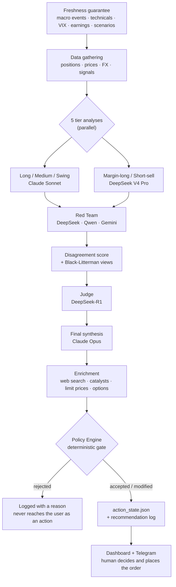

# ALMANAC

*[日本語](README.ja.md)*

**ALMANAC** is a personal, AI-assisted portfolio management and risk-control system. It pairs a quantitative Python backend with a Next.js dashboard to run daily portfolio analysis, market screening, and disciplined risk management for a real long-term investment account — with hard, deterministic guardrails sitting between any AI suggestion and an actual trade.

**This is not an automated trading bot.** There is no broker order API anywhere in this codebase. The AI proposes, the policy engine either blocks or allows the proposal through, and a human places the actual order at their broker.

This repository is a **public, sanitized snapshot** of that system. Runtime data, credentials, and anything that could identify the account owner are intentionally excluded — see [Public Repository Safety](#public-repository-safety).

## What it does

The objective function is explicit and version-controlled ([`objective.md`](objective.md)): maximize **after-tax, after-fee, JPY-denominated time-weighted return**, benchmarked against a 60% global equity / 40% global bond blend, subject to hard risk limits (VaR, drawdown, VIX-based circuit breakers) enforced by a deterministic policy engine — not by an LLM's judgment call.

| Area | What it does |
|---|---|
| **Portfolio & risk** | Black-Litterman optimization with LLM-generated views, GJR-GARCH volatility modeling, market-regime detection (bull / neutral / bear / crash), concentration and human-capital-exposure limits |
| **AI decision support** | Multi-model analysis (Claude + DeepSeek, cost-routed by task) for case-based decisions — trim, add, rebalance, tax-loss harvest — all gated by deterministic policy rules before anything reaches an order |
| **Screening & signals** | Long-term JP/US fundamental screening, disclosure-driven catalyst detection (EDINET / TDnet / EDGAR filings), margin and short-sale candidate screening, insider-cluster and IPO tracking |
| **Execution & guardrails** | Daily/monthly drawdown circuit breakers, VaR- and VIX-based trade blocking, an append-only event ledger for full auditability, open-order-aware position sizing |
| **Tax & accounts** | FIFO/LIFO/loss-harvest/gain-minimize tax-lot strategies, NISA allocation tracking, employee-stock-plan concentration management |
| **Observability** | NAV/TWR performance tracking against benchmark (a Modified Dietz cash-flow-adjusted approximation, not a daily sub-period-exact TWR), with a verification page that reports actual measured performance rather than a fixed claim |

## How it works

The heart of the system is a daily pipeline that turns market data into a small number of concrete, human-executable proposals — and a deterministic gate that throws most of them away.

### 1. The daily loop



Each stage exists for a reason:

**Freshness first.** Every input the gate depends on — the macro-event calendar, technical state, VIX, earnings proximity, scenario snapshot — is regenerated *before* analysis starts. A stale calendar would otherwise be silently read as "no important events coming up," which is the difference between an earnings blackout firing and not firing. Refresh failures are printed rather than swallowed, and the readiness gate treats a missing calendar as `review`, not as "clear."

**Five specialists, not one generalist.** The portfolio is split by holding intent — long-term core, medium-term, swing — plus two credit-side lanes (margin-long, short-sell). Each gets its own analysis with its own prompt and its own risk vocabulary. They run in parallel with a per-call timeout, and a tier that times out degrades that lane rather than failing the whole run.

**Adversarial review.** The tier outputs go to a Red Team of *different* model families (DeepSeek, Qwen, Gemini) whose job is to attack the reasoning. Using different vendors is deliberate — models from the same family tend to share blind spots. A disagreement score between agents is computed and carried forward, so downstream stages can see where the analysts diverged instead of only seeing a merged consensus.

**Judge, then synthesis.** A reasoning model (DeepSeek-R1) adjudicates, then Claude Opus performs the final synthesis into a structured result. The synthesis call uses forced tool use, so the output is a validated object rather than prose that has to be parsed — and a response truncated by the token limit is rejected outright rather than accepted as a partial answer.

**Enrichment.** Only after a proposal survives that far does the system spend effort on execution detail: current news, catalyst hypotheses, chart-derived limit-price context, and options signals.

### 2. Why several models

Model choice is centralized in one registry (`model_router.py`) that maps a *role* to a *tier*, so no module hardcodes a model ID. A single environment variable (`ALMANAC_BUDGET_MODE=eco|normal|premium`) shifts every role at once.

| Role | Model tier | Why |
|---|---|---|
| Final synthesis | Claude Opus | The one call where a mistake propagates into every proposal |
| Long / Medium / Swing tiers | Claude Sonnet | Bulk analysis where quality still matters |
| Margin-long / Short-sell | DeepSeek V4 Pro | Credit-side first pass; the final synthesis decides whether to adopt it |
| Screener pre-debate | DeepSeek | Wide, cheap first pass over many candidates |
| Screener second opinion | Claude Sonnet | Only the top BUY candidates get the expensive look |
| Red Team | DeepSeek / Qwen / Gemini | Deliberately different vendors, for uncorrelated criticism |
| Chat / delta monitor | Claude Haiku | High frequency, low stakes |

The economic shape is a funnel: cheap models see everything, expensive models see only what survived. Every call is logged with its token usage and estimated cost to a shared ledger, so the spend is measurable rather than assumed.

### 3. The gate

This is the part that makes the system something other than "an LLM that suggests trades." Every proposed action passes through an ordered chain of **deterministic rules** — plain Python, no model in the loop. A rule can reject an action or modify it (downgrade urgency, halve the size).

| Rule | What it does |
|---|---|
| `ledger_integrity` | If the event ledger is inconsistent, nothing passes. Fail-closed. |
| `var_budget` | Ex-ante 1-day 95% VaR over budget → reject **all** new buying |
| `dd_stage` | Drawdown ≤ −8% → new buys stop entirely; ≤ −5% → urgency downgraded and size halved |
| `leverage_block` | Leverage status in warning/deleverage/emergency → no new margin positions |
| `earnings_blackout` | Within 5 business days of earnings → reject buy / add / DCA on that name |
| `freshness_downgrade` | Inputs too old → downgrade rather than trust them |
| `cvar_unstable` | Tail sample too thin to estimate CVaR → no margin buying |
| `vix_extreme` | VIX ≥ 40 → speculative types rejected, buy urgency downgraded |

Two design choices matter more than the individual thresholds:

- **Fail-closed, not fail-open.** A missing or unreadable input is treated as "not permitted," never as "no objection." Several rules distinguish `False` from `None` explicitly for exactly this reason.
- **Rejections are recorded, not discarded.** Rejected and modified actions are written into the analysis output with their reason, so the gate's behavior is auditable after the fact — you can ask why a trade you expected never appeared.

The thresholds themselves are not arbitrary: they derive from [`objective.md`](objective.md), a version-controlled definition of what the system is optimizing. Changing a limit means changing that document first.

### 4. From suggestion to executed trade

**There is no broker API in this repository.** The loop closes through a human:

```
proposal → readiness (ready | review | blocked) → human places the order at their broker
         → human records the fill → executed | partial → event ledger → portfolio state
```

Recording a fill is deliberately separated from applying it to the portfolio. An execution whose account/route cannot be determined unambiguously is stored as a *fact that happened* and held as `portfolio_application_pending` rather than being guessed into the wrong account — because a wrong attribution silently corrupts every downstream tax lot, NISA allowance, and performance figure. Writes are idempotent through a client-generated key, so a double-submitted form cannot become two trades.

### 5. How performance is measured

The system grades itself rather than asserting a result. A daily recorder captures NAV and computes time-weighted return (a Modified Dietz cash-flow-adjusted approximation, not a sub-period-exact TWR) against a 60% global equity / 40% global bond benchmark. The objective is **after-tax, after-fee, JPY-denominated** — Japanese separate taxation and US dividend withholding are modeled, USD positions are converted at the daily close.

A verification page in the dashboard reports what was actually measured, including when the measurement window is too short or too dirty to support a conclusion. Separately, a watchdog checks data freshness, schema drift, ledger integrity, backup status, and disk headroom on a schedule, and pushes only genuinely actionable problems.

### 6. What happens when something breaks

Degradation is explicit rather than silent. A timed-out tier marks the run degraded and says so in the output; a truncated LLM response is rejected instead of parsed; a stale input downgrades an action instead of being trusted; an unavailable safety module refuses the call rather than proceeding un-audited. The recurring principle is that the system would rather produce *no* recommendation than a confident wrong one.

## Architecture

- **Backend** — Python 3.12 / FastAPI. Portfolio optimization ([PyPortfolioOpt](https://github.com/robertmartin8/PyPortfolioOpt), [riskfolio-lib](https://riskfolio-lib.readthedocs.io/), [skfolio](https://skfolio.org/)), GARCH risk modeling ([arch](https://arch.readthedocs.io/)), FinBERT sentiment (`transformers` / `torch`), Claude (Anthropic) and DeepSeek for LLM-assisted analysis.
- **Frontend** — Next.js 16 (App Router) / React 19 / TypeScript. A single console covering portfolio, screening, risk, scenarios, strategy, margin, NISA, AI decision support, execution log, and a performance-verification page.
- **Privacy layer** — ALMANAC runs locally, but some of its configured AI features do send portfolio context (holdings, quantities, P&L, allocation) to an external LLM. Non-Anthropic calls that are meant to carry only public or anonymized data (disclosure-feature extraction, the analyst debate, Red Team, screening) go through an allowlist gate (`almanac/llm_safety.py`). Separately, "book-aware" call sites (the chat assistant, case-based decision support, some guardrail alerts) send portfolio context to Anthropic — and in one path, to DeepSeek — by design, and log that usage. See [Public Repository Safety](#public-repository-safety) for exactly what never leaves the machine regardless.

## Configuration

Copy `.env.example` to `.env` and fill in what you need. Nothing is required just to read the code — these only matter if you actually run the system.

**Required for AI features**

| Variable | Purpose |
|---|---|
| `ANTHROPIC_API_KEY` | Claude — powers AI decision support, case analysis, and LLM-generated portfolio views |
| `DEEPSEEK_API_KEY` | DeepSeek — cost-efficient screening and long-term-scan harness |

**Optional**

| Variable | Purpose |
|---|---|
| `FRED_API_KEY` | Macro data (Federal Reserve Economic Data) for regime/risk context |
| `FINNHUB_API_KEY` | Supplementary market data |
| `GEMINI_API_KEY`, `GOOGLE_AI_API_KEY` | Alternative LLM backend |
| `GROQ_API_KEY` | Alternative fast-inference LLM backend |
| `OPENROUTER_API_KEY` | LLM routing/aggregator, alternative backend |
| `TELEGRAM_TOKEN`, `TELEGRAM_BOT_TOKEN`, `TELEGRAM_CHAT_ID` | Push notifications for alerts and daily briefings |
| `ALMANAC_API_KEY`, `NEXT_PUBLIC_ALMANAC_API_KEY` | Auth key for write endpoints (recording trades, editing tuning params) — read-only browsing works without it |
| `ALMANAC_ESPP_*` | Employee-stock-plan tracking; disabled (`0`) by default |
| `ALMANAC_CONTRIBUTION_SCHEDULE_JSON` | Recurring cash-flow definitions; empty by default |
| `ALMANAC_CLEAN_NAV_SINCE`, `ALMANAC_MIN_CLEAN_DAYS` | Performance-measurement window hygiene |
| `ALMANAC_PRIVACY_MODE` | Gates *book-aware* external LLM calls (chat, decision support, guardrail alerts, final daily synthesis) — see below |

### Privacy mode

Some AI features intentionally send portfolio context (holdings, balances, P&L) to an external model — see [Public Repository Safety](#public-repository-safety) for exactly which ones. `ALMANAC_PRIVACY_MODE` controls whether those specific calls are allowed to run at all:

| Value | Effect |
|---|---|
| `strict_local` (default) | No book-aware call leaves the machine. Chat / decision-support / guardrail-alert / final-synthesis call sites return a local "disabled" response instead of calling out. |
| `anthropic_book_aware` | Book-aware calls to Anthropic only. |
| `multi_provider_book_aware` | Book-aware calls to any configured provider (this codebase's original, pre-gate behavior). |

Public/anonymized calls (screening, disclosure-feature extraction) are unaffected by this setting — they never carry portfolio data in the first place. Every call site with a `assert_book_aware_allowed()` gate is enumerated (and enforced by a regression test) in `tests/test_llm_call_site_gating.py`.

## Public Repository Safety

This repository intentionally does not track local portfolio state, broker exports, databases, logs, screenshots, local AI-tool sessions, or API keys.

Files such as `holdings.json`, `account.json`, `nisa_portfolio.json`, `trade_history.csv`, and `almanac.db` are ignored by Git and never leave the local machine. Worked examples use a rounded placeholder portfolio size rather than any real figure. `scripts/check_public_safety.py` scans tracked files for known private identifiers and secret-key patterns; it's meant to be run before every push.

If you're preparing your own public release from a fork of this project, rotate any token that was ever committed or pasted into local tool settings before publishing repository history.

## Getting started

### Backend

```bash
python3 -m venv venv
source venv/bin/activate
pip install -r requirements.txt

# API keys are read from ~/.almanac_secrets (shell-style KEY=VALUE, one per
# line), not from a project-local .env file — nothing in this repo loads
# dotenv. Copy .env.example there and fill in your own values:
cp .env.example ~/.almanac_secrets
chmod 600 ~/.almanac_secrets

python scripts/init_private_state.py   # seeds local state files with small
                                        # demo values (sample cash + SPY),
                                        # not your real portfolio

./start_v5.sh                      # FastAPI on :8000 only — see below for the dashboard
```

`start_v5.sh` starts the FastAPI backend and nothing else; the script's own comments say the Next.js dashboard is expected to be managed separately (a macOS LaunchAgent, in the original setup). To run the dashboard yourself:

```bash
cd frontend
npm install
npm run dev                        # http://localhost:3000, talking to the FastAPI backend above
```

Write endpoints require `ALMANAC_API_KEY` (or a key file at `~/.config/almanac/api_key`).

## Project structure

```
almanac/                 core package — runtime config, LLM safety layer, DB migrations, observability
analyst/                 LLM-assisted analysis pipeline (multi-model, case-based)
api/                     FastAPI routes
frontend/                Next.js dashboard
examples/private_state/  templates for local-only state files (never committed)
tests/                   pytest suite
```

Most other top-level `.py` files are single-purpose modules — screeners, data fetchers, the policy and risk engines, tax tooling — rather than parts of a package. See individual file docstrings for details.

## Disclaimer

This is a personal project built around one person's own portfolio. It is not investment advice, has not been independently audited for correctness, and is shared as-is for anyone curious how the system works. Use any part of it at your own risk.

## License

[MIT](LICENSE)
