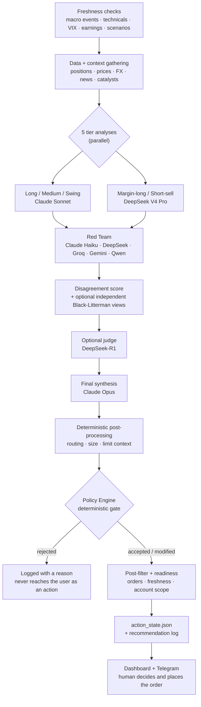

# ALMANAC

*[日本語](README.ja.md)*

**ALMANAC** is a personal, AI-assisted portfolio management and risk-control system. It pairs a quantitative Python backend with a Next.js dashboard to run daily portfolio analysis, market screening, and disciplined risk management for a real long-term investment account — with hard, deterministic guardrails sitting between any AI suggestion and an actual trade.

**This is not an automated trading bot.** There is no broker order API anywhere in this codebase. The AI proposes, the policy engine either blocks or allows the proposal through, and a human places the actual order at their broker.

This repository is a **public, sanitized snapshot** of that system. Runtime data, credentials, and anything that could identify the account owner are intentionally excluded — see [Public Repository Safety](#public-repository-safety).

> **Project status:** this is an opinionated reference implementation and an evolving personal system, not a turnkey portfolio product or a stable public API. Start with the demo state, inspect the rules, and expect file schemas and operating procedures to change.

## What it does

The objective function is explicit and version-controlled ([`objective.md`](objective.md)): maximize **after-tax, after-fee, JPY-denominated time-weighted return**, benchmarked against a 60% global equity / 40% global bond blend, subject to hard risk limits (VaR, drawdown, VIX-based circuit breakers) enforced by a deterministic policy engine — not by an LLM's judgment call.

The checked-in default is not “every product is off.” It separates **always-on measurement** from **authority to change an action**: cash securities and non-leveraged funds are active; margin and short candidates are conditional on the safety gates; options are analysis signals only; half-Kelly sizing and FX hedging run in shadow; tax basis runs in comparison mode; and GINN is rejected unless a validated model has been promoted, falling back to GJR-GARCH. The execution-plan gate starts in observe mode, and none of these modes can place a broker order. The complete activation contract is in [`objective.md`](objective.md#8-機能商品の有効化契約).

The dashboard's **System** page is a live operating inventory, not a static feature list. It shows configured and effective state, stop reasons, authority source, last confirmation time, freshness, and job heartbeats for short and margin candidates, options signals, market regime, GINN, frozen analysis inputs, broker reconciliation, tax basis, privacy, Kelly and FX shadows, currency policy, the execution plan, and Auto Tune. **Only the two short-candidate switches are mutable** there; every other row is read-only and names the state, environment variable, or validation gate that has authority and where it must be changed.

For each short lane, the funnel keeps unlike counts separate: configured universe, the **US proxy-eligibility rate** or **JP loanable-eligibility rate**, latest price-download rate, detected candidates, and candidates that pass the per-ticker borrow gate. Missing broker or price data excludes that individual ticker fail-closed; it does not by itself mean the entire lane is off. A lane stops only when a required source is missing or stale, while low scan coverage remains visible as a degradation warning. Runtime overrides are kept in the local, git-ignored `feature_control_state.json`. The product switch and the market-regime recommendation are separate: an enabled short lane may remain available for borrow-verified, human-reviewed overheat candidates even when a bullish regime discourages broad directional shorts. A switch never bypasses freshness, regulation, liquidity, squeeze, or insider gates, and short orders remain human-only.

Every confirmed cash balance loaded into this deployment is treated as surplus investment capital; the protected lifestyle reserve inside ALMANAC is JPY 0. Market-regime rules may still retain tactical cash, and the zero reserve does not bypass the existing account, freshness, order-intent, settlement, tax, fee or collateral checks. The execution plan can deploy only cash above the tactical target, up to its monthly pacing cap; current-month buys consume that allowance and it is recalculated automatically in the next month. Cash authority is event-based rather than a rolling time-to-live: elapsed time alone does not invalidate a confirmed balance, but later unconfirmed account activity does. Any household emergency reserve belongs outside the accounts represented here.

> **Time-weighted return (TWR)** strips out the effect of deposits and withdrawals. Paying in on payday makes the account bigger without the investing having been any good; TWR removes that, so what is left reflects the decisions rather than the cash flow. Unfamiliar terms used below are collected in the [Glossary](#glossary).

| Area | What it does |
|---|---|
| **Portfolio & risk** | Optional Black-Litterman optimization with independent alpha views, GJR-GARCH volatility modeling, market-regime detection (bull / neutral / bear / crash), concentration and human-capital-exposure limits |
| **AI decision support** | Multi-model analysis (Claude + DeepSeek, cost-routed by task) for case-based decisions — trim, add, rebalance, tax-loss harvest — all gated by deterministic policy rules before anything reaches an order |
| **Screening & signals** | Long-term JP/US fundamental screening, disclosure-driven catalyst detection (EDINET / TDnet / EDGAR filings), margin and short-sale candidate screening, insider-cluster and IPO tracking |
| **Execution & guardrails** | Daily/monthly drawdown circuit breakers, VaR- and VIX-based trade blocking, an append-only event ledger plus reconciliation checks for an audit trail, open-order-aware position sizing |
| **Tax & accounts** | Auditable inventory lots, a total-average cost-basis migration path, owner/account-scoped NISA planning, employee-stock-plan concentration management |
| **Observability** | NAV/TWR performance tracking against benchmark (a Modified Dietz cash-flow-adjusted approximation, not a daily sub-period-exact TWR), with a verification page that reports actual measured performance rather than a fixed claim |

## What this assumes

Things worth knowing before you decide to adopt it.

**It is built for a Japanese retail investor.** The objective is denominated in JPY, the tax model is Japan's 20.315% separate taxation plus 10% US dividend withholding, the tax-exempt allowance is NISA, and the disclosure sources are EDINET and TDnet. These are not switchable settings; they are baked into the design. Using this from another country means rebuilding the tax, allowance, and domestic-disclosure layers.

**It needs a machine that stays running.** The automation is the point, and none of it fires if the machine is asleep at the scheduled time. What a missed run costs is covered in [Keeping it running](#5-keeping-it-running).

**It costs money to operate.** LLM usage. Over 45 days of logs from the reference deployment, the **median was $0.91/day, or roughly $27/month**. The mean is $1.50, pulled up by days with development work on them (the heaviest was $13.63). Your figure moves with `ALMANAC_BUDGET_MODE` and which features you enable.

**Price data depends on yfinance.** 61 modules import it, which makes it the de-facto foundation. It is an unofficial Yahoo Finance library and breaks when the upstream changes; when it does, screening and outcome verification stop. `FINNHUB_API_KEY` supplies supplementary data, not a full substitute.

**Manual work remains.** A human places every order and a human records every fill. What is automated ends at deciding what should be done.

## How it works

The heart of the system is a daily pipeline that turns market data into a small number of concrete, human-executable proposals — and a deterministic gate that can reject or modify them before they reach the user.

### 1. The daily loop



Each stage exists for a reason:

**Freshness first.** Every input the gate depends on — the macro-event calendar, technical state, VIX, earnings proximity, scenario snapshot — is checked *before* analysis starts and refreshed when its own staleness rule requires it. A stale calendar would otherwise be silently read as "no important events coming up," which is the difference between an earnings blackout firing and not firing. Refresh failures are printed rather than swallowed, and the readiness gate treats a missing calendar as `review`, not as "clear."

The analysis then freezes a two-stage **decision snapshot**. The base snapshot contains holdings, cash, prices, FX, macro, news and screening data; after the held and candidate tickers are known, an enriched snapshot adds their chart and options payloads. A single run-wide `analysis_id` is issued before catalyst or tier work begins and follows the catalyst, every tier result, final synthesis, action, stage log and both snapshot stages. Every tier and the final synthesis receive the same content hash, source timestamps and payload hashes, and external re-fetches are forbidden after the enriched snapshot is sealed. A separate execution-quote snapshot may refresh price, spread and market status just before an order, but it may only reprice or downgrade an action—not rewrite the investment thesis or confidence.

**Five specialists, not one generalist.** The portfolio is split by holding intent — long-term core, medium-term, swing — plus two credit-side lanes (margin-long, short-sell). Each gets its own analysis with its own prompt and its own risk vocabulary. They run in parallel with a per-call timeout, and a tier that times out degrades that lane rather than failing the whole run.

**Adversarial review.** The tier outputs go to a Red Team of *different* model families whose job is to attack the reasoning. A Claude Haiku leg can use book-aware context; the external legs use only public or anonymized material and may run through DeepSeek, Groq, Gemini, and Qwen when their keys are configured. Using different vendors is deliberate — models from the same family tend to share blind spots. A disagreement score between agents is computed and carried forward, so downstream stages can see where the analysts diverged instead of only seeing a merged consensus.

**Optional judge, then synthesis.** When `DEEPSEEK_API_KEY` is configured, DeepSeek-R1 adjudicates pseudonymized actions without receiving ticker symbols or the analysts' free-text rationales. If that optional judge is unavailable, the stage is omitted rather than taking down the whole run. Claude Opus then performs the final synthesis.

The normal path forces the model to answer through a declared tool, so what comes back is structured data rather than prose that has to be interpreted. Occasionally a provider returns visible text instead; a fallback extracts the JSON from it. Either way, downstream guards then check that the result is not empty and that the action fields are present.

On top of that, **a response truncated by the token limit is rejected outright** rather than accepted as a partial answer, so a half-finished list is never mistaken for a conclusion.

**Decision context is frozen before the tier models; execution detail comes after.** News, catalyst, chart and options inputs that can affect judgment are collected into the enriched decision snapshot before any tier LLM is called. After structured proposals come back, deterministic code adds routing, sizing and limit-price context before the policy gate. Every sourced claim carries either external provenance (URL and publication/observation/retrieval times), snapshot provenance, or derived provenance linking it to input claim IDs and a calculation version. Missing or unverifiable provenance downgrades an action to review.

### 2. What runs when

The repository ships **example** macOS LaunchAgent definitions in `launchagents/`; they are not installed automatically. After replacing every `/path/to/ALMANAC` placeholder and loading only the jobs you want, they run the following weekday cadence. Times are Asia/Tokyo.

| Time | Job |
|---|---|
| 06:15 | The AI analysis — the entire daily loop above |
| 16:30 | Ingest TDnet timely disclosures |
| 16:45 | Ingest EDINET filings |
| 17:10 | Update the disclosure-driven shadow book |
| 23:00 | Record the day's NAV |
| 23:05 | Recompute the benchmark comparison |

The analysis runs at 06:15 so the day's proposals exist before the Tokyo market opens. Disclosure ingestion clusters at 16:30–17:10 because that is after the Tokyo close, when the day's filings have landed.

Screening and threshold tuning run on their own cadences, described below.

### 3. Finding candidates (screening)

The daily loop above is mostly about **what to do with positions you already hold**. Finding new candidates is an entirely separate mechanism, with a dedicated screener per thing being hunted.

| Script | What it looks for |
|---|---|
| `screener.py` | Momentum |
| `short_screener.py` | Short candidates, with conditions that vary by market regime |
| `margin_long_screener.py` | Margin-buy candidates |
| `long_term_screener.py` | Long-term fundamentals |
| `news_screener.py` | News sentiment |
| `social_screener.py` | Social chatter plus options-market anomalies |
| `pair_screener.py` | Long-short pair-trading signals |
| `screener_shadow_book.py` | **Measures what actually happened** to the candidates the others produced — it places nothing (see §11) |

**When they run**

The time-of-day split is deliberate:

- **06:00–06:05 on weekdays** — `--us-only --morning`. US names only, using prices from the close that just happened overnight, so candidates exist before Tokyo opens.
- **15:30 on weekdays** — `--jp-only`, at the Tokyo close.
- **18:00–19:15 on weekdays** — the unrestricted runs: momentum → measurement → news → pairs/shorts → social → margin, staggered 10–15 minutes apart so they don't hammer the market-data APIs simultaneously.
- **07:00 on Sunday and Thursday** — the long-term screener, twice a week.

**Inside the momentum path: two stages**

1. One DeepSeek call evaluates every candidate, expanding bull, bear, and macro perspectives *within* that single call, and labels each one BUY / WATCH / SKIP.
2. Only the **top three BUY candidates** get a Claude Sonnet second opinion.

An earlier version ran three Claude Sonnet passes in parallel and merged them with Opus. That cost far more calls than the result justified, so it was replaced. The funnel logic is the same as everywhere else: broad and cheap first, narrow and expensive second.

**Inside the long-term screener**

The universe is yours to define: it is read from `long_term_universe` in `tickers.json`, which is gitignored and ships as an empty template in `examples/private_state/`. The reference deployment runs about 120 names — US across all sectors, plus Japanese non-tech. Ten metrics are scored out of 160 points.

| Metric | Points |
|---|---|
| EPS growth | 25 |
| ROE | 20 |
| Revenue growth | 15 |
| Gross margin | 15 |
| FCF yield | 15 |
| PEG ratio | 15 |
| Analyst ratings | 15 |
| Technicals | 10 |
| Preferred-sector bonus | 10 |
| Insider ownership / capital-return capacity | 10 |

Thesis generation goes through Anthropic's Batch API — submit now, collect later, with the provider's current [50% batch discount](https://docs.anthropic.com/en/docs/about-claude/pricing#batch-processing) on input and output tokens. That asynchrony is why **submission (Sunday and Thursday) and collection (Monday and Friday at 08:30) are separate jobs**. It is not urgent work, so it takes the slower, cheaper path.

These cadences are collected in [`examples/crontab.example`](examples/crontab.example).

### 4. From disclosures to signals

Corporate filings — earnings releases, timely disclosures, large-shareholding reports — are documents, not decision inputs. Turning them into numbers takes a pipeline.

| Stage | Script | What it does |
|---|---|---|
| Ingest | `ingest_disclosures.py` | Pull the day's items from EDINET and TDnet |
| Extract | `disclosure_feature_extractor.py` | Derive evidence-backed numeric features from the text |
| Review | `disclosure_feature_promotion.py` | Produce promote / maintain / retire verdicts for monthly governance |
| Enrich | `disclosure_enrich.py` | Attach additional context |
| Measure | `disclosure_shadow_book.py` | Record what following the signal would have returned, broker costs included |

The important part is that extracted features land as **observe_only** first.

The promotion script compares disclosure types against later excess returns — but **it only produces a verdict to review.** It does not mutate live configuration, and it does not turn a raw feature row into an order candidate. Whether a feature is adopted is decided by a human at monthly governance.

There is a narrower, explicitly bounded path for an observe-only source to become a *provisional* action. The final synthesis must emit provenance, a reason, and the provisional marker; deterministic post-processing then applies a confidence floor and size cap before the normal policy gate. A raw `observe_only=true` action is rejected. Measurement, governance promotion, and capped provisional review are therefore separate concepts.

The extraction prompt carries a version number, so rewriting the prompt does not silently mix features produced by two different versions.

### 5. Why several models

Primary role-based model choice is centralized in `model_router.py`. `ALMANAC_BUDGET_MODE=eco|normal|premium` changes the routed Claude tiers after the role is resolved. It does **not** rewrite fixed low-stakes utility calls, fallback model IDs, or external-provider roles; those exceptions are intentionally visible at their call sites.

| Role | Model tier | Why |
|---|---|---|
| Final synthesis | Claude Opus | The one call where a mistake propagates into every proposal |
| Long / Medium / Swing tiers | Claude Sonnet | Bulk analysis where quality still matters |
| Margin-long / Short-sell | DeepSeek V4 Pro | Credit-side first pass; the final synthesis decides whether to adopt it |
| Screener pre-debate | DeepSeek | Wide, cheap first pass over many candidates |
| Screener second opinion | Claude Sonnet | Only the top BUY candidates get the expensive look |
| Red Team | Claude Haiku / DeepSeek / Groq / Gemini / Qwen | Book-aware Anthropic leg plus public/anonymized cross-vendor criticism |
| Chat / delta monitor | Claude Haiku | High frequency, low stakes |

The economic shape is a funnel: cheap models see everything, expensive models see only what survived.

Spend is measurable rather than assumed, because the main analysis, screening, disclosure, and monitoring transports all write token usage and estimated cost to a shared LLM-call log. The caveat is that this covers the instrumented paths, not every call in the tree.

### 6. The gate

This is the part that makes the system something other than "an LLM that suggests trades." Every proposed action passes through an ordered chain of **deterministic rules** — plain Python, no model in the loop. A rule can reject an action or modify it (downgrade urgency, halve the size).

| Rule | What it does |
|---|---|
| `ledger_integrity` | If the event ledger is inconsistent, no executable action passes. Fail-closed. |
| `var_budget` | Ex-ante 1-day 95% VaR at or above budget → reject **all** new buying. The budget moves with the regime (1.2% stress / 1.6% normal / 2.0% confirmed bull with VIX < 25). Raising it by environment variable still cannot pass 2.3%. |
| `dd_stage` | Drawdown ≤ −8% → new buys normally stop; ≤ −5% → urgency downgraded and size halved. A deterministic DCA-ladder exception is separately bounded. |
| `leverage_block` | Leverage status in warning/deleverage/emergency → no new margin positions |
| `earnings_blackout` | Within 5 business days of earnings → normally reject buy / add / DCA. An explicit high-confidence event-trade exception is capped downstream. |
| `freshness_downgrade` | Inputs too old → downgrade rather than trust them |
| `cvar_unstable` | Thin real-tail samples hard-block margin buying; insufficient clean history degrades size instead of creating a permanent block |
| `vix_extreme` | VIX ≥ 40 → speculative types rejected, buy urgency downgraded |

Two design choices matter more than the individual thresholds:

- **Fail closed where safety depends on the answer.** A policy-engine failure or missing safety-critical evidence blocks the affected action instead of becoming "no objection." Less critical freshness gaps may downgrade an action to review. Several rules distinguish `False` from `None` explicitly so "unknown" cannot masquerade as "safe."
- **Rejections are recorded, not discarded.** Rejected and modified actions are written into the analysis output with their reason, so the gate's behavior is auditable after the fact — you can ask why a trade you expected never appeared.

The default thresholds are intended to implement [`objective.md`](objective.md), the version-controlled definition of what the system is optimizing. When a limit changes, the objective, runtime configuration, code, and regression tests should be kept in sync.

### 7. Scenarios and playbooks

A mechanism for deciding "if X happens, do Y" ahead of time.

`geopolitical_monitor.py` matches public news against the keywords in `scenario_playbook.json`. `scenario_engine.py` evaluates the scenario definitions — required signals, severity, decision enablement, and phase actions — and writes the resulting state. When a scenario is `active` or `partial` and explicitly enabled for decisions, the analysis pipeline can deterministically inject its eligible phase-one actions as proposals.

The thing to note is that **a playbook proposal does not bypass the gate**. Injection happens before the policy and post-filter stages, with `source=scenario_playbook` and an attestation record. `execution_plan_engine.py` later recognizes that provenance and accepts a playbook-specific override only when the scenario status, per-entry and per-run caps, and target checks all attest correctly. Deciding in advance buys speed, not exemption.

### 8. From suggestion to executed trade

**There is no broker API in this repository.** The loop closes through a human:

```
proposal → readiness (ready | review | blocked) → human places the order at their broker
         → human records the fill → executed | partial → event ledger → portfolio state
```

Recording a fill is deliberately separated from applying it to the portfolio. An execution whose account/route cannot be determined unambiguously is stored as a *fact that happened* and held as `portfolio_application_pending` rather than being guessed into the wrong account — because a wrong attribution silently corrupts every downstream tax lot, NISA allowance, and performance figure. Writes are idempotent through a client-generated key, so a double-submitted form cannot become two trades.

Broker exports may later prove that the recorded route was wrong. The original execution remains immutable; a separate atomic reconciliation overlay may correct only owner, broker and account, and every safety/reporting consumer resolves the same effective route. Quantity, price or trade-date corrections use a different correction type rather than being smuggled into a route fix. A malformed overlay fails closed to `review`. Cost basis is also accepted only from a broker position snapshot whose identity, quantity and as-of ordering can be reconciled; a same-day fill with no usable time is treated as temporally unknown rather than guessed before or after the snapshot.

Broker-confirmed positions, cash, NISA capacity and hedge balances use **event-based validity**, not a rolling 72-hour expiry. Time passing does not change a share count or cost basis. After the initial snapshot, a fill or cash movement entered in the Web UI with its broker confirmation, external transaction ID, timestamp, quantity and price advances the authority chain for the affected position and wallet, so recurring full CSV exports are unnecessary. An incomplete, unapplied or ambiguously routed event still fails closed and requires reconciliation. Trades, transfers or deposits made outside ALMANAC must therefore be imported or recorded—the system cannot invalidate a balance for an event it cannot observe. Market inputs such as prices, volatility and news remain time-sensitive and keep their own freshness limits.

The execution plan keeps unattributed legacy activity visible, but only risk-increasing purchases (`buy` / `add` / `DCA` / margin buys) block monthly-budget enforcement. Sales and unpriced exits remain audit warnings; they do not consume a purchase budget or prevent the plan from moving out of observe mode.

### 9. The record, and auditing it

The ledger subsystem creates three SQLite tables.

**`ledger_events`** holds what happened. The design point here is that **the time something occurred and the time it was recorded are stored separately**. Enter a trade from three days ago today, and the first is three days ago while the second is today. Collapse them into one column and you can no longer reconstruct when you found out.

Three event types carry most of the traffic:

| Type | Meaning |
|---|---|
| `trade` | A buy or sell |
| `cash_flow` | External deposits and withdrawals — salary in, cash out |
| `dividend` | Dividends received |

`cash_flow` is its own type because performance measurement (§10) has to control those out. Mix them into trades and TWR stops meaning anything.

The schema also supports tax, fee, FX-conversion, split/merge, NISA-use, internal-transfer, and reconciliation events. They are omitted from the short table above, not from the ledger.

**`execution_idempotency`** prevents double registration. It keys on an idempotency key plus a hash of the request, so the same operation arriving twice does not become two trades.

**`portfolio_application_journal`** stores the exact holdings and account *after-state*, the application inputs, result, and status before local portfolio files are touched. That makes an interrupted application inspectable and recoverable; it is not a general-purpose undo history for completed trades.

On top of that, `portfolio_integrity.py` periodically checks the record against reality. What it looks for is concrete:

- an execution exists but has no ledger event
- a ledger event exists but was never applied to holdings
- an application is stuck pending
- no external reconciliation source was recorded

Once you separate "recorded" from "applied," you need something that finds the ones stalled in between.

### 10. How performance is measured

The system grades itself rather than asserting a result. A daily recorder captures NAV and computes time-weighted return (a Modified Dietz cash-flow-adjusted approximation, not a sub-period-exact TWR) against a 60% global equity / 40% global bond benchmark. The objective is **after-tax, after-fee, JPY-denominated** — Japanese separate taxation and US dividend withholding are modeled, USD positions are converted at the daily close.

A verification page in the dashboard reports what was actually measured, including when the measurement window is too short or too dirty to support a conclusion. Separately, a watchdog checks data freshness, schema drift, ledger integrity, backup status, and disk headroom on a schedule, and pushes only genuinely actionable problems.

### 11. Learning from outcomes

Recommendations are not issued and forgotten — they are marked afterwards and fed back. There are three kinds of learning here, and each is allowed a different amount of autonomy.

**1. Grading past recommendations**

`recommendation_verifier.py` scores past recommendations against prices **5, 20, and 60 business days** later, producing a win-rate table by action type × urgency. That table is injected back into the next analysis prompt, so the model sees its own hit rate before deciding.

One detail matters. **Sells, trims, and shorts are not graded on whether the price fell.** They are graded against SPY. In a bull regime the whole market drifts up, so an absolute test would mark nearly every sell as wrong and distort the win rate structurally. A name that underperforms SPY by at least 0.5% counts as a correct trim.

Screener candidates are tracked the same way. `screener_shadow_book.py` runs on weekdays and records what would have happened to the candidates, without placing an order or writing to the financial event ledger. It measures the candidate stream independently; it does not attempt to prove that a candidate was never bought manually. It exists so screener quality is judged on the record rather than on the hits people remember.

**2. Accumulating beliefs, and discarding stale ones**

Each run updates a set of investment beliefs, each carrying a conviction score.

Accumulating without pruning would let old assumptions sit around forever, so **generic beliefs with conviction ≤ 55 that have not been updated in 30 days are deleted automatically.** There is a mechanism for forgetting, not only for remembering.

Alongside this, the gap between the price at decision time and the actual fill price (implementation shortfall) is recorded — median and spread — once at least 10 samples exist. That separates "the call was right but the execution was poor" from "the call was wrong."

**3. Tuning the thresholds themselves — but not all of them**

`tuning_advisor.py` feeds current market and portfolio state, plus 30 days of rejection statistics, to a model and asks for recommended parameter values with reasoning.

The system does **not** simply apply what comes back. Auto-application is constrained at several levels:

| Constraint | Effect |
|---|---|
| Allowlist / denylist | Auto-changeable parameters are enumerated explicitly. **VIX thresholds, minimum order size, the loss-harvest floor, the critical cash ratio, and the execution-gate mode** sit on the denylist and can never be applied automatically |
| Risk class | Every parameter is classified high / medium / low |
| Step size | Per-parameter cap on a single move — currency targets, for example, may shift at most 3 points |
| Batch size | At most one group per risk class per run; changes are not made en masse |
| Cooldown | One trading day before the next change |
| Input freshness | No tuning on inputs older than 3h (guard), 4h (VIX), 8h (regime), 12h (macro) |
| Atomic groups | Parameters that only make sense together — the JPY and USD targets, say — always move together |

In other words, **tuning uses the same structure as trading.** The model proposes; deterministic rules decide what may change, by how much, and how often.

The runtime state has three modes — `off`, `shadow`, and `apply` — and **only `apply` may mutate a parameter**. A `--force` flag exists, but it is valid only with `--dry-run` and merely bypasses same-context de-duplication; it never crosses that boundary. This guarded orchestrator replaced an earlier design after a July 2026 review found the scheduled job applying recommendations derived from stale logs.

A fresh clone starts **off**: the mutable `tuning_auto_state.json` is local runtime state and is not shipped. In the reference deployment, that state was changed to `apply` and a separate LaunchAgent runs it four times per weekday. As of the 2026-07-24 operational snapshot, runs since re-enablement had ended in either "no change warranted" or "context unchanged," with zero parameters auto-applied. That is a dated deployment observation, not the repository default or a promise about future runs. Inspect your own state with `python auto_tune.py --status` or the `/tuning` page.

That is the intended shape. A tuner that rarely fires is working; one that changes something every run would mean the bar is too low.

### 12. What happens when something breaks

Degradation is explicit rather than silent. A timed-out tier marks the run degraded and says so in the output; a truncated LLM response is rejected instead of parsed; a stale input downgrades an action instead of being trusted; an unavailable safety module refuses the call rather than proceeding un-audited. The recurring principle is that the system would rather produce *no* recommendation than a confident wrong one.

## The quant layer

Where the numbers come from. **Each item carries its status**, because having an implementation and having it drive daily decisions are different things.

| Label | Meaning |
|---|---|
| **Live** | Wired into the daily decision path |
| **Optional** | Runs only when explicitly enabled |
| **Unwired** | Implemented but not used for decisions (CLI/diagnostic) |
| **Retired** | Not used in normal operation |

### Choosing weights

Allocation runs through [PyPortfolioOpt](https://github.com/robertmartin8/PyPortfolioOpt) and [skfolio](https://skfolio.org/), with three objectives.

| Method | What it does |
|---|---|
| `max_sharpe` | Maximises return per unit of risk |
| `min_cvar` | Minimises the average loss in the worst cases |
| `equal_risk` | **Inverse-volatility weighting** — quieter names get more. Not true risk parity, which would equalise each holding's risk contribution |

**Black-Litterman (Optional)** — runs only when explicitly selected.

There was a design failure here. Originally the Sonnet tier's (action, urgency) output was mapped to expected returns and injected straight in as views: the same model's subjective confidence, dressed up as a number and handed back to itself. A review called it *confidence laundering*.

`bl_alpha_sources.py` implements three sources independent of the tier LLM output — analyst consensus, momentum and factor beta. **They are not on by default.** `BL_USE_INDEPENDENT_ALPHA` defaults to `"0"`; in that mode the tier-derived values remain in `bl_views.json` only as an audit artifact and are excluded from both the final Opus prompt and Black-Litterman optimization. `"1"` uses independent sources alone; `"mix"` may retain tier-derived rows in the artifact, but only rows marked `is_independent=true` are consumed.

The same lineage is never counted twice. When `independent_count=0`, no Black-Litterman corroboration block is added to the final prompt and the optimizer falls back to its market prior rather than recycling the previous LLM output.

### Measuring risk

**VaR uses the Cornish-Fisher expansion.** Plain VaR assumes normal returns; real markets have fat tails, so the quantile is corrected using skewness and kurtosis.

**CVaR's primary output is historical Expected Shortfall** — the mean of observed losses beyond the quantile. A Cornish-Fisher-threshold CVaR is also computed but is an auxiliary value (`method: 'historical'`). Fewer than ten tail observations raises `cvar_unstable`.

Volatility is forecast with **GJR-GARCH**, which lets downside moves raise expected volatility more than upside ones.

**GINN (Research)** — `ginn_model.py` implements the GARCH-Informed Neural Network (ICAIF 2024).

```
model: 2-layer LSTM (hidden=64, dropout=0.1) + linear + Softplus
loss:  MSE(σ_pred, |ε_t|) + 0.3 · MSE(σ_pred, σ_GARCH)
```

The second term penalises divergence from the GARCH estimate. **It cannot be claimed to prevent overfitting**: during training VIX and regime are passed as constants (0.2 / 1.0) rather than real series, and the GARCH σ is a single per-ticker forecast broadcast across the window.

Runtime use is fail-closed. A legacy model without validation metadata, or a candidate that fails the predeclared validation thresholds, is rejected and the forecast falls back to GJR-GARCH. The model name carried into tier artifacts, the Today API and the dashboard is the model actually used—not an unconditional “GINN” label. This safety gate does not make the research model validated; it prevents an unvalidated model from entering decisions.

Training uses three expanding rolling-origin folds. Each fold fits its normalisation statistics and GARCH baseline only on its training window, then evaluates the following validation window; after validation, a fresh candidate is refit on the available history. The versioned bundle stores `model.pt`, a manifest and the per-ticker scaler artifact used by inference, each protected by checksums. Promotion requires the predeclared sample, ticker-coverage, feature-coverage, data-age and GARCH-relative-error thresholds; inference also requires an explicit ticker route and the matching persisted scaler. Post-promotion performance is still measured only on subsequently observed data: `forward_observations` and `forward_metrics` remain empty until such observations exist, and the walk-forward validation must not be described as a final untouched test set.

**Risk is computed on current holdings, not the NAV series.** That series is short and older accounting bugs contaminated part of it, so `portfolio_risk_returns.py` reconstructs daily returns by applying today's weights to historical prices.

**The VaR model is validated.** `risk_model_validation.py` stores each day's forecast and runs a **Kupiec proportion-of-failures test** — do breaches of the 95% VaR occur about 5% of the time? It covers the Cornish-Fisher VaR built from clean daily P&L, not the risk stack as a whole.

### Sizing (Shadow only)

`kelly_sizing.py` proposes sizes at **half-Kelly**:

```
kelly = 0.5 × (p·b − q) / b     p = win rate, b = average win ÷ average loss
```

p and b come from graded **buy/add/DCA recommendation signals**, not executed trades. Duplicate recommendations from the same analysis are removed, statistics are separated into 5-, 20- and 60-business-day horizons, and at least 20 observations are required for the requested horizon. A counterfactual shadow path applies the cap before the same policy rules, then runs the same post-filter and readiness checks without persistence; a final invariant rejects any downstream rounding or minimum-notional change that would raise the result above the Kelly cap. It never mutates the real action, action state, execution plan or notifications. Signal statistics remain ticker/direction/horizon scoped, while the current holding used for sizing is resolved by owner + broker + account + instrument. Missing identity or an unproven zero holding makes the shadow cap unobservable rather than assuming zero.

### Adding on the way down

`drawdown_dca_engine.py` addresses a specific failure: wait for the bottom to be confirmed and the rebound has already passed you. Three tranches fire on **separate** conditions.

| | Trigger |
|---|---|
| T1 | Decay from the VIX peak (VIX-led; no Fear & Greed condition) |
| T2 | DD ≤ −12% and VIX ≥ 25 and Fear & Greed ≤ 25 and HY spread ≥ 500bps |
| T3 | DD ≤ −18% and VIX ≥ 40 and (Put/Call > 1.2 **or** VIX > 40) and an RSI reversal |

T3 is not a combination of T1 and T2; it is a distinct capitulation-reversal condition.

All tranches additionally pass sector-breadth, volume, a five-day cooldown, an annual budget cap (15% of net worth) and per-currency cash checks.

### Currency (Components and shadow only)

`fx_hedge_manager.py` computes a target hedge ratio between **0 and 70%** from regime, VIX, implied volatility and the USDJPY level, clamping change from the previous target to **±10 points** to prevent whipsaw.

The hedge manager and economic-exposure resolver are wired into the analysis run as an **observation-only shadow lane**, not into action sizing or order creation. Hedge targets can run only in `off`, `shadow` or `advisory`; shadow state is separate from actual holdings and is not advanced when product classification or broker-reconciled hedge notional is missing. The older AI 58/42-style currency-allocation recommendation is also observation-only: rebalance continues to receive the static target until look-through economic exposure and broker-reconciled hedge notional are authoritative. Listing currency alone is never treated as economic currency.

Specific instrument codes are intentionally omitted here because product classifications can change and must be checked against issuer or exchange material; the code records the source and confirmation date for each classified instrument.

### Tax

`tax_lot.py` reconstructs a per-ticker acquisition-lot history from the event ledger's trade record, **FIFO**. Its purpose is internal audit and surfacing candidate gains and losses.

**The authoritative cost basis is the broker's and the tax authority's calculation** — for partial sales of the same security, Japan uses a weighted-average-based method. The internal lot view is not treated as establishing cost basis for tax.

`tax_harvest_scanner.py` runs on a schedule and surfaces loss-harvest candidates for a human to act on. `tax_optimizer.py` covers NISA headroom and foreign tax credit simulation.

The API uses a mode-independent v2 schema separating economic, taxable and NISA realised P&L. A `legacy|compare|total_average` flag changes the calculation source, not the response shape. The total-average-like path is account-level and fail-closed on missing FX or incomplete history; until owner-and-broker scope and broker reconciliation are complete, it remains comparison/advisory data and specific-lot selection is not actionable.

NISA migration candidates keep owner, broker, account and instrument identity together. Missing identity data makes the plan non-actionable, and positions or tax lots with the same ticker at different brokers are not combined. The endpoint is advisory and human-execution-only.

### Attributing performance

`factor_attribution.py` regresses by **OLS** to produce α, β and R². The ETF-proxy factors are **eight**, not three: MKT/SMB/HML plus MOM, QMJ, LVOL, BAB and FX.

```
MKT = SPY          SMB = IWM − SPY       HML = IVE − IVW
MOM = MTUM − SPY   QMJ = QUAL − SPY      LVOL = SPLV − SPY   …
```

**The dependent variable is not realised return.** It is a synthetic series: current weights held fixed backwards, funds and cash excluded and the remainder renormalised, USDJPY pinned to a constant. So α here cannot be read as skill. It is the regression residual of a proxy portfolio built from part of the current book.

### Regimes

**The operating classifier is deterministic and market-specific.** `market_regime_v2.py` scores the US and Japan separately on five levels: strong bull, mild bull, neutral, mild bear and strong bear. It also records whether the score is improving, stable or deteriorating, while an independent shock overlay catches abrupt stress.

The score combines each index's distance from its 50- and 200-day moving averages, **market breadth** (the percentage of the allowed screening universe above those averages), VIX, the high-yield credit spread and US interest rates. Breadth is accepted only when each market has at least 20 instruments with enough valid closing prices; the denominator is the post-restriction `tickers.json` universe actually downloaded for that run, not missing names counted as weak.

Rates are a modifier, not a market-timing switch. The inputs are the nominal and inflation-adjusted US 10-year yields, 5- and 20-observation changes, 10-year expected inflation and the 10Y–3M curve. A fast rise or a persistently restrictive real yield reduces the equity score; falling yields help only when credit is not already signalling stress. The same US-rate block is explicitly treated as a global equity discount-rate modifier, not mislabeled as a Japanese rate series.

Normal changes require confirmation on two distinct evaluation dates; a shock is immediate. When data coverage is incomplete, v2 is review-only and the legacy four-state scenario remains unchanged. An HMM remains a separate risk signal and is not counted as an independent confirmation of inputs already used by v2.

| Level | Tactical cash target | New-buy size cap | Leverage |
|---|---:|---:|---|
| Strong bull | 3% | 1.00× | Allowed only if every other gate passes |
| Mild bull | 7% | 0.75× | Off |
| Neutral | 12% | 0.50× | Off |
| Mild bear | 20% | 0.25× | Off |
| Strong bear | 30% | 0× discretionary; active deterministic DCA only | Off |

These are recommendation and sizing-policy limits, not broker orders. In a crash, 30% is a ceiling for cash already held, **not an instruction to sell after the fall to raise cash**. Existing tactical cash may be deployed only through an active DCA tranche; thesis failure, credit risk and hard concentration limits are evaluated separately.

The parameters in `regime_params.py` started from an older walk-forward optimisation and have since been **updated by hand**. The generator, `backtest_wfo.py`, is now **retired** — it exits unless explicitly enabled.

### Also present

- `technical_signals.py` — RSI, MACD, Bollinger Bands, volume
- `rebalance_engine.py` — currency and sector drift detection with prioritised orders
- `currency_policy.py` — validates AI currency targets on confidence, expiry and a ±10-point change limit before they reach the rebalance target
- `sector_rotation.py` — narrows screening candidates to the leading sectors
- `insider_restrictions.py` — compliance exclusions wired across the screeners
- `short_universe.py` — fail-closed checks on borrow availability, regulation, freshness and liquidity (human-only)

## The dashboard

The current snapshot exposes 20 routes, split by purpose.

| Page | Purpose |
|---|---|
| `/today` | What to do today — effectively the home screen |
| `/portfolio` | Holdings and allocation |
| `/performance` | Performance verification, reporting measured values as-is |
| `/risk` | VaR, drawdown, concentration |
| `/screening` | Screener output |
| `/decision` | AI decision support |
| `/executions`, `/trade`, `/history` | Recording fills, and the history of them |
| `/nisa`, `/cash`, `/margin` | Tax-exempt allowance, cash, margin |
| `/scenarios`, `/strategy` | Scenarios and strategy |
| `/disclosures` | Disclosure feed |
| `/tuning`, `/admin` | Parameter tuning and administration |
| `/agent`, `/design` | Agent output; live feature authority, freshness and job-health review |

Reading requires no API key. Authentication applies only to writes — recording a fill, changing a setting.

## Tests and backups

### Tests

At this snapshot, pytest collects **3,075 tests across 229 `test_*.py` files**. The count basis is `pytest tests/ -q --collect-only` for cases and `find tests -type f -name 'test_*.py'` for files.

The composition matters more than the count: **16 files are named for the invariant they hold down** — specifically, filenames containing `safety`, `gating`, `policy`, `guard`, `integrity`, or `privacy`. A sample:

| File | What it protects |
|---|---|
| `test_llm_call_site_gating.py` | Coarse file-level backstop for new direct LLM clients; it does not prove each individual call is wired correctly |
| `test_llm_safety.py` | Public/anonymized payload validation |
| `test_redteam_privacy.py` | External Red Team payloads stay public/anonymized, and the book-aware Haiku leg obeys privacy mode |
| `test_execution_safety.py` | Execution handling |
| `test_actions_ledger_safety.py` | Ledger writes |
| `test_cash_route_safety.py` | Cash-route classification and ambiguous-account rejection |
| `test_order_strategy_safety.py` | Order strategy |
| `test_portfolio_integrity.py` | Detecting drift between record and reality |

The targeted tests pin known paths, and the file-level test catches many common omissions when a new client is added. It is intentionally only a backstop: a gate call elsewhere in the same file can satisfy its heuristic. Review call-site wiring as well, and use key omission or network isolation when an absolute no-egress guarantee is required.

### Backups

`backup_manager.py` covers local state that cannot be reconstructed easily: holdings, accounts, NISA, trade and cash history, beliefs, tuned parameters, observability logs, and the SQLite databases. A snapshot also creates a hash manifest, Git bundles, and a frontend worktree archive; missing optional targets are reported rather than invented.

- `snapshot` — create today's set under `backups/YYYYMMDD/`
- `verify` — validate JSON/JSONL and run SQLite integrity checks
- `restore YYYYMMDD <file>` — stage a file-level recovery; `--yes` performs it after preserving the current file as `.bak`
- `rotate` — retain daily sets for 7 days, Mondays through 30 days, and first-of-month sets through 365 days
- `offsite` — copy today's set to the configured rclone remote

Off-site copy is opt-in. The default remote name is `crypt-gdrive:almanac_backup`, but encryption is provided by how **you configure rclone**, not enforced by this Python code; `ALMANAC_OFFSITE_REMOTE` may point elsewhere. The watchdog expects off-site backup by default, which can be changed with `ALMANAC_REQUIRE_OFFSITE_BACKUP=0`. A copy on the same disk dies with the disk, which is why off-site is a separate command.

## Glossary

Terms used above, for readers who don't work in finance or haven't seen the house vocabulary.

| Term | Meaning |
|---|---|
| **TWR (time-weighted return)** | Performance with deposits and withdrawals stripped out, so payday inflows don't read as investing skill |
| **Modified Dietz** | An approximation of TWR: cash flows during the period are weighted by when they landed |
| **VaR (value at risk)** | A one-day loss threshold estimated to be exceeded on roughly 5% of modeled days; it is not a maximum-loss guarantee |
| **CVaR** | The average loss *given* that you have already blown through VaR — the mean of the worst cases |
| **Expected Shortfall** | Another name for CVaR: the average loss inside the tail beyond the VaR threshold |
| **Drawdown** | How far below its previous peak the portfolio currently sits |
| **VIX** | The market's expectation of near-term US equity volatility. Higher means a more unstable market |
| **Black-Litterman** | A way to combine the market's implied view with additional return views. ALMANAC consumes only rows marked as independent; tier-LLM-derived rows are audit-only |
| **GJR-GARCH** | A volatility model that allows downside moves to raise expected volatility more than upside moves — the asymmetry real markets show |
| **GINN** | A research neural network whose volatility forecast is trained both on realised moves and on a GARCH estimate; a candidate enters decisions only after the walk-forward validation, persisted-scaler and promotion contracts all pass |
| **LSTM** | A neural-network layer designed for sequences, so earlier observations can influence a later forecast |
| **Softplus** | A smooth output transformation that keeps a predicted volatility above zero |
| **Regime** | Which state the market is in (bull / neutral / bear / crash). The same action can be reasonable in one and reckless in another |
| **DCA** | Buying in scheduled instalments instead of all at once |
| **NISA** | Japan's tax-exempt investment allowance. It is capped, so the remaining headroom has to be tracked |
| **Margin buying** | Buying with borrowed money, taking a position larger than your own cash |
| **Short selling** | Borrowing shares, selling them, and buying them back later — profitable if the price falls |
| **Fail-closed** | When the system cannot tell whether something is safe, it refuses. The opposite, fail-open, would let it through silently |
| **Append-only** | Records are only ever added, never edited or deleted, so the history can be audited |
| **Idempotent** | Repeating the same operation changes nothing after the first time — a double-submitted form cannot become two trades |
| **Book-aware** | A call that includes the actual portfolio — holdings, quantities, P&L. The opposite carries only public or anonymized material |
| **Tier** | One of the five analysis lanes (long / medium / swing / margin-long / short-sell). Also used for a model's grade |
| **Red Team** | Models whose assigned job is to attack the conclusion and surface its weak points |
| **Sharpe ratio** | Return earned per unit of risk. For the same profit, a smoother ride scores higher |
| **Cornish-Fisher** | A correction to VaR. Plain VaR assumes returns are normal; this adjusts the quantile using skewness and kurtosis so the real fat tail is not understated |
| **Kupiec POF test** | A statistical test of whether a VaR model is honest — do breaches of the 95% VaR actually happen about 5% of the time? |
| **Half-Kelly** | Half the theoretically growth-optimal bet size. Full Kelly is correct in theory and too violent in practice |
| **Shadow execution** | Running a proposed rule beside the live path and recording the counterfactual result without changing actions, orders, notifications or production state |
| **HMM (hidden Markov model)** | Infers a state you cannot observe directly — here, which market regime you are in — from data you can |
| **Walk-forward optimisation** | Fit on one window, validate on the next, repeat. Avoids the overfitting you get from tuning on the whole history at once |
| **Alpha / beta** | Beta is the return that came from moving with the market; alpha is what is left over. It separates the market's work from yours |
| **OLS regression** | Ordinary least squares: the straight-line fit used here to estimate factor exposures and the unexplained residual |
| **HY spread** | The yield gap between high-yield corporate bonds and government bonds. It widens when credit stress rises |
| **Market breadth** | How much of the market participates in a move — here, the percentage of eligible screened instruments above a moving average |
| **Real yield** | A bond yield after expected inflation is removed. A high real yield raises the discount rate applied to future corporate earnings |
| **Hysteresis** | Requiring a changed signal to persist before changing state, so a one-day wobble does not repeatedly flip the policy |

## Architecture

- **Backend** — Python 3.12 / FastAPI. Portfolio optimization ([PyPortfolioOpt](https://github.com/robertmartin8/PyPortfolioOpt), [riskfolio-lib](https://riskfolio-lib.readthedocs.io/), [skfolio](https://skfolio.org/)), GARCH risk modeling ([arch](https://arch.readthedocs.io/)), FinBERT sentiment (`transformers` / `torch`), Claude (Anthropic) and DeepSeek for LLM-assisted analysis.
- **Frontend** — Next.js 16 (App Router) / React 19 / TypeScript. A single console covering portfolio, screening, risk, scenarios, strategy, margin, NISA, AI decision support, execution log, and a performance-verification page.
- **Privacy layer** — ALMANAC runs locally, but some configured AI features do send portfolio context (holdings, quantities, P&L, allocation) to an external LLM. Disclosure extraction, the pseudonymized judge, external Red Team legs, and selected analyzer transports validate their public/anonymized payload through `almanac/llm_safety.py`. Public-only screeners use direct provider adapters and are explicitly allowlisted by the coarse call-site test, so their no-book contract still depends on call-site review. Book-aware paths include tier/final analysis, chat, decision support, guardrail alerts, and the Anthropic Red Team leg; each is controlled by a privacy gate.

For the end-to-end contracts behind this overview, see the [system specification](docs/SYSTEM_SPEC.md). The [module catalog](docs/MODULE_CATALOG.md) maps every root-level Python module to its responsibility and operational status. `scripts/check_docs_consistency.py` keeps the English/Japanese section structure, README links, and module coverage in sync.

## Configuration

Use `.env.example` as a template. CLI analysis secrets are supplied through the process environment or `~/.almanac_secrets` (via `run_with_secrets.sh`). The wrapper exports both plain `KEY=value` assignments and explicit `export KEY=value` assignments to the child process. FastAPI write authentication separately reads `ALMANAC_API_KEY` or `~/.config/almanac/api_key`. The backend and CLI do **not** load a repository-root `.env`; the Next.js frontend uses `frontend/.env.local` in the normal way. Nothing is required just to read the code, use the read-only API, or inspect the demo dashboard.

**Required only for the corresponding external workflows**

| Variable | Purpose |
|---|---|
| `ANTHROPIC_API_KEY` | Claude — powers AI decision support, case analysis, and LLM-generated portfolio views |
| `DEEPSEEK_API_KEY` | DeepSeek — cost-efficient screening and long-term-scan harness |
| `EDINET_API_KEY` | Live EDINET v2 filing ingestion and document enrichment |

**Optional**

| Variable | Purpose |
|---|---|
| `FRED_API_KEY` | Macro data (Federal Reserve Economic Data) for regime/risk context |
| `FINNHUB_API_KEY` | Supplementary market data |
| `GEMINI_API_KEY`, `GOOGLE_AI_API_KEY` | Alternative LLM backend |
| `GROQ_API_KEY` | Alternative fast-inference LLM backend |
| `OPENROUTER_API_KEY` | LLM routing/aggregator, alternative backend |
| `DASHSCOPE_API_KEY` | Direct Qwen adapter; otherwise that adapter can fall back to OpenRouter or Groq |
| `TELEGRAM_TOKEN`, `TELEGRAM_BOT_TOKEN`, `TELEGRAM_CHAT_ID` | Push notifications for alerts and daily briefings |
| `ALMANAC_API_KEY`, `NEXT_PUBLIC_ALMANAC_API_KEY` | Auth key for write endpoints (recording trades, editing tuning params) — read-only browsing works without it |
| `ALMANAC_OFFSITE_REMOTE`, `ALMANAC_REQUIRE_OFFSITE_BACKUP` | rclone backup destination and whether watchdog requires a recent off-site copy |
| `ALMANAC_ESPP_*` | Employee-stock-plan tracking; disabled (`0`) by default |
| `ALMANAC_CONTRIBUTION_SCHEDULE_JSON` | Recurring cash-flow definitions; empty by default |
| `ALMANAC_CLEAN_NAV_SINCE`, `ALMANAC_MIN_CLEAN_DAYS` | Narrows the performance-measurement window, so periods with known-dirty data are excluded from the result |
| `ALMANAC_PRIVACY_MODE` | Controls call-site-gated *book-aware* external LLM calls — see the scope below |
| `ALMANAC_BUDGET_MODE` | Routed Claude tier policy: `eco`, `normal` (default), or `premium`; fixed utility calls and external-provider roles are unchanged |
| `ALMANAC_MARKET_REGIME_V2_MODE` | `off`, `shadow`, or `advisory` (default). Advisory applies the five-level recommendation and sizing limits but never submits broker orders |
| `ALMANAC_MODEL_OVERRIDE_<ROLE>` | Per-role routing override for controlled testing or rollback; the value is a registry key such as `sonnet`, not a provider model ID |

### Privacy mode

Some AI features intentionally send portfolio context (holdings, balances, P&L) to an external model — see [Public Repository Safety](#public-repository-safety) for exactly which ones. `ALMANAC_PRIVACY_MODE` controls whether those specific calls are allowed to run at all:

| Value | Effect |
|---|---|
| `strict_local` (default) | Book-aware call sites — tier/final analysis, chat, decision support, guardrail alerts, and the Anthropic Red Team leg — are blocked before the provider request and return a local disabled/error result. |
| `anthropic_book_aware` | Book-aware calls to Anthropic only. |
| `multi_provider_book_aware` | Book-aware calls to any configured provider (this codebase's original, pre-gate behavior). |

Public/anonymized calls (screening, disclosure-feature extraction) are unaffected by this setting — by design their payload contains no portfolio data.

There are two kinds. Some go through the shared validation choke point; explicitly reviewed public-only screeners call provider adapters directly.

A regression test checks this, and **its limits are worth stating.** It scans files holding a direct client for either a gate marker or a reviewed public-allowlist entry, and targeted tests pin the important paths. But it is a coarse file-level heuristic — **not proof of every call site's data flow.**

> **Implementation boundary:** privacy mode is a tested call-site policy, not a process-wide network sandbox. Known book-aware paths are gated, while public/anonymized calls are still allowed. For defense in depth or an absolute no-egress run, omit external API keys or enforce network isolation.

## Public Repository Safety

This repository intentionally does not track local portfolio state, broker exports, databases, logs, screenshots, local AI-tool sessions, or API keys.

Files such as `holdings.json`, `account.json`, `nisa_portfolio.json`, `trade_history.csv`, and `almanac.db` are ignored by Git, so normal commits do not publish them.

But **gitignore is not a data-loss-prevention boundary.** Configured book-aware calls do transmit selected portfolio context, and nothing stops a user copying or uploading an ignored file by hand. What it prevents is the accidental commit, and no more. Worked examples use a rounded placeholder portfolio size rather than any real figure. `scripts/check_public_safety.py` scans the **current tracked snapshot** for known private identifiers and secret-key patterns; it does not inspect Git history or replace a dedicated secret scanner. Run it before every push.

If you're preparing your own public release from a fork of this project, rotate any token that was ever committed or pasted into local tool settings before publishing repository history.

## Getting started

### Prerequisites

- Python 3.12
- Node.js 20 and npm for the dashboard
- macOS only if you want to reuse the included LaunchAgent automation; manual backend and frontend development also work without it
- API keys only for the external data or AI features you choose to enable
- A machine that is awake at the scheduled times, if you use the automation (see "Keeping it running" below)

The supported Python install includes `torch`, `transformers`, portfolio optimizers, and risk libraries, so the first dependency install is substantial.

### 1. Backend and demo state

```bash
python3 -m venv venv
source venv/bin/activate
pip install -r requirements.txt

# API keys are read from ~/.almanac_secrets (shell-style KEY=VALUE, one per
# line), not from a project-local .env file — nothing in this repo loads
# dotenv. Copy .env.example there and fill in your own values:
cp .env.example ~/.almanac_secrets
chmod 600 ~/.almanac_secrets

python scripts/init_private_state.py   # seeds missing local state files with
                                        # sample cash + SPY; never overwrites
                                        # existing state

./start_v5.sh                      # FastAPI on 127.0.0.1:8000 only
```

`start_v5.sh` remains attached to the backend process. In another terminal, verify it with:

```bash
curl http://127.0.0.1:8000/health
```

Interactive API documentation is available at <http://127.0.0.1:8000/docs>. The script starts the FastAPI backend and nothing else; scheduled jobs and the dashboard are separate, opt-in processes.

### 2. Dashboard

```bash
cd frontend
npm ci
npm run dev                        # http://localhost:3000, talking to the FastAPI backend above
```

Read-only views work without an API key. To use write controls locally, create a key:

```bash
mkdir -p ~/.config/almanac
python -c 'import secrets; print(secrets.token_urlsafe(32))' > ~/.config/almanac/api_key
chmod 600 ~/.config/almanac/api_key
```

Then create `frontend/.env.local` with the same value:

```dotenv
NEXT_PUBLIC_API_BASE=http://127.0.0.1:8000
NEXT_PUBLIC_ALMANAC_API_KEY=<contents of ~/.config/almanac/api_key>
```

`NEXT_PUBLIC_*` values are embedded in browser-delivered JavaScript. This setup is for the default localhost-only deployment; do not expose the dashboard or this key to an untrusted network.

### 3. Run the AI analysis

```bash
./run_with_secrets.sh venv/bin/python portfolio_analyst.py --force
```

This command can make live external API calls and incur provider charges. The default `ALMANAC_PRIVACY_MODE=strict_local` blocks book-aware tier/final analysis and the Anthropic Red Team leg; public/anonymized provider calls may still run. Enable `anthropic_book_aware` or `multi_provider_book_aware` only after reviewing what portfolio context each mode permits to leave the machine.

### 4. Optional scheduling

Nothing in `launchagents/` or [`examples/crontab.example`](examples/crontab.example) **is installed by setup.** Adding them is a deliberate step.

**For the macOS LaunchAgents**

1. Pick the plist you want
2. Replace every `/path/to/ALMANAC` in it with your own path
3. Check its command and log paths
4. Copy just that one into your `~/Library/LaunchAgents` and load it

**For the screener schedule**

1. Set `ALMANAC_DIR` in the crontab example to your checkout
2. Copy only the entries you want into `crontab -e`

Both assume Asia/Tokyo local time, and that `venv/` and `~/.almanac_secrets` already exist.

### 5. Keeping it running

This system **assumes it runs on a schedule.** The daily analysis fires at 06:15 on weekdays, NAV is recorded at 23:00, the screeners run in the evening, the watchdog every 30 minutes. None of it happens unless the machine is awake at that moment.

That makes it a poor fit for a laptop you close and carry around. It assumes a machine that **stays on** — a desktop, or one configured not to sleep.

What a missed run costs you depends on what was missed.

**What heals itself**

Benchmark history can be rebuilt with `benchmark_tracker.py rebuild`. It is derived from public market data, so running it later produces the same answer.

**What does not**

Your own NAV is different. **Nobody else has a record of what you held that day.** If the machine is not running at 23:00, that day's measured value is simply gone.

`nav_backfill.py` can reconstruct it afterwards. It anchors on your current holdings and rewinds trade and cash-flow events from the ledger, so it is a derivation rather than interpolation. But the result is marked `estimated=1`, because mutual funds stay pinned at their anchor valuation and gaps in price data are approximated.

That mark carries weight. The lookup for the previous NAV **excludes estimated rows**, because daily P&L feeds the drawdown and VaR gates and an estimate should not be treated as a measurement.

So skipping a day means the next day's "daily" P&L is computed against the day *before* that one, and the −4% / −8% thresholds shift accordingly. **A backfill restores the chart; it does not restore the measured chain the guardrails read.**

**Recovering from a missed run**

```bash
# Run the analysis now
./run_with_secrets.sh venv/bin/python portfolio_analyst.py --force

# Rebuild the benchmark
venv/bin/python benchmark_tracker.py rebuild

# Inspect NAV gaps (dry-run by default; --apply writes)
venv/bin/python nav_backfill.py --days 30
venv/bin/python nav_backfill.py --days 30 --apply
```

### 6. Local verification

```bash
venv/bin/python -m pytest tests/ -q
python scripts/check_public_safety.py
python scripts/check_docs_consistency.py
git diff --check

cd frontend
npm ci
npm run lint
npm test
npm run build
```

## Project structure

```
almanac/                 core package — runtime config, LLM safety layer, DB migrations, observability
analyst/                 LLM-assisted analysis pipeline (multi-model, case-based)
api/                     FastAPI routes
frontend/                Next.js dashboard
examples/private_state/  templates for local-only state files (never committed)
tests/                   pytest suite
model_router.py           role-based Claude routing and budget-mode transforms
policy_engine.py          ordered deterministic action gate
event_ledger.py           append-only audit events and integrity checks
objective.md              version-controlled objective and hard constraints
```

Most other top-level `.py` files are single-purpose modules — screeners, data fetchers, policy and risk engines, and tax tooling — rather than parts of a package. Do not treat a docstring alone as proof of live behavior: the exhaustive [module catalog](docs/MODULE_CATALOG.md) records each module's role and status, while tests and runtime artifacts remain the operational authority.

## Disclaimer

This is a personal project built around one person's own portfolio. It is not investment advice, has not been independently audited for correctness, and is shared as-is for anyone curious how the system works. Use any part of it at your own risk.

## License

[MIT](LICENSE)
