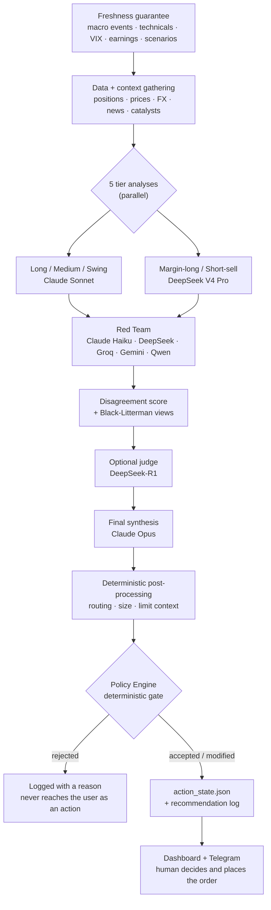

# ALMANAC

*[日本語](README.ja.md)*

**ALMANAC** is a personal, AI-assisted portfolio management and risk-control system. It pairs a quantitative Python backend with a Next.js dashboard to run daily portfolio analysis, market screening, and disciplined risk management for a real long-term investment account — with hard, deterministic guardrails sitting between any AI suggestion and an actual trade.

**This is not an automated trading bot.** There is no broker order API anywhere in this codebase. The AI proposes, the policy engine either blocks or allows the proposal through, and a human places the actual order at their broker.

This repository is a **public, sanitized snapshot** of that system. Runtime data, credentials, and anything that could identify the account owner are intentionally excluded — see [Public Repository Safety](#public-repository-safety).

> **Project status:** this is an opinionated reference implementation and an evolving personal system, not a turnkey portfolio product or a stable public API. Start with the demo state, inspect the rules, and expect file schemas and operating procedures to change.

## What it does

The objective function is explicit and version-controlled ([`objective.md`](objective.md)): maximize **after-tax, after-fee, JPY-denominated time-weighted return**, benchmarked against a 60% global equity / 40% global bond blend, subject to hard risk limits (VaR, drawdown, VIX-based circuit breakers) enforced by a deterministic policy engine — not by an LLM's judgment call.

> **Time-weighted return (TWR)** strips out the effect of deposits and withdrawals. Paying in on payday makes the account bigger without the investing having been any good; TWR removes that, so what is left reflects the decisions rather than the cash flow. Unfamiliar terms used below are collected in the [Glossary](#glossary).

| Area | What it does |
|---|---|
| **Portfolio & risk** | Black-Litterman optimization with LLM-generated views, GJR-GARCH volatility modeling, market-regime detection (bull / neutral / bear / crash), concentration and human-capital-exposure limits |
| **AI decision support** | Multi-model analysis (Claude + DeepSeek, cost-routed by task) for case-based decisions — trim, add, rebalance, tax-loss harvest — all gated by deterministic policy rules before anything reaches an order |
| **Screening & signals** | Long-term JP/US fundamental screening, disclosure-driven catalyst detection (EDINET / TDnet / EDGAR filings), margin and short-sale candidate screening, insider-cluster and IPO tracking |
| **Execution & guardrails** | Daily/monthly drawdown circuit breakers, VaR- and VIX-based trade blocking, an append-only event ledger for full auditability, open-order-aware position sizing |
| **Tax & accounts** | FIFO/LIFO/loss-harvest/gain-minimize tax-lot strategies, NISA allocation tracking, employee-stock-plan concentration management |
| **Observability** | NAV/TWR performance tracking against benchmark (a Modified Dietz cash-flow-adjusted approximation, not a daily sub-period-exact TWR), with a verification page that reports actual measured performance rather than a fixed claim |

## How it works

The heart of the system is a daily pipeline that turns market data into a small number of concrete, human-executable proposals — and a deterministic gate that can reject or modify them before they reach the user.

### 1. The daily loop



Each stage exists for a reason:

**Freshness first.** Every input the gate depends on — the macro-event calendar, technical state, VIX, earnings proximity, scenario snapshot — is regenerated *before* analysis starts. A stale calendar would otherwise be silently read as "no important events coming up," which is the difference between an earnings blackout firing and not firing. Refresh failures are printed rather than swallowed, and the readiness gate treats a missing calendar as `review`, not as "clear."

**Five specialists, not one generalist.** The portfolio is split by holding intent — long-term core, medium-term, swing — plus two credit-side lanes (margin-long, short-sell). Each gets its own analysis with its own prompt and its own risk vocabulary. They run in parallel with a per-call timeout, and a tier that times out degrades that lane rather than failing the whole run.

**Adversarial review.** The tier outputs go to a Red Team of *different* model families whose job is to attack the reasoning. A Claude Haiku leg can use book-aware context; the external legs use only public or anonymized material and may run through DeepSeek, Groq, Gemini, and Qwen when their keys are configured. Using different vendors is deliberate — models from the same family tend to share blind spots. A disagreement score between agents is computed and carried forward, so downstream stages can see where the analysts diverged instead of only seeing a merged consensus.

**Optional judge, then synthesis.** When `DEEPSEEK_API_KEY` is configured, DeepSeek-R1 adjudicates pseudonymized actions without receiving ticker symbols or the analysts' free-text rationales. If that optional judge is unavailable, the stage is omitted rather than taking down the whole run. Claude Opus then performs the final synthesis into a structured result. The synthesis call forces the model to answer through a declared tool schema, so the result arrives as a validated object rather than prose that has to be parsed — and a response truncated by the token limit is rejected outright rather than accepted as a partial answer, so a half-finished list is never mistaken for a conclusion.

**Context before synthesis, execution detail after.** News, catalyst, chart, and options context can be gathered before or during synthesis when it can affect the judgment. After structured proposals come back, deterministic code adds routing, size, and limit-price context before the policy gate.

### 2. What runs when

The included automation (`launchagents/`) runs these on weekdays. Times are Asia/Tokyo.

| Time | Job |
|---|---|
| 06:15 | The AI analysis — the entire daily loop above |
| 16:30 | Ingest TDnet timely disclosures |
| 16:45 | Ingest EDINET filings |
| 17:10 | Update the disclosure-driven shadow book |
| 23:00 | Record the day's NAV |
| 23:05 | Recompute the benchmark comparison |

The analysis runs at 06:15 so the day's proposals exist before the Tokyo market opens. Disclosure ingestion clusters at 16:30–17:10 because that is after the Tokyo close, when the day's filings have landed.

Screening and threshold tuning run on their own cadences, described below.

### 3. Finding candidates (screening)

The daily loop above is mostly about **what to do with positions you already hold**. Finding new candidates is an entirely separate mechanism, with a dedicated screener per thing being hunted.

| Script | What it looks for |
|---|---|
| `screener.py` | Momentum |
| `short_screener.py` | Short candidates, with conditions that vary by market regime |
| `margin_long_screener.py` | Margin-buy candidates |
| `long_term_screener.py` | Long-term fundamentals |
| `news_screener.py` | News sentiment |
| `social_screener.py` | Social chatter plus options-market anomalies |
| `pair_screener.py` | Long-short pair-trading signals |
| `screener_shadow_book.py` | **Measures what actually happened** to the candidates the others produced — it places nothing (see §8) |

**When they run**

The time-of-day split is deliberate:

- **06:00–06:05 on weekdays** — `--us-only --morning`. US names only, using prices from the close that just happened overnight, so candidates exist before Tokyo opens.
- **15:30 on weekdays** — `--jp-only`, right after the Tokyo close.
- **18:00–19:15 on weekdays** — the unrestricted runs: momentum → measurement → news → pairs/shorts → social → margin, staggered 10–15 minutes apart so they don't hammer the market-data APIs simultaneously.
- **07:00 on Sunday and Thursday** — the long-term screener, twice a week.

**Inside the momentum path: two stages**

1. One DeepSeek call evaluates every candidate, expanding bull, bear, and macro perspectives *within* that single call, and labels each one BUY / WATCH / SKIP.
2. Only the **top three BUY candidates** get a Claude Sonnet second opinion.

An earlier version ran three Claude Sonnet passes in parallel and merged them with Opus. That cost far more calls than the result justified, so it was replaced. The funnel logic is the same as everywhere else: broad and cheap first, narrow and expensive second.

**Inside the long-term screener**

About 90 names (US across all sectors, plus Japanese non-tech). Ten metrics are scored out of 160 points.

| Metric | Points |
|---|---|
| EPS growth | 25 |
| ROE | 20 |
| Revenue growth | 15 |
| Gross margin | 15 |
| FCF yield | 15 |
| PEG ratio | 15 |
| Analyst ratings | 15 |
| Technicals | 10 |
| Preferred-sector bonus | 10 |
| Insider buying / buybacks | 5 |

Thesis generation goes through the Batch API — submit now, collect later, at half price. That asynchrony is why **submission (Sunday and Thursday) and collection (Monday and Friday at 08:30) are separate jobs**. It is not urgent work, so it takes the slower, cheaper path.

These cadences are collected in [`examples/crontab.example`](examples/crontab.example).

### 4. Why several models

Primary role-based model choice is centralized in `model_router.py`. `ALMANAC_BUDGET_MODE=eco|normal|premium` changes the routed Claude tiers after the role is resolved. It does **not** rewrite fixed low-stakes utility calls, fallback model IDs, or external-provider roles; those exceptions are intentionally visible at their call sites.

| Role | Model tier | Why |
|---|---|---|
| Final synthesis | Claude Opus | The one call where a mistake propagates into every proposal |
| Long / Medium / Swing tiers | Claude Sonnet | Bulk analysis where quality still matters |
| Margin-long / Short-sell | DeepSeek V4 Pro | Credit-side first pass; the final synthesis decides whether to adopt it |
| Screener pre-debate | DeepSeek | Wide, cheap first pass over many candidates |
| Screener second opinion | Claude Sonnet | Only the top BUY candidates get the expensive look |
| Red Team | Claude Haiku / DeepSeek / Groq / Gemini / Qwen | Book-aware Anthropic leg plus public/anonymized cross-vendor criticism |
| Chat / delta monitor | Claude Haiku | High frequency, low stakes |

The economic shape is a funnel: cheap models see everything, expensive models see only what survived. Every call is logged with its token usage and estimated cost to a shared ledger, so the spend is measurable rather than assumed.

### 5. The gate

This is the part that makes the system something other than "an LLM that suggests trades." Every proposed action passes through an ordered chain of **deterministic rules** — plain Python, no model in the loop. A rule can reject an action or modify it (downgrade urgency, halve the size).

| Rule | What it does |
|---|---|
| `ledger_integrity` | If the event ledger is inconsistent, no executable action passes. Fail-closed. |
| `var_budget` | Ex-ante 1-day 95% VaR over budget → reject **all** new buying |
| `dd_stage` | Drawdown ≤ −8% → new buys normally stop; ≤ −5% → urgency downgraded and size halved. A deterministic DCA-ladder exception is separately bounded. |
| `leverage_block` | Leverage status in warning/deleverage/emergency → no new margin positions |
| `earnings_blackout` | Within 5 business days of earnings → normally reject buy / add / DCA. An explicit high-confidence event-trade exception is capped downstream. |
| `freshness_downgrade` | Inputs too old → downgrade rather than trust them |
| `cvar_unstable` | Thin real-tail samples hard-block margin buying; insufficient clean history degrades size instead of creating a permanent block |
| `vix_extreme` | VIX ≥ 40 → speculative types rejected, buy urgency downgraded |

Two design choices matter more than the individual thresholds:

- **Fail-closed, not fail-open.** A missing or unreadable input is treated as "not permitted," never as "no objection." Several rules distinguish `False` from `None` explicitly for exactly this reason.
- **Rejections are recorded, not discarded.** Rejected and modified actions are written into the analysis output with their reason, so the gate's behavior is auditable after the fact — you can ask why a trade you expected never appeared.

The default thresholds are intended to implement [`objective.md`](objective.md), the version-controlled definition of what the system is optimizing. When a limit changes, the objective, runtime configuration, code, and regression tests should be kept in sync.

### 6. From suggestion to executed trade

**There is no broker API in this repository.** The loop closes through a human:

```
proposal → readiness (ready | review | blocked) → human places the order at their broker
         → human records the fill → executed | partial → event ledger → portfolio state
```

Recording a fill is deliberately separated from applying it to the portfolio. An execution whose account/route cannot be determined unambiguously is stored as a *fact that happened* and held as `portfolio_application_pending` rather than being guessed into the wrong account — because a wrong attribution silently corrupts every downstream tax lot, NISA allowance, and performance figure. Writes are idempotent through a client-generated key, so a double-submitted form cannot become two trades.

### 7. How performance is measured

The system grades itself rather than asserting a result. A daily recorder captures NAV and computes time-weighted return (a Modified Dietz cash-flow-adjusted approximation, not a sub-period-exact TWR) against a 60% global equity / 40% global bond benchmark. The objective is **after-tax, after-fee, JPY-denominated** — Japanese separate taxation and US dividend withholding are modeled, USD positions are converted at the daily close.

A verification page in the dashboard reports what was actually measured, including when the measurement window is too short or too dirty to support a conclusion. Separately, a watchdog checks data freshness, schema drift, ledger integrity, backup status, and disk headroom on a schedule, and pushes only genuinely actionable problems.

### 8. Learning from outcomes

Recommendations are not issued and forgotten — they are marked afterwards and fed back. There are three kinds of learning here, and each is allowed a different amount of autonomy.

**1. Grading past recommendations**

`recommendation_verifier.py` scores past recommendations against prices **5, 20, and 60 business days** later, producing a win-rate table by action type × urgency. That table is injected back into the next analysis prompt, so the model sees its own hit rate before deciding.

One detail matters. **Sells, trims, and shorts are not graded on whether the price fell.** They are graded against SPY. In a bull regime the whole market drifts up, so an absolute test would mark nearly every sell as wrong and distort the win rate structurally. A name that underperforms SPY by at least 0.5% counts as a correct trim.

Screener candidates are tracked the same way. `screener_shadow_book.py` runs on weekdays and records what happened to candidates that were **never actually bought** — a way to measure "what if we had" without placing anything. It exists so screener quality is judged on the record rather than on the hits people remember.

**2. Accumulating beliefs, and discarding stale ones**

Each run updates a set of investment beliefs, each carrying a conviction score.

Accumulating without pruning would let old assumptions sit around forever, so **generic beliefs with conviction ≤ 55 that have not been updated in 30 days are deleted automatically.** There is a mechanism for forgetting, not only for remembering.

Alongside this, the gap between the price at decision time and the actual fill price (implementation shortfall) is recorded — median and spread — once at least 10 samples exist. That separates "the call was right but the execution was poor" from "the call was wrong."

**3. Tuning the thresholds themselves — but not all of them**

`tuning_advisor.py` feeds current market and portfolio state, plus 30 days of rejection statistics, to a model and asks for recommended parameter values with reasoning.

The system does **not** simply apply what comes back. Auto-application is constrained at several levels:

| Constraint | Effect |
|---|---|
| Allowlist / denylist | Auto-changeable parameters are enumerated explicitly. **VIX thresholds, minimum order size, the loss-harvest floor, the critical cash ratio, and the execution-gate mode** sit on the denylist and can never be applied automatically |
| Risk class | Every parameter is classified high / medium / low |
| Step size | Per-parameter cap on a single move — currency targets, for example, may shift at most 3 points |
| Batch size | At most one group per risk class per run; changes are not made en masse |
| Cooldown | One trading day before the next change |
| Input freshness | No tuning on inputs older than 3h (guard), 4h (VIX), 8h (regime), 12h (macro) |
| Atomic groups | Parameters that only make sense together — the JPY and USD targets, say — always move together |

In other words, **tuning uses the same structure as trading.** The model proposes; deterministic rules decide what may change, by how much, and how often.

The runtime state has three modes — `off`, `shadow`, and `apply` — and **only `apply` may mutate a parameter**. A `--force` flag exists, but it only de-duplicates context for dry runs; it never crosses that boundary. This guarded orchestrator replaced an earlier design after a July 2026 review found the scheduled job applying recommendations derived from stale logs. The values that review reconciled by hand are still the ones in effect.

It currently runs in `apply` mode, four times per weekday. In practice the constraints bind hard: since it was re-enabled, every run has ended in either "no change warranted" or "context unchanged since last evaluation," and **no parameter has been auto-applied at all**. The mechanism is live; it simply does not often clear its own bar.

That is the intended shape. A tuner that rarely fires is working; one that changes something every run would mean the bar is too low.

### 9. What happens when something breaks

Degradation is explicit rather than silent. A timed-out tier marks the run degraded and says so in the output; a truncated LLM response is rejected instead of parsed; a stale input downgrades an action instead of being trusted; an unavailable safety module refuses the call rather than proceeding un-audited. The recurring principle is that the system would rather produce *no* recommendation than a confident wrong one.

## Glossary

Terms used above, for readers who don't work in finance or haven't seen the house vocabulary.

| Term | Meaning |
|---|---|
| **TWR (time-weighted return)** | Performance with deposits and withdrawals stripped out, so payday inflows don't read as investing skill |
| **Modified Dietz** | An approximation of TWR: cash flows during the period are weighted by when they landed |
| **VaR (value at risk)** | An estimate of how much could be lost in one day if things go badly. Here, at 95% confidence |
| **CVaR** | The average loss *given* that you have already blown through VaR — the mean of the worst cases |
| **Drawdown** | How far below its previous peak the portfolio currently sits |
| **VIX** | The market's expectation of near-term US equity volatility. Higher means a more unstable market |
| **Black-Litterman** | A way to combine the market's implied view with your own views to produce allocations. Here, the views come from the LLM analysis |
| **GJR-GARCH** | A volatility model that allows downside moves to raise expected volatility more than upside moves — the asymmetry real markets show |
| **Regime** | Which state the market is in (bull / neutral / bear / crash). The same action can be reasonable in one and reckless in another |
| **DCA** | Buying in scheduled instalments instead of all at once |
| **NISA** | Japan's tax-exempt investment allowance. It is capped, so the remaining headroom has to be tracked |
| **Margin buying** | Buying with borrowed money, taking a position larger than your own cash |
| **Short selling** | Borrowing shares, selling them, and buying them back later — profitable if the price falls |
| **Fail-closed** | When the system cannot tell whether something is safe, it refuses. The opposite, fail-open, would let it through silently |
| **Append-only** | Records are only ever added, never edited or deleted, so the history can be audited |
| **Idempotent** | Repeating the same operation changes nothing after the first time — a double-submitted form cannot become two trades |
| **Book-aware** | A call that includes the actual portfolio — holdings, quantities, P&L. The opposite carries only public or anonymized material |
| **Tier** | One of the five analysis lanes (long / medium / swing / margin-long / short-sell). Also used for a model's grade |
| **Red Team** | Models whose assigned job is to attack the conclusion and surface its weak points |

## Architecture

- **Backend** — Python 3.12 / FastAPI. Portfolio optimization ([PyPortfolioOpt](https://github.com/robertmartin8/PyPortfolioOpt), [riskfolio-lib](https://riskfolio-lib.readthedocs.io/), [skfolio](https://skfolio.org/)), GARCH risk modeling ([arch](https://arch.readthedocs.io/)), FinBERT sentiment (`transformers` / `torch`), Claude (Anthropic) and DeepSeek for LLM-assisted analysis.
- **Frontend** — Next.js 16 (App Router) / React 19 / TypeScript. A single console covering portfolio, screening, risk, scenarios, strategy, margin, NISA, AI decision support, execution log, and a performance-verification page.
- **Privacy layer** — ALMANAC runs locally, but some configured AI features do send portfolio context (holdings, quantities, P&L, allocation) to an external LLM. Non-Anthropic calls intended to carry only public or anonymized data (disclosure extraction, debate, external Red Team legs, screening) go through an allowlist gate (`almanac/llm_safety.py`). Book-aware paths include tier/final analysis, chat, decision support, guardrail alerts, and the Anthropic Red Team leg; each is controlled by a call-site privacy gate.

## Configuration

Use `.env.example` as a template. CLI analysis secrets are supplied through the process environment or `~/.almanac_secrets` (via `run_with_secrets.sh`). FastAPI write authentication separately reads `ALMANAC_API_KEY` or `~/.config/almanac/api_key`. A project-local `.env` is **not** loaded. Nothing is required just to read the code, use the read-only API, or inspect the demo dashboard.

**Required only for the corresponding AI workflows**

| Variable | Purpose |
|---|---|
| `ANTHROPIC_API_KEY` | Claude — powers AI decision support, case analysis, and LLM-generated portfolio views |
| `DEEPSEEK_API_KEY` | DeepSeek — cost-efficient screening and long-term-scan harness |

**Optional**

| Variable | Purpose |
|---|---|
| `FRED_API_KEY` | Macro data (Federal Reserve Economic Data) for regime/risk context |
| `FINNHUB_API_KEY` | Supplementary market data |
| `GEMINI_API_KEY`, `GOOGLE_AI_API_KEY` | Alternative LLM backend |
| `GROQ_API_KEY` | Alternative fast-inference LLM backend |
| `OPENROUTER_API_KEY` | LLM routing/aggregator, alternative backend |
| `TELEGRAM_TOKEN`, `TELEGRAM_BOT_TOKEN`, `TELEGRAM_CHAT_ID` | Push notifications for alerts and daily briefings |
| `ALMANAC_API_KEY`, `NEXT_PUBLIC_ALMANAC_API_KEY` | Auth key for write endpoints (recording trades, editing tuning params) — read-only browsing works without it |
| `ALMANAC_ESPP_*` | Employee-stock-plan tracking; disabled (`0`) by default |
| `ALMANAC_CONTRIBUTION_SCHEDULE_JSON` | Recurring cash-flow definitions; empty by default |
| `ALMANAC_CLEAN_NAV_SINCE`, `ALMANAC_MIN_CLEAN_DAYS` | Narrows the performance-measurement window, so periods with known-dirty data are excluded from the result |
| `ALMANAC_PRIVACY_MODE` | Controls call-site-gated *book-aware* external LLM calls — see the scope below |
| `ALMANAC_BUDGET_MODE` | Routed Claude tier policy: `eco`, `normal` (default), or `premium`; fixed utility calls and external-provider roles are unchanged |
| `ALMANAC_MODEL_OVERRIDE_<ROLE>` | Per-role routing override for controlled testing or rollback; the value is a registry key such as `sonnet`, not a provider model ID |

### Privacy mode

Some AI features intentionally send portfolio context (holdings, balances, P&L) to an external model — see [Public Repository Safety](#public-repository-safety) for exactly which ones. `ALMANAC_PRIVACY_MODE` controls whether those specific calls are allowed to run at all:

| Value | Effect |
|---|---|
| `strict_local` (default) | Book-aware call sites — tier/final analysis, chat, decision support, guardrail alerts, and the Anthropic Red Team leg — are blocked before the provider request and return a local disabled/error result. |
| `anthropic_book_aware` | Book-aware calls to Anthropic only. |
| `multi_provider_book_aware` | Book-aware calls to any configured provider (this codebase's original, pre-gate behavior). |

Public/anonymized calls (screening, disclosure-feature extraction) are unaffected by this setting — they never carry portfolio data in the first place. Every call site with an `assert_book_aware_allowed()` gate is enumerated by a regression test in `tests/test_llm_call_site_gating.py`.

> **Implementation boundary:** privacy mode is a tested call-site policy, not a process-wide network sandbox. Known book-aware paths are gated, while public/anonymized calls are still allowed. For defense in depth or an absolute no-egress run, omit external API keys or enforce network isolation.

## Public Repository Safety

This repository intentionally does not track local portfolio state, broker exports, databases, logs, screenshots, local AI-tool sessions, or API keys.

Files such as `holdings.json`, `account.json`, `nisa_portfolio.json`, `trade_history.csv`, and `almanac.db` are ignored by Git and never leave the local machine. Worked examples use a rounded placeholder portfolio size rather than any real figure. `scripts/check_public_safety.py` scans the **current tracked snapshot** for known private identifiers and secret-key patterns; it does not inspect Git history or replace a dedicated secret scanner. Run it before every push.

If you're preparing your own public release from a fork of this project, rotate any token that was ever committed or pasted into local tool settings before publishing repository history.

## Getting started

### Prerequisites

- Python 3.12
- Node.js 20 and npm for the dashboard
- macOS only if you want to reuse the included LaunchAgent automation; manual backend and frontend development also work without it
- API keys only for the external data or AI features you choose to enable

The supported Python install includes `torch`, `transformers`, portfolio optimizers, and risk libraries, so the first dependency install is substantial.

### 1. Backend and demo state

```bash
python3 -m venv venv
source venv/bin/activate
pip install -r requirements.txt

# API keys are read from ~/.almanac_secrets (shell-style KEY=VALUE, one per
# line), not from a project-local .env file — nothing in this repo loads
# dotenv. Copy .env.example there and fill in your own values:
cp .env.example ~/.almanac_secrets
chmod 600 ~/.almanac_secrets

python scripts/init_private_state.py   # seeds missing local state files with
                                        # sample cash + SPY; never overwrites
                                        # existing state

./start_v5.sh                      # FastAPI on 127.0.0.1:8000 only
```

`start_v5.sh` remains attached to the backend process. In another terminal, verify it with:

```bash
curl http://127.0.0.1:8000/health
```

Interactive API documentation is available at <http://127.0.0.1:8000/docs>. The script starts the FastAPI backend and nothing else; scheduled jobs and the dashboard are separate, opt-in processes.

### 2. Dashboard

```bash
cd frontend
npm ci
npm run dev                        # http://localhost:3000, talking to the FastAPI backend above
```

Read-only views work without an API key. To use write controls locally, create a key:

```bash
mkdir -p ~/.config/almanac
python -c 'import secrets; print(secrets.token_urlsafe(32))' > ~/.config/almanac/api_key
chmod 600 ~/.config/almanac/api_key
```

Then create `frontend/.env.local` with the same value:

```dotenv
NEXT_PUBLIC_API_BASE=http://127.0.0.1:8000
NEXT_PUBLIC_ALMANAC_API_KEY=<contents of ~/.config/almanac/api_key>
```

`NEXT_PUBLIC_*` values are embedded in browser-delivered JavaScript. This setup is for the default localhost-only deployment; do not expose the dashboard or this key to an untrusted network.

### 3. Run the AI analysis

```bash
./run_with_secrets.sh venv/bin/python portfolio_analyst.py --force
```

This command can make live external API calls and incur provider charges. The default `ALMANAC_PRIVACY_MODE=strict_local` blocks book-aware tier/final analysis and the Anthropic Red Team leg; public/anonymized provider calls may still run. Enable `anthropic_book_aware` or `multi_provider_book_aware` only after reviewing what portfolio context each mode permits to leave the machine.

### 4. Local verification

```bash
venv/bin/python -m pytest tests/ -q
python scripts/check_public_safety.py
git diff --check

cd frontend
npm ci
npm run lint
npm test
npm run build
```

## Project structure

```
almanac/                 core package — runtime config, LLM safety layer, DB migrations, observability
analyst/                 LLM-assisted analysis pipeline (multi-model, case-based)
api/                     FastAPI routes
frontend/                Next.js dashboard
examples/private_state/  templates for local-only state files (never committed)
tests/                   pytest suite
model_router.py           role-based Claude routing and budget-mode transforms
policy_engine.py          ordered deterministic action gate
event_ledger.py           append-only audit events and integrity checks
objective.md              version-controlled objective and hard constraints
```

Most other top-level `.py` files are single-purpose modules — screeners, data fetchers, the policy and risk engines, tax tooling — rather than parts of a package. See individual file docstrings for details.

## Disclaimer

This is a personal project built around one person's own portfolio. It is not investment advice, has not been independently audited for correctness, and is shared as-is for anyone curious how the system works. Use any part of it at your own risk.

## License

[MIT](LICENSE)
